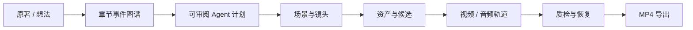

# AIGC 导演工作室

<p align="center"></p>

<p align="center"><strong>无限画布、章节事件图谱、可审阅 Agent 与可恢复媒体任务组成的本地 AI 视频生产工作室</strong></p>

<p align="center">
  <a href="LICENSE"></a>
  
  
  
  
  <a href="https://github.com/728792899-create/aigc-video-platform/actions/workflows/ci.yml"></a>
</p>

> 基于公开行为研究，通过 clean-room 方式独立实现的 AI 导演能力超集。

2.0 是一次有意的全栈替换：旧 Dashboard、固定阶段页面、旧 API 和旧数据库不再属于当前产品。唯一界面是 `/studio`，业务事实保存在 schema v9 数据库中，画布只投影领域对象。


桌面端使用同一领域数据源；下图为 Electron 40 中完成原生目录选择与零 Key MP4 导出后的 Delivery Graph。


## 产品闭环



工作室提供三张原创领域图：

- **Story Graph**：原文范围、章节、事件、叙事顺序、因果边和改编审批。
- **Production Graph**：场景、镜头、Character/Scene/Prop/Style/Voice/Music 资产和生成候选。
- **Delivery Graph**：已选候选、持久任务、视频轨道、字幕、音乐和导出。

节点可以平移、缩放、框选和检查；所有领域命令携带 graph revision 与 idempotency key。画布布局损坏不会损坏项目数据，刷新后可从数据库重建。

## 当前真实能力

| 领域 | 已实现 | 安全边界 |
| --- | --- | --- |
| 事件改编 | 确定性章节/事件提取、source range、图校验、场景与镜头 revision | Provider 输出进入核心数据前必须通过 Zod |
| 原著导入 | 手工粘贴或 TXT/Markdown 隔离预览、章节识别、确认后事务提交 | 严格 UTF-8、6 MB/200 万字符、hash 复检；Markdown 不作为 HTML 执行 |
| Prompt / Agent | 固定版本 Prompt Pack（26 Prompt、31 Skill、2 Workflow）、用户 Prompt/Skill 不可变 revision、双语 diff、编译预览、黄金样例、追加式回滚、局部重生成与 AgentRun checkpoint | 只有已发布 revision 可进入生产；任务固定 Prompt/目标 revision，计划只保存脱敏记忆证据 |
| 生产 | 默认 Style/Voice/Music 资产、多 Beat 镜头、持久 CandidateBatch、收藏/比较/批准、真实视频尾帧 | Beat 精确覆盖总时长；选择、收藏和比较相互独立，新批次不覆盖历史 |
| 任务 | PromptRun、幂等键、独立 Attempt、Provider receipt、诊断与重启 reconcile | 已接收后超时先对账；云端状态未知时不得自动重复提交 |
| 媒体 | 确定性 Model Catalog、MediaResolver 脱敏 receipt、系统 FFmpeg/FFprobe、最后可解码帧原子提取 | 安装包不携带旧 nonfree FFmpeg；数据库不保存 signed URL、Authorization 或定位明文 |
| 分层记忆 | Episode → Series → Global 召回、来源 revision、stale 保留、采用原因与关键词降级 | 只索引已批准的事件/产物/反馈/候选摘要；密钥、签名 URL、Provider 原始响应和二进制媒体会被排除 |
| 安全出口 | media-fetch/model-api/temporary-upload 三通道 Egress Broker、逐跳 DNS/IP 校验、固定 IP 连接、流式上限和 hash 审计 | 默认关闭且 allowlist 为空；凭据只能由宿主注入，客户端/插件不能携带凭据头 |
| 可选插件运行时 | Deno 2.9.2 固定资产目录、大小/SHA-256/ZIP/版本校验、原子安装和二次确认 | 默认网络门禁关闭；安装包不携带 Deno，当前不能启用自定义插件 |
| 本地数据 | better-sqlite3、事务、WAL、schema v9、逐版幂等迁移、未来版本拒绝 | Server 只绑定 127.0.0.1，并要求随机会话 token |
| 连续性资产 | Project 作为 Episode；Series 排序、Episode→Series→Global resolver、fork/promote、批量改绑与 revision drift | 共享媒体复制到独立受管目录，来源 Project 删除不会使共享 Variant 失效 |
| 备份迁移 | `.aigcproj` v1 永久导入；v2 支持 Project/Series、共享资产快照、媒体校验和与全量 ID remap | Global 资产随 Series 导入时固定为 Series 副本，不静默污染目标 Global |
| 桌面 | Electron 40、safeStorage、IPC 白名单、原生目录选择 | `contextIsolation=true`、`nodeIntegration=false`、sandbox 与 CSP |

Demo Mode 会走完整数据流并输出真正可播放的 MP4，所有任务记录 `provider=demo-local` 与 `billed=false`。测试不会提交任何付费生成请求。

### 当前验证状态

- 148/148 workspace tests、TypeScript strict、ESLint、Smoke 与生产构建通过。
- Security scan、clean-room scan 与系统 FFmpeg 有效 MP4 冒烟通过。
- Event/Scene 局部重生成只追加 Artifact；Shot 局部重生成只追加 Candidate，不覆盖其他场景或已选结果。
- macOS arm64 内部目录包通过 Electron preflight、包内容泄漏扫描和真实启动冒烟。
- 正式签名、公证、Windows 干净机和真实 Provider/线上更新仍属于外部门禁，不宣称已完成。

## 快速开始

要求：Node.js 24、pnpm 11、系统可用的 `ffmpeg` 与 `ffprobe`。

```bash
corepack enable
pnpm install
pnpm quality
pnpm dev
```

浏览器打开 `http://127.0.0.1:5173/studio`。开发命令会显式启用：

```text
DEMO_MODE=1
PROVIDER_NETWORK_DISABLED=1
```

最短验收命令：

```bash
pnpm test:smoke
```

它会在系统临时目录完成：创建项目 → 导入章节 → 事件图谱 → Agent 审批 → 镜头 → Candidate → MP4 → 服务重启 → 数据恢复，并在结束后删除临时数据。

## 架构

```text
apps/
├── studio/      Vue 3 + Pinia + Vue Router + Vue Flow + Reka UI
├── server/      Express 5 + Socket.IO + better-sqlite3
└── desktop/     Electron main / preload / legacy purge gate
packages/
├── contracts/   Zod 与共享 TypeScript 契约
├── model-catalog/ 确定性模型能力目录
├── domain/      事件图、投影、状态机与 stale 规则
├── agents/      Prompt Pack 适配、模型选择、计划与审批
├── ai-video-director-prompt-pack/  固定版本 Prompt / Skill / Workflow Registry
├── providers/   Fake Provider、Egress Broker、签名 manifest 与 Deno 隔离协议
├── media/       MediaResolver、系统 FFmpeg / FFprobe 与真实尾帧
└── testing/     零付费端到端验收
```

Renderer 不直接访问 Node、数据库、Provider SDK 或凭据。HTTP API 统一位于 `/api/v2`，实时任务使用 Socket.IO `/studio-v2`。旧 `/api/*` 与旧路由返回 404。

完整设计见 [2.0 架构](docs/architecture-v2.md)、[API v2](docs/api-v2.md) 和 [数据模型](docs/data-model-v2.md)。

项目切换器中的“备份当前项目”可下载 Project `.aigcproj`；项目属于 Series 时还可备份整个 Series。导入会先验证版本、路径、schema、共享资产和所有媒体 SHA-256，再以新 ID 事务恢复。Project 包把实际使用的共享 revision 固定为 Episode 本地副本；Series 包保留有序 Episodes 与 Series 资产。完整知识库对照见 [升级记录](docs/knowledge-base-upgrade.md)。

Story Graph 的“导入原著”同时支持粘贴文本和 `.txt/.md/.markdown`。文件先进入可取消的隔离预览；只有用户确认标题、章节和内容 hash 后，才事务写入项目并生成事件图谱。

## 2.0 数据清理门禁

2.0 不读取或迁移旧数据库。桌面端首次启动如果发现已知旧数据目录，会先展示目录、文件数量与大小：

- 输入精确短语“删除旧数据”才执行普通文件删除与凭据清理；
- 取消会退出应用，不会打开旧数据；
- 路径、realpath 和符号链接都经过边界校验；
- 完成后写入 tombstone，重复启动不会再次删除；
- 这不是安全擦除，不能保证从存储介质不可恢复。

测试仅在临时目录验证该流程，不触碰真实用户目录。

## 常用命令

```bash
pnpm typecheck            # strict TypeScript / vue-tsc
pnpm lint                 # ESLint 与依赖边界
pnpm test                 # 单元、组件、API 和媒体测试
pnpm test:smoke           # 零付费完整闭环 + 重启恢复
pnpm clean-room:check     # 品牌、Prompt 与复制路径扫描
pnpm security:scan        # 密钥、运行数据与危险模式扫描
pnpm build                # 所有 packages、Server、Studio、Electron
pnpm prepare:package      # 隔离生产依赖并重建 native module
pnpm electron:preflight  # 桌面安全与包内容预检
pnpm run pack             # 在系统临时目录生成并校验内部目录包
pnpm desktop:open:demo    # 验签后用隔离数据目录打开最新包
```

## 发布状态

- 本地 macOS arm64：TypeScript、测试、零付费 MP4、重启恢复、生产构建和 Electron preflight 已自动化。
- 当前 macOS arm64 内部包已通过 ad-hoc 签名、LaunchServices 和 Computer Use；同一隔离项目中已完成导入、事件图谱、Agent 审批、10 个候选生成、5 个镜头选择、原生目录选择、15 秒 MP4 导出和重启恢复。
- Windows x64、macOS Intel/Apple Silicon：CI 配置会在干净 Runner 重复上述门禁。
- 正式 macOS Developer ID、公证、stapling 与 Windows Authenticode 仍需要仓库 Secrets。
- 未签名或 ad-hoc 包只能用于内部预检，不应公开分发。
- 真实 Provider reconcile/cancel/billing 与线上自动更新需要单独授权、测试凭据和非 Draft Release。

详情见 [桌面发布](docs/desktop-release-v2.md) 与 [Release Checklist](docs/release-checklist-v2.md)。

## 安全与许可证

API Key 只允许通过桌面 Credential Vault 注入，公开响应、Socket 事件和诊断不返回原始凭据或本机导出路径。上传只允许经过 magic bytes、MIME、大小与图像解析验证的受控图片。

本仓库使用 MIT License。代码许可不代表模型、权重、Provider、用户素材、字体、音乐、肖像或生成内容的商业授权。请阅读 [SECURITY.md](SECURITY.md)、[THIRD_PARTY_NOTICES.md](THIRD_PARTY_NOTICES.md) 与 [clean-room 溯源](docs/legal/clean-room-provenance.md)。

## 文档

- [文档中心](docs/README.md)
- [Demo 操作](docs/demo-v2.md)
- [安全与隐私](docs/security-v2.md)
- [测试与 CI](docs/testing-ci-v2.md)
- [故障排查](docs/troubleshooting-v2.md)
- [参与贡献](CONTRIBUTING.md)
- [English README](README.en.md)
