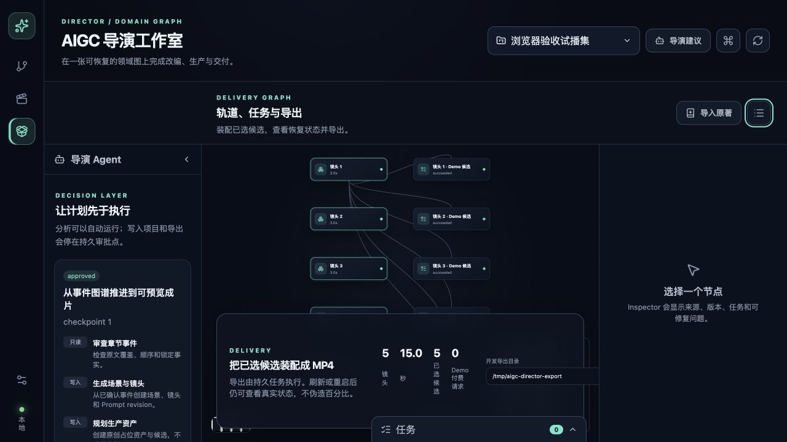
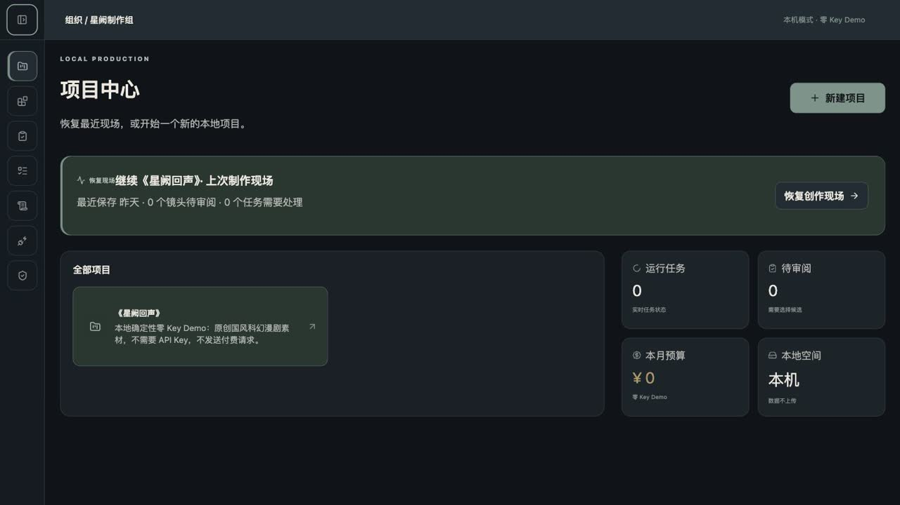
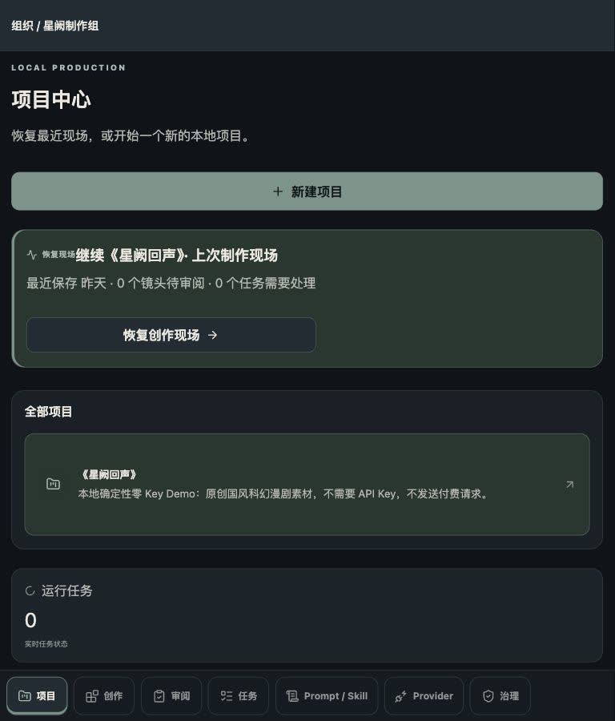
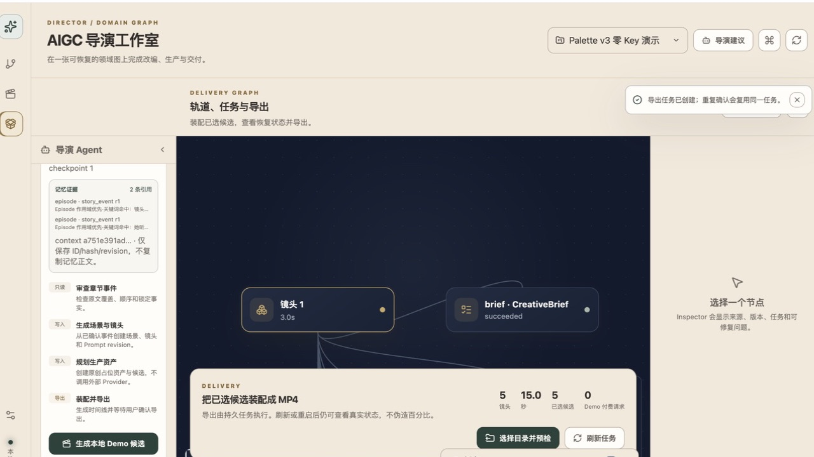
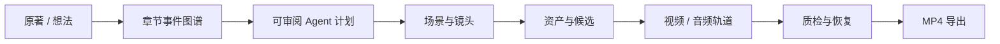

# AIGC 导演工作室

<p align="center"></p>

<p align="center"><strong>无限画布、章节事件图谱、可审阅 Agent 与可恢复媒体任务组成的本地 AI 视频生产工作室</strong></p>

<p align="center">
  <a href="LICENSE"></a>
  
  
  
  
  <a href="https://github.com/728792899-create/aigc-video-platform/actions/workflows/ci.yml"></a>
</p>

> 基于公开行为研究，通过 clean-room 方式独立实现的 AI 导演能力超集。

2.0 是一次有意的全栈替换：旧 Dashboard、固定阶段页面、旧 API 和旧数据库不再属于当前产品。唯一界面是 `/studio`；16 个可深链接 Workspace 通过 `workspace` 查询参数在同一工作台中切换，Story/Production/Delivery 三张领域图只作为局部数据投影。业务事实保存在 schema v12 数据库中，导航和引导不保存第二套项目进度。

当前界面采用固定的 **Obsidian Atelier** 暗色体系：低饱和墨黑画布、抬升面板、鼠尾草品牌色、蓝灰信息色、金色警告和酒红危险色。全局只有一层可折叠主侧栏，项目内使用横向八阶段导航；状态同时保留图标和文字，不依赖颜色单独传达含义。



主侧栏可在桌面端收起为 72px 图标栏；小于等于 768px 时只保留单层底部导航，项目主操作和恢复入口不受影响。

<details>
<summary>查看收起侧栏与窄屏实机图</summary>





</details>

桌面端使用同一领域数据源；下图为 2026-07-23 在隔离 userData 中重新采集的 Electron 40 候选审阅工作区，明确显示 `demo-local`、`billed=false` 与零费用边界。



## 产品闭环



工作室提供三张原创领域图：

- **Story Graph**：原文范围、章节、事件、叙事顺序、因果边和改编审批。
- **Production Graph**：场景、镜头、Character/Scene/Prop/Style/Voice/Music 资产和生成候选。
- **Delivery Graph**：已选候选、持久任务、视频轨道、字幕、音乐和导出。

节点可以平移、缩放、框选和检查；所有领域命令携带 graph revision 与 idempotency key。画布布局损坏不会损坏项目数据，刷新后可从数据库重建。

## 当前真实能力

| 领域 | 已实现 | 安全边界 |
| --- | --- | --- |
| 创作简报 | 严格 CreativeBrief Schema、不可变批准稿、字段锁定、三候选审阅和二次确认 | 格式错误的历史 Artifact 被隔离；候选不经批准不会移动事实源或污染下游 |
| 事件改编 | 确定性章节/事件提取、source range、图校验、场景与镜头 revision | Provider 输出进入核心数据前必须通过 Zod |
| 原著导入 | 手工粘贴或 TXT/Markdown 隔离预览、章节识别、确认后事务提交 | 严格 UTF-8、6 MB/200 万字符、hash 复检；Markdown 不作为 HTML 执行 |
| Prompt / Agent | 固定版本 Prompt Pack（26 Prompt、31 Skill、2 Workflow）、用户 Prompt/Skill 不可变 revision、双语 diff、确定性 Demo 润色、last-known-good、编译预览、黄金样例、追加式回滚、局部重生成与 AgentRun checkpoint | 只有已发布 revision 可进入生产；润色失败不覆盖已发布兜底，任务固定 Prompt/目标 revision，计划只保存脱敏记忆证据 |
| 生产 | 默认 Style/Voice/Music 资产、多 Beat 镜头、持久 CandidateBatch、收藏/比较/批准、真实视频尾帧、失败项批次重试 | Beat 精确覆盖总时长；失败重试创建新 batch/new attempt，选择、收藏、比较和历史证据互不覆盖 |
| 任务 | PromptRun、幂等键、独立 Attempt、Provider receipt、诊断与重启 reconcile、可下载脱敏项目诊断包 | 已接收后超时先对账；云端状态未知时不得自动重复提交；诊断包不含原文、Prompt、凭据、Provider payload 或本机路径 |
| 生成策略 | 项目级并发、候选批次、导出时长、用户自付预算和路由准入；revision/CAS 与二次确认 | 默认 Demo-only/预算 0；只有显式切换用户自付、配置受信连接并确认上限后才允许外部请求 |
| 恢复中心 | authenticated 本地完整性报告、未知任务批量对账、断裂引用定位和失效边界帧二次确认修复 | 只查询或执行可验证的本地修复；不会自动重提 Provider 任务，公开诊断包继续只含 hash |
| 安全审计 | 发布、回滚、重试、取消、对账、导出与 destructive graph command 的 append-only started/terminal 事件 | 只保存固定动作、状态、稳定错误码、correlation ID 与哈希引用；正文、密钥和路径不入审计 |
| 媒体 | 确定性 Model Catalog、MediaResolver 脱敏 receipt、系统 FFmpeg/FFprobe、最后可解码帧原子提取 | 上传图片在落盘前解码并重新编码以移除 EXIF/ICC；拒绝动画和超限像素；数据库不保存 signed URL、Authorization 或定位明文 |
| 分层记忆 | Episode → Series → Global 召回、来源 revision、stale 保留、采用原因与关键词降级 | 只索引已批准的事件/产物/反馈/候选摘要；密钥、签名 URL、Provider 原始响应和二进制媒体会被排除 |
| Provider 连接 | 内置 Demo、OpenAI-compatible 与声明式 HTTP manifest；按模态主路由、降级链、超时和不可变成本账本 | 只允许 HTTPS origin 与受限 submit/poll/cancel 描述；任意 JS/Python/Deno 适配器被永久封存，旧插件接口返回 410 |
| 凭据与出口 | 本机使用系统 Keychain/Credential Manager；Docker 使用只读 Secret；Egress Broker 逐跳校验 DNS/IP、重定向、大小和超时 | API、Socket、日志、项目包、诊断和成本账本永不返回 secret；Demo 默认完全禁用 Provider 网络 |
| 本地数据 | better-sqlite3、事务、WAL、schema v12、逐版幂等迁移、未来版本拒绝 | 原生服务只绑定 127.0.0.1；Docker 只映射宿主回环地址；随机 bootstrap/session token 与 HttpOnly Cookie 防止本机跨站调用 |
| 连续性资产 | Project 作为 Episode；Series 排序、跨集摘要、Episode→Series→Global resolver、fork/promote、批量改绑与 revision drift | 跨集摘要固定 Source/Event revision；上游变化只标记 stale，旧 Artifact 与共享媒体继续保留 |
| 交付 | 已选 Candidate/Media hash 快照、assembly hash 幂等、导出预检、显式确认、真实媒体 FFmpeg 装配和受管归档 | 预检不会启动 FFmpeg；镜头或候选变化会使确认失效；重复确认只复用同一任务，数据库不公开用户输出路径 |
| 备份迁移 | `.aigcproj` v1 永久导入；v2 支持 Project/Series、共享资产快照、媒体校验和与全量 ID remap | Global 资产随 Series 导入时固定为 Series 副本，不静默污染目标 Global |
| 桌面 | Electron 40、safeStorage、IPC 白名单、原生目录选择 | `contextIsolation=true`、`nodeIntegration=false`、sandbox 与 CSP |

Demo Mode 会走完整数据流并输出真正可播放的 MP4，所有任务记录 `provider=demo-local` 与 `billed=false`。测试不会提交任何付费生成请求。

### 当前验证状态

- 单一当前事实源见 [2026-07-23 项目状态](docs/current-status.md)；历史记录不得覆盖该页的运行时、测试与发布判断。
- Workspace tests、Provider 契约、TypeScript strict、ESLint、Smoke 与生产构建通过；准确数量以当前 `pnpm quality` 输出为准。
- Security scan、clean-room scan 与系统 FFmpeg 有效 MP4 冒烟通过。
- Event/Scene 局部重生成先追加 Artifact；Scene draft 可包含 Scene 与所属 Shot 的字段 patch，审阅后以 project/scene/shot revision CAS 在单个事务内应用。对白只污染 voice/subtitle/timeline/export，视觉字段才污染 image/video；Shot 局部重生成仍只追加 Candidate，不覆盖其他场景或已选结果。
- Browser 已验证 1440/1180/≤768 单侧栏工作台、72px 收起模式、16 个 Workspace、定向引导与零页面控制台错误；截图与审查证据见 [Product Design 实机审查](docs/product-design-audit-2026-07-23.md)。
- 正式 Provider 线上语义、安装包签名、公证、Windows 干净机和自动更新仍属于外部门禁，不宣称已完成。

## 快速开始

要求：Node.js 22.20+（推荐 24）、pnpm 11、系统可用的 `ffmpeg` 与 `ffprobe`。

```bash
corepack enable
pnpm install --frozen-lockfile
pnpm quality
pnpm start
```

`pnpm start` 是面向用户的首选入口（`pnpm local` 保留为兼容别名）：它会构建内置 Studio 与 Server，在 `127.0.0.1:33100` 启动单一生产服务，生成一次性本机会话并自动在默认浏览器打开项目中心。服务以前台进程运行，按 `Ctrl+C` 即可停止；数据保存在操作系统应用数据目录，无需账号、登录或云端数据库。开发调试仍使用 `pnpm dev`（`http://127.0.0.1:5173/studio`）。默认环境为：

```text
DEMO_MODE=1
PROVIDER_NETWORK_DISABLED=1
```

首次进入可在项目切换器中选择“打开零 Key Demo 项目”。工作台会创建隔离的本地示例、导入原著并生成待审批计划；后续按阶段导航完成简报、分镜、候选审阅、时间线和本地导出。旧 `?view=story|production|delivery` 链接仍可使用，新的 `?workspace=brief|shots|tasks|...` 链接可直接恢复工作位置。

最短验收命令：

```bash
pnpm test:smoke
```

它会在系统临时目录完成：创建项目 → 导入章节 → Agent 审批 → 候选生产 → 注入部分失败 → 仅重试失败项与幂等复用 → MP4 → 服务重启 → 数据恢复，并在结束后删除临时数据。

### Docker 一键部署

要求 Docker Engine 与 Compose v2：

```bash
pnpm start:docker   # 构建、健康检查并打开本机工作台
pnpm docker:logs    # 查看脱敏服务日志
pnpm stop:docker    # 停止容器，保留数据卷
```

Compose 只映射 `127.0.0.1:33100`，容器使用非 root 用户、只读根文件系统、移除 Linux capabilities，并把 Provider 凭据作为 `/run/secrets` 只读挂载。首次启动自动创建权限为 0600 的本地 secret 文件；不要提交 `.local/`。

这与常见的本地一体化 Web 应用相同：仓库内包含编译后的前端构建流程，用户只启动一个服务，浏览器就是产品界面，不需要另外部署前端或打开 Electron。端口占用、远程主机和停止/备份说明见[本地 Web 部署指南](docs/local-web-deployment.md)。

## 架构

```text
apps/
├── studio/      Vue 3 + Pinia + Vue Router + Vue Flow + Reka UI
├── server/      Express 5 + Socket.IO + better-sqlite3
└── desktop/     Electron main / preload / legacy purge gate
packages/
├── contracts/   Zod 与共享 TypeScript 契约
├── model-catalog/ 确定性模型能力目录
├── domain/      事件图、投影、状态机与 stale 规则
├── agents/      Prompt Pack 适配、模型选择、计划与审批
├── ai-video-director-prompt-pack/  固定版本 Prompt / Skill / Workflow Registry
├── providers/   Fake/OpenAI-compatible/声明式 HTTP Provider、路由与安全 Egress Broker
├── media/       MediaResolver、系统 FFmpeg / FFprobe 与真实尾帧
└── testing/     零付费端到端验收
```

Renderer 不直接访问 Node、数据库、Provider SDK 或凭据。HTTP API 统一位于 `/api/v2`，实时任务使用 Socket.IO `/studio-v2`。旧 `/api/*` 与旧路由返回 404。

完整设计见 [2.0 架构](docs/architecture-v2.md)、[API v2](docs/api-v2.md) 和 [数据模型](docs/data-model-v2.md)。

开发交付规则见 [Local v1 最终 Figma 研发交付说明](docs/local-v1/final-handoff.md)、[Studio Workspace 交付矩阵](docs/studio-workspace-delivery-matrix.md)、[产品术语与内容规范](docs/product-language-and-content.md)、[内部联合评审](docs/internal-review-candidate.md) 与 [开发预览验收报告](docs/development-preview-acceptance.md)。

项目切换器中的“备份当前项目”可下载 Project `.aigcproj`；项目属于 Series 时还可备份整个 Series。导入会先验证版本、路径、schema、共享资产和所有媒体 SHA-256，再以新 ID 事务恢复。Project 包把实际使用的共享 revision 固定为 Episode 本地副本；Series 包保留有序 Episodes 与 Series 资产。完整知识库对照见 [升级记录](docs/knowledge-base-upgrade.md)。

Story Graph 的“导入原著”同时支持粘贴文本和 `.txt/.md/.markdown`。文件先进入可取消的隔离预览；只有用户确认标题、章节和内容 hash 后，才事务写入项目并生成事件图谱。

## 2.0 数据清理门禁

2.0 不读取或迁移旧数据库。桌面端首次启动如果发现已知旧数据目录，会先展示目录、文件数量与大小：

- 输入精确短语“删除旧数据”才执行普通文件删除与凭据清理；
- 取消会退出应用，不会打开旧数据；
- 路径、realpath 和符号链接都经过边界校验；
- 完成后写入 tombstone，重复启动不会再次删除；
- 这不是安全擦除，不能保证从存储介质不可恢复。

测试仅在临时目录验证该流程，不触碰真实用户目录。

## 常用命令

```bash
pnpm typecheck            # strict TypeScript / vue-tsc
pnpm lint                 # ESLint 与依赖边界
pnpm test                 # 单元、组件、API 和媒体测试
pnpm test:smoke           # 零付费完整闭环 + 重启恢复
pnpm clean-room:check     # 品牌、Prompt 与复制路径扫描
pnpm security:scan        # 密钥、运行数据与危险模式扫描
pnpm build                # 所有 packages、Server、Studio、Electron
pnpm start                # 首选：生产服务启动并自动打开浏览器
pnpm local                # 与 pnpm start 等价的兼容入口
pnpm local:smoke          # 本机生产入口快速检查
pnpm start:docker         # Docker 一键部署并自动打开浏览器
pnpm stop:docker          # 停止 Docker 服务并保留数据卷
pnpm docker:smoke         # 干净容器健康检查
pnpm prepare:package      # 隔离生产依赖并重建 native module
pnpm electron:preflight  # 桌面安全与包内容预检
pnpm run pack             # 在系统临时目录生成并校验内部目录包
pnpm desktop:open:demo    # 验签后用隔离数据目录打开最新包
```

## 发布状态

- 当前首选交付是浏览器中的本机 Web 服务（`pnpm start`）和 Docker（`pnpm start:docker`），两者都把 Studio 与 Server 合并在同一 origin、自动打开浏览器，且无需登录或云数据库。
- macOS/Windows Electron 仍保留为开发壳和后续可选分发面；本轮不把安装包、签名、公证和自动更新作为产品完成条件。
- 正式 macOS Developer ID、公证、stapling、Windows Authenticode 与真实 Provider live verification 仍需外部凭据和独立授权。

详情见 [桌面发布](docs/desktop-release-v2.md) 与 [Release Checklist](docs/release-checklist-v2.md)。

## 安全与许可证

API Key 只允许通过系统 Keychain/Credential Manager（本机）或 Docker Secret（容器）注入；公开响应、Socket 事件、日志、数据库业务表、项目包和诊断不返回原始凭据或本机导出路径。上传只允许经过 magic bytes、MIME、大小与图像解析验证的受控图片。

本仓库使用 MIT License。代码许可不代表模型、权重、Provider、用户素材、字体、音乐、肖像或生成内容的商业授权。请阅读 [SECURITY.md](SECURITY.md)、[THIRD_PARTY_NOTICES.md](THIRD_PARTY_NOTICES.md) 与 [clean-room 溯源](docs/legal/clean-room-provenance.md)。

## 文档

- [文档中心](docs/README.md)
- [Local v1 最终 Figma 研发交付说明](docs/local-v1/final-handoff.md)
- [Demo 操作](docs/demo-v2.md)
- [安全与隐私](docs/security-v2.md)
- [测试与 CI](docs/testing-ci-v2.md)
- [故障排查](docs/troubleshooting-v2.md)
- [参与贡献](CONTRIBUTING.md)
- [English README](README.en.md)
