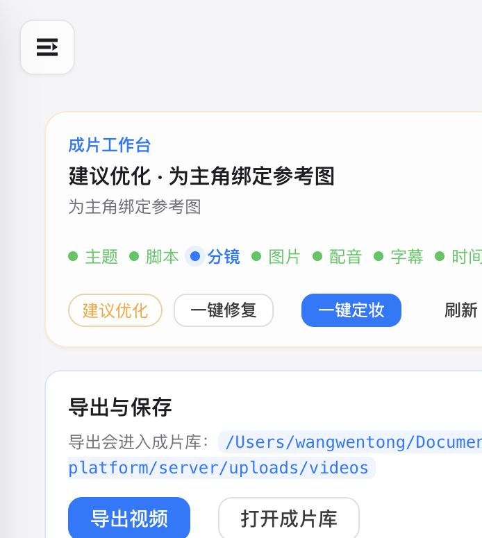
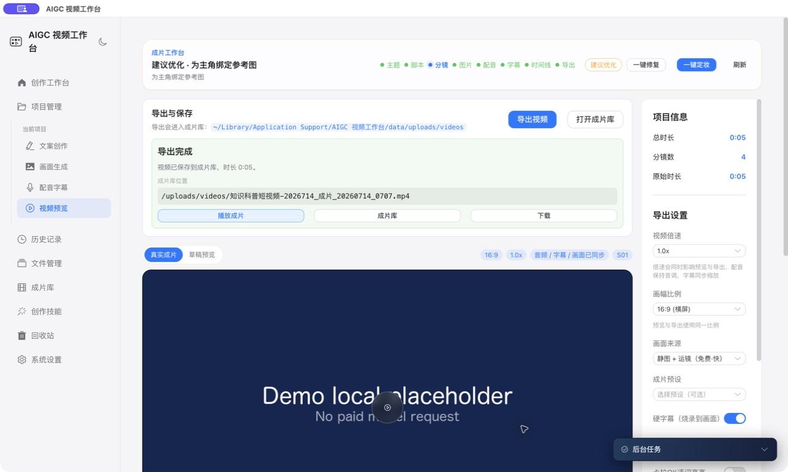

# AIGC 视频工作台

本地优先、可恢复、可打包发布的 AIGC 视频桌面创作产品。它把“主题 → 脚本 → 分镜 → 图片 → 配音 → 字幕 → 时间线 → 导出”建模为八阶段持久化工作流，既能连接用户自己的 Provider，也能在无 Key 的 Demo Mode 中离线完成有效 MP4 导出。

> 当前版本适合桌面单用户创作与公开演示，不是多租户 SaaS。公开仓库和安装包不包含共享模型密钥、数据库、日志或用户素材。

## 五分钟体验

要求 Node.js 22+。FFmpeg 由依赖自带，也可以在设置中指定系统版本。

```bash
npm ci
npm --prefix server ci
npm --prefix client ci
npm run demo
```

打开 `http://127.0.0.1:5173`。Demo Mode 使用本地脚本、原创占位画面和本地音频，不调用付费模型，也不需要 API Key。

## 可复现验收

```bash
npm run quality              # 服务端、离线恢复验收、客户端测试与生产构建
npm run test:smoke           # API 烟测 + 有效 MP4 + 单阶段重试 + 重启恢复
npm run security:audit:all   # root / server / client 完整依赖审计
node scripts/security-check.mjs
node scripts/ffmpeg-smoke.mjs
```

`npm run test:smoke` 会清空常见 Provider 环境变量，使用临时数据库与临时素材目录，并验证：

- Demo 全流程成功导出可识别的 MP4；
- 在 `export` 阶段注入一次失败后，只重试该阶段且不重跑分镜；
- 在 `image` 检查点停止服务后，用同一数据库重启并自动续跑；
- 所有测试完成后删除临时项目、数据库与媒体文件。

## 创作工作台

创作界面围绕稳定的 storyboard id 和八阶段状态机组织：步骤导航展示检查点，主画布用于编辑和预览，分镜列表保留逐镜资产状态，任务浮层展示 Provider、成本标识、进度、取消和失败修复入口。长任务允许部分成功，成功资产不会因后续失败被删除。



桌面端也使用同一创作状态与媒体任务，导出路径在界面和截图中自动隐藏操作系统账户名：



主要能力：

- 阶段级保存、取消、重试、部分成功和进程重启恢复；
- Provider 契约归一化：无密钥、超时、限流、异常格式、降级和占位兜底；
- 分镜图片、配音、字幕、时间线、预览与 FFmpeg 导出；
- 自定义导出目录、成片库、回收站、配置/数据库备份；
- 多画幅、字幕预设、背景音乐、运镜和静图视频降级；
- 键盘可达的项目卡片、误操作确认、空状态与长任务进度。

## 凭证与安全边界

- 桌面版使用 Electron `safeStorage`，由 macOS Keychain 或 Windows DPAPI/Credential Manager 的系统能力加密；后端只持有运行时内存副本。
- 密钥不会写入 `settings.json`、日志、前端响应、配置导出或备份。旧版明文配置首次启动时自动迁移并清除。
- Electron renderer 使用 `contextIsolation: true`、`nodeIntegration: false`、`sandbox: true`；preload 只有语言切换和目录选择两个静态 IPC 通道，并校验调用来源。
- 后端默认仅监听 `127.0.0.1`，启用 CSP、本地 CORS 白名单、请求 ID、生成接口限流与可选 `API_TOKEN`。
- Sentry 默认关闭；只有显式配置 `SENTRY_DSN` 才初始化，并在发送前清理令牌与密钥。详见 [监控方案](docs/observability.md)。

## 桌面构建

```bash
npm run prepare:desktop      # 客户端构建 + Electron 运行时匹配的后端字节码
npm run electron:preflight   # Electron 安全配置与包内容门禁
npm run pack                 # 当前平台 unpacked 目录
npm run dist                 # 当前平台安装包
```

构建使用 ASAR，并把 FFmpeg 二进制放入 `app.asar.unpacked`。Windows 目标为 NSIS x64；macOS 目标为 arm64/x64 的 DMG 与 ZIP，启用 hardened runtime。未配置证书时可以完成 unsigned 预检包，但不得作为正式公开发行。签名、公证、自动更新、迁移、备份与卸载策略见 [桌面发布指南](docs/desktop-release.md) 和 [发布清单](docs/release-checklist.md)。

## 代码结构

```text
client/src/components/       页面区块、任务浮层、工作流步骤条
client/src/views/            创作页面与路由容器
server/services/             状态机、恢复器、Provider、媒体与凭证服务
server/routes/               兼容 REST API 的薄路由层
electron/                    主进程、preload、Sentry 适配与系统凭证库
scripts/                     离线验收、FFmpeg、桌面准备与安全门禁
.github/workflows/           Linux 质量门禁、Win/macOS 包预检、签名发布
```

更完整的边界和数据流见 [架构说明](docs/architecture.md)。

## 许可与素材

源码采用 [MIT License](LICENSE)。Inter 字体使用 SIL Open Font License 1.1；依赖、字体、截图、音乐和生成素材的分发规则见 [素材与第三方许可](docs/assets-and-licenses.md)。产品已改用描述性名称“AIGC 视频工作台”和通用帧图形，不再把第三方角色名称或形象作为产品标识。

安全问题请按 [SECURITY.md](SECURITY.md) 私下报告，不要在公开 issue 中披露可利用细节。
