# Prompt Pack 集成审计

> 审计日期：2026-07-18
> 基准：`codex/aigc-video-desktop-hardening@3d71bc961e50baf902434cbbe5a453fa820b57b9` 加当前未提交 2.0 工作树
> 模式：Demo/Fake Provider；Provider Key 为空；网络和计费请求均为 0

本文只描述当前 `apps/* + packages/*` 2.0 运行链。已退出的 1.x 源码、Prompt、API 和数据库不是集成输入，也不进入构建或发行包。

## 事实结论

- `@local/ai-video-director-prompt-pack@0.1.0` 是唯一内置 Prompt、Skill 与 Workflow Registry。
- Registry 当前包含 26 个 Prompt、31 个 Skill、2 个 Workflow；运行时使用 exact version 和内容 hash。
- `packages/agents` 是宿主适配边界；Vue、Route 和 Repository 不直接读取 Registry JSON 内部结构。
- 每次执行先创建 `PromptRun`，随后固定 Prompt、Skill、Provider Profile、Model capability、变量 hash、compiled hash 和媒体顺序。
- Prompt Pack 是 `private / UNLICENSED`。源码来源已经记录，但公开再分发仍需所有者给出明确许可。

## 数据流

```mermaid
flowchart LR
  UI["Studio / 三张领域图"] --> API["Express /api/v2"]
  API --> DS["DirectorService"]
  DS --> MAP["Project / Story / Shot Context Mapper"]
  MAP --> PACK["Prompt Pack Registry + Compiler"]
  PACK --> RUN["PromptRun"]
  RUN --> TASK["GenerationTask + Attempt"]
  TASK --> FAKE["Fake Adapter submit / poll / reconcile"]
  FAKE --> ART["Artifact + Candidate + Receipt"]
  ART --> REVIEW["Critic + 人工批准"]
```

核心领域对象始终由 schema v9 数据库持有。Prompt Pack 不维护项目、画布、任务或候选的第二份事实。用户 Prompt/Skill revision 同样只存于 canonical database，不修改内置 Registry。分层记忆是可重建索引，AgentRun checkpoint 只保存脱敏引用证据，都不会替代 PromptRun 或 Artifact provenance。

## 可审计闭环

Demo 串联 16 个环节：需求归一、故事扩展、剧本结构化、实体提取、风格分析、镜头规划、角色/场景/道具细化、连续性快照、画面构图、图像 Prompt 编译、候选生成、Critic、人工批准和批准产物。

每个结构化输出在写入核心数据前经过 Schema 校验。异常输出只产生失败诊断；不会创建 Artifact。新候选不会覆盖已选结果，自动 Critic 也不能代替人工批准。

## 任务与恢复证据

- 外部执行前先持久化任务意图和幂等键。
- 每次 attempt 独立建档；Provider 接收后立即保存脱敏 receipt。
- `timeout-after-accept` 先 reconcile，不能直接重复 submit。
- 服务重启后，有可验证 receipt 的 Demo 任务可以恢复；未知云端状态进入 `orphaned`。
- API、Socket 和日志不会返回凭据、签名 URL、完整 Provider 响应或本机导出路径。

## 验证结果与边界

2026-07-19 本地 `git diff --check && DEMO_MODE=1 PROVIDER_NETWORK_DISABLED=1 pnpm quality` 通过：148 项 workspace test、TypeScript、ESLint、Smoke、有效 MP4、重启恢复、clean-room、安全扫描和生产构建全部完成，付费请求 0。Phase 1 覆盖 schema v3 与 Series/Episode，Phase 2 覆盖 schema v4 与 Prompt/Skill/Artifact 及作用域局部重生成，Phase 3 覆盖 schema v5、CandidateBatch、Model Catalog、MediaResolver 和真实尾帧，Phase 4 覆盖 schema v6 分层记忆，Phase 5 覆盖 schema v7/v8 插件与发布者信任，schema v9 将脱敏记忆 provenance 绑定到 Agent run/plan checkpoint。知识库 Prompt Pack 的 19/19 test 继续作为 workspace 门禁运行。

尚未验证：真实 Provider 的质量、费用、线上 reconcile/cancel/billing，Prompt Pack 对外许可，正式签名/公证和线上自动更新。不得把这些项目描述为已经通过生产验收。
