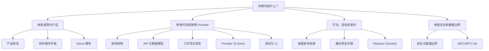

# 文档中心

这里汇总 AIGC 视频工作台的产品、工程、安全、测试和发布说明。README 负责快速理解项目，本目录负责回答“为什么这样设计”和“出问题时怎么办”。

## 按角色阅读

## 产品文档

- [English quick guide](../README.en.md)：英文产品介绍、Demo Quick Start、架构与文档入口。
- [创作操作手册](user-guide.md)：主题到导出的八阶段完整操作、失败修复和键盘操作。
- [产品导览](product-tour.md)：页面结构、典型路径、工作台信息层级与键盘操作。
- [Demo 演示脚本](demo-script.md)：五分钟无 Key 演示顺序与讲解重点。
- [已知限制](known-limitations.md)：当前明确不解决的场景和发布边界。

## 工程文档

- [贡献指南](../CONTRIBUTING.md)：环境、分支、TDD、无 Key 测试、提交与 PR 规范。
- [架构说明](architecture.md)：进程边界、数据流、状态机和发布结构。
- [API 参考](api-reference.md)：当前 `/api/*` 内部兼容接口、请求 ID、幂等与错误格式。
- [数据模型](data-model.md)：schema v3 ERD、检查点、快照、回收站、迁移和资产一致性。
- [工作流与崩溃恢复](workflow-recovery.md)：阶段记录、事件、幂等、重试与恢复算法。
- [Provider 与 Demo 指南](provider-guide.md)：能力注册、错误归一化、降级与扩展清单。
- [测试与 CI 指南](testing-ci.md)：测试分层、离线保证、CI 矩阵和复现方式。
- [故障排查](troubleshooting.md)：启动、端口、素材、FFmpeg、恢复和打包问题。

## 安全与发布

- [安全与数据边界](security-and-data.md)：凭证、Electron、SQLite、日志和备份威胁模型。
- [备份与恢复手册](backup-restore.md)：数据库、媒体目录、凭证排除和恢复后验证。
- [监控方案](observability.md)：本地日志、请求 ID、Sentry opt-in 和脱敏。
- [桌面发布指南](desktop-release.md)：Windows/macOS 打包、签名、公证、更新和卸载。
- [Release Checklist](release-checklist.md)：发布前自动与人工门禁。
- [素材与第三方许可](assets-and-licenses.md)：图片、字体、音乐、图标和截图授权说明。

## 推荐阅读顺序

第一次体验：

1. 根目录 [README](../README.md)；
2. [创作操作手册](user-guide.md)；
3. [产品导览](product-tour.md)；
4. [Demo 演示脚本](demo-script.md)。

第一次参与开发：

1. [贡献指南](../CONTRIBUTING.md)；
2. [架构说明](architecture.md)；
3. [API 参考](api-reference.md)与[数据模型](data-model.md)；
4. [工作流与崩溃恢复](workflow-recovery.md)；
5. [Provider 与 Demo 指南](provider-guide.md)；
6. [测试与 CI 指南](testing-ci.md)。

准备桌面发布：

1. [安全与数据边界](security-and-data.md)；
2. [备份与恢复手册](backup-restore.md)；
3. [桌面发布指南](desktop-release.md)；
4. [Release Checklist](release-checklist.md)。
