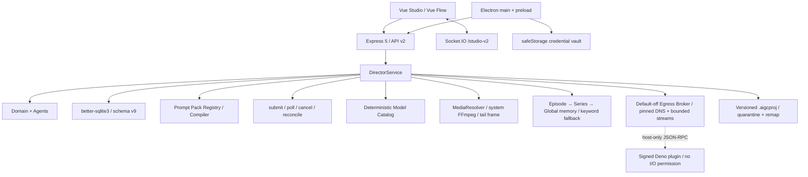

# 2.0 架构与能力边界

## 原则

1. `/studio` 是唯一产品界面；没有 Dashboard 或固定阶段页面。
2. 领域数据库是唯一事实来源；画布只保存位置与 viewport。
3. Agent 交换结构化计划和 Artifact，不执行开放式工具循环。
4. Provider、媒体和 IPC 输入先通过 Zod，再进入领域服务。
5. 高影响操作需要持久审批，任务先保存意图再执行。
6. Demo/Fake Provider 必须完整走通数据流且付费请求为 0。

## 三张领域图

- Story Graph 投影 Source、Chapter、Event 与 EventEdge。
- Production Graph 投影 Scene、Shot、Asset、Candidate 与任务。
- Delivery Graph 投影选定 Candidate、轨道、导出与恢复任务。

`GraphCommand` 是 discriminated union，当前支持节点移动、事件连接、Candidate 选择和实体归档。每个命令必须提供 expected revision 与 idempotency key。

## Agent 与 Prompt

唯一内置定义来源是 `@local/ai-video-director-prompt-pack@0.1.0` 的固定 Registry。用户 Prompt 和 Skill 以 schema v9 不可变 revision 存储；内置定义只能 fork，发布前必须通过变量/Schema 校验和 Fake Provider 黄金样例。编译顺序为：系统安全策略 → output schema → 身份/连续性锁 → 已批准事实 → 用户要求 → exact Skill 软策略 → Provider 渲染约束。每次计划签发时保存不可覆盖的 AgentRunCheckpoint，只固定 memory ID/hash/revision/采用原因和已批准 Artifact hash，不复制记忆正文。付费、删除、批量改写和导出不能绕过 Approval。

## 分层记忆

schema v9 将可重建的 `MemoryRecord`/`MemoryChunk` 与 canonical Source、Event、Artifact、Asset 和 Candidate 分开。索引仅接受已批准的故事事实、用户反馈和选定候选摘要，并保存 scope、source revision、hash 与 stale 状态。召回优先级是 Episode → Series → Global；每条结果返回来源和采用原因。AgentRunCheckpoint 将每次计划真正采用的记忆证据固定到 run/plan，不携带记忆正文。当前默认使用完全本地的关键词检索，ONNX 只有在用户明确请求、同意大小/许可证并通过固定 hash 后才可下载。禁用或删除记忆不会删除其 canonical source。Provider 插件版本、发布者信任与状态另行持久，不保存 bundle 源码、绝对路径或运行输出。

## 任务与恢复

任务保存 provider、model、idempotency key、PromptRun、model/profile snapshot、media order、独立 attempt、receipt、结果、错误和时间边界。CandidateBatch 记录数量、并发、来源、父批次和完成/失败计数；视频尾帧提取同样是可取消、可重启恢复的本地任务。Provider 已接收但 submit 超时时必须先 reconcile；状态未知的任务标记 orphaned，不自动再次提交。

## 出口 Broker 与插件边界

`EgressBroker` 将 `media-fetch`、`model-api` 和 `temporary-upload` 分成独立策略通道。当前三通道均默认关闭、host allowlist 为空，也没有执行任意 URL 的 HTTP API。启用后仍必须通过 HTTPS、方法、请求/响应大小、MIME、超时和 redirect 上限。每一跳都重新解析 DNS，所有结果均必须是公网地址，TLS 连接固定到已验证 IP 以缩小 rebinding 窗口。凭据不存在于 `EgressRequestDescriptor`，只由宿主 secret resolver 在运输边界注入。

自定义 Provider 必须使用锁定 Deno 2.9.2 的单文件 bundle、SHA-256 和受信 Ed25519 签名。启动命令明确 deny read/write/net/env/run/sys/ffi/import，关闭 prompt、config、更新检查与网络 import；JSON-RPC 单消息上限 64 KiB。宿主监督器不继承任意环境变量，对请求超时、输出/错误流上限、未知 response ID、异常退出和工具调用次数实施硬门禁；违规进程会被终止并进入 `quarantined`。插件发起的反向 RPC 仅允许 `broker.execute`，实际网络仍由宿主 Broker 二次校验和注入凭据；插件不会看到 secret。

按需运行时安装核心使用官方 Deno 2.9.2 固定资产目录，记录平台、压缩大小、URL 和 SHA-256。它逐跳限制到 GitHub HTTPS 资产域、流式限制大小并核对 hash，只接受包含一个预期可执行文件且无 symlink/加密/嵌套路径的 ZIP；精确版本探测成功后才将 staging 原子发布到版本目录。已有安装必须再次核对 receipt、二进制 hash 和版本。Systems 通过只读状态 API 展示平台、体积、安装阶段、字节进度和验证状态，下载要经过二次确认；进行中可以用独立精确确认取消，AbortSignal 贯通到下载/校验管线，重复取消返回稳定冲突而不伪造成功。默认网络门禁关闭时 UI/API 均在下载前拒绝，响应不包含 URL、staging 路径或 `executablePath`。测试只使用生成的 ZIP 与注入式探测器，没有下载或执行真实 Deno。真实隔离进程验收仍不开放。Deno 权限边界以[官方权限文档](https://docs.deno.com/runtime/reference/permissions/)为准。

## 当前延期项

- 真实 Provider reconcile/cancel/billing：需要明确授权、凭据和已有 task ID。
- ONNX 语义记忆模型下载：固定模型/revision/hash 与关键词降级已实现，下载管理和 embedding 索引仍未开放。
- Deno 自定义 Provider 工作台：固定 hash 运行时安装、脱敏进度 API、并发取消、发布者信任/撤销二次确认 UI，以及持久 installed/tested/enabled/quarantined 记录已实现；真实 Deno 进程验收仍未开放。
- 正式签名、公证和线上自动更新：需要外部证书与 Release。

## 项目可移植性

Studio 的备份/导入使用版本化 `.aigcproj`。导出从 canonical database 读取，不保存 API Key、Provider secret、日志或绝对路径。导入先在内存中验证 ZIP 中央目录、解压配额、manifest、Zod schema 和 SHA-256，媒体写入 staging；只在全部验证通过后才事务写入新项目并原子发布媒体目录。
