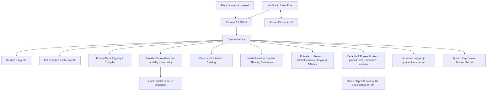

# 2.0 架构与能力边界

## 原则

1. `/studio` 是唯一产品界面；没有 Dashboard 或固定阶段页面。
2. 领域数据库是唯一事实来源；画布只保存位置与 viewport。
3. Agent 交换结构化计划和 Artifact，不执行开放式工具循环。
4. Provider、媒体和 IPC 输入先通过 Zod，再进入领域服务。
5. 高影响操作需要持久审批，任务先保存意图再执行。
6. Demo/Fake Provider 必须完整走通数据流且付费请求为 0。

## 三张领域图

- Story Graph 投影 Source、Chapter、Event 与 EventEdge。
- Production Graph 投影 Scene、Shot、Asset、Candidate 与任务。
- Delivery Graph 投影选定 Candidate、轨道、导出与恢复任务。

`GraphCommand` 是 discriminated union，当前支持节点移动、事件连接、Candidate 选择和实体归档。每个命令必须提供 expected revision 与 idempotency key。

## Agent 与 Prompt

唯一内置定义来源是 `@local/ai-video-director-prompt-pack@0.1.0` 的固定 Registry。用户 Prompt 和 Skill 以 schema v12 不可变 revision 存储；内置定义只能 fork，发布前必须通过变量/Schema 校验和 Fake Provider 黄金样例。编译顺序为：系统安全策略 → output schema → 身份/连续性锁 → 已批准事实 → 用户要求 → exact Skill 软策略 → Provider 渲染约束。每次计划签发时保存不可覆盖的 AgentRunCheckpoint，只固定 memory ID/hash/revision/采用原因和已批准 Artifact hash，不复制记忆正文。付费、删除、批量改写和导出不能绕过 Approval。

## 分层记忆

schema v12 将可重建的 `MemoryRecord`/`MemoryChunk` 与 canonical Source、Event、Artifact、Asset 和 Candidate 分开。索引仅接受已批准的故事事实、用户反馈和选定候选摘要，并保存 scope、source revision、hash 与 stale 状态。召回优先级是 Episode → Series → Global；每条结果返回来源和采用原因。AgentRunCheckpoint 将每次计划真正采用的记忆证据固定到 run/plan，不携带记忆正文。当前默认使用完全本地的关键词检索，ONNX 只有在用户明确请求、同意大小/许可证并通过固定 hash 后才可下载。禁用或删除记忆不会删除其 canonical source。

## 任务与恢复

任务保存 provider、model、idempotency key、PromptRun、model/profile snapshot、media order、独立 attempt、receipt、结果、错误和时间边界。CandidateBatch 记录数量、并发、来源、父批次和完成/失败计数；视频尾帧提取同样是可取消、可重启恢复的本地任务。Provider 已接收但 submit 超时时，canonical task 标记 `outcome_unknown` 并必须先 reconcile；对账仍无结论时进入 `needs_attention`，绝不自动再次提交。确定性的本地失败任务可在显式确认后创建新 child attempt，原失败记录保持不变。

Recovery Center 从 canonical snapshot 动态生成 authenticated 本地报告，检查 Shot→Candidate、Candidate→Media/Task 和 BoundaryFrame→Media。它可以批量调用现有 reconcile、定位实体，或在二次确认后用 GraphCommand 解除失效边界帧；不会另建恢复数据库，也不会自动重提 Provider。对外诊断包使用同一检查器但只输出实体 hash，避免把实际 ID 或私密项目内容交给支持人员。

自 schema v11 引入后，schema v12 继续为高风险写操作保留 append-only 安全审计：在执行前写入 `started`，完成后追加 `succeeded` 或 `rejected`。数据库 trigger 禁止修改和删除；事件只记录固定动作、目标类型、目标哈希、correlation ID 与稳定错误码，不复制业务正文、输入参数、路径或凭据。Studio 本地治理工作区只投影这组受限字段。

schema v12 扩展 `ProjectGenerationPolicy`：默认仍为 `demo-only`、预算 0；用户只有通过 `ENABLE_USER_FUNDED_PROVIDERS` 精确确认，才可切换为用户自付模式。`TaskAdmission` 在任务意图持久化前统一约束并发、单批候选、导出时长、网络门禁与剩余预算；客户端不能绕过服务端检查。

## Provider 连接、路由与出口边界

schema v12 新增 `ProviderConnection`、`ProviderRoutePolicy` 与 `ProviderCostLedgerEntry`。连接只允许三种协议：内置 `demo-local`、OpenAI-compatible HTTPS，以及严格 Schema 的声明式 HTTP manifest。声明式 manifest 只能描述固定路径的 submit/poll/cancel 和终态映射，不能携带脚本、任意 header 或运行时代码。

每个项目可按 text/image/video/audio 模态配置主连接、降级链、模型、最大尝试数和超时。路由只引用已就绪且声明相应能力的连接；`outcome_unknown` 不进入降级链，必须先对账，避免同一付费请求重复提交。每次接受或完成都会保留脱敏 receipt，成本写入不可变本地账本；Studio 不售卖额度，用户直接向 Provider 付费。

`EgressBroker` 仍将 `media-fetch`、`model-api` 和 `temporary-upload` 分成独立策略通道。每个连接生成精确 host 策略，通过 HTTPS、方法、请求/响应大小、MIME、超时和 redirect 上限；每一跳重新解析 DNS并拒绝非公网地址。凭据不存在于请求描述，只由宿主在运输边界从系统 Keychain/Credential Manager 或 Docker Secret 注入。

任意 JavaScript、Python 或 Deno Provider 适配器不属于生产架构。旧表只为历史迁移保留；HTTP 应用不初始化插件服务，所有 `/api/v2/provider-plugins*` 与 `/api/v2/provider-plugin-publishers*` 路径稳定返回 HTTP 410 `EXECUTABLE_PROVIDER_ADAPTERS_DISABLED`。

## 当前延期项

- 真实 Provider live verification：需要明确授权、测试凭据、预算和可安全对账的已有 task ID。
- ONNX 语义记忆模型下载：固定模型/revision/hash 与关键词降级已实现，下载管理和 embedding 索引仍未开放。
- 正式签名、公证和线上自动更新：需要外部证书与 Release。

## 项目可移植性

Studio 的备份/导入使用版本化 `.aigcproj`。导出从 canonical database 读取，不保存 API Key、Provider secret、日志或绝对路径。导入先在内存中验证 ZIP 中央目录、解压配额、manifest、Zod schema 和 SHA-256，媒体写入 staging；只在全部验证通过后才事务写入新项目并原子发布媒体目录。
