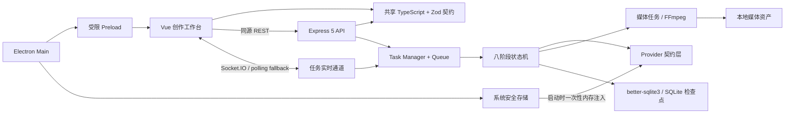
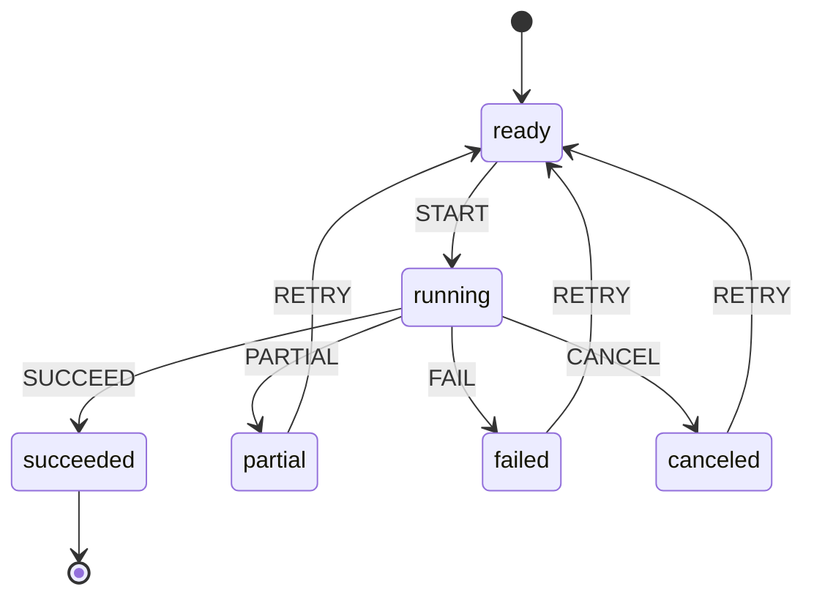

# 架构说明

## 运行边界

Electron 只负责系统能力、后端子进程、窗口、安全存储、更新与崩溃边界。Vue 不接触 Node API；Express 默认仅绑定回环地址。发布包使用 `better-sqlite3` + WAL/外键，`sql.js` 作为显式兼容驱动；Knex 仅用于编译 SQL，不建立第二数据库连接。数据库保存项目、资产引用和任务检查点，大文件保存在用户数据目录。

一方运行时代码以 TypeScript 为主。`packages/contracts` 提供不依赖 UI 或 Provider SDK 的 DTO、Zod schema、错误、任务、资产、模型与 IPC 契约；client/server 只通过包的构建产物消费。server 和 Electron 源码编译为 CommonJS 后运行，因此本轮没有同时改变既有模块加载语义。桌面准备链按 contracts、server、client、Electron 的顺序构建，Bytenode 只处理已经编译的 server JavaScript。

## 八阶段状态机

固定阶段为 `topic → script → storyboard → image → voice → subtitle → timeline → export`。每阶段保存 `status / attempts / progress / output / error / timestamps`，状态包括 `pending / ready / running / succeeded / partial / failed / canceled / skipped`。

阶段完成会解锁下一阶段。重试目标阶段时仅清空其下游检查点；上游输出、已有图片和配音继续复用。非法越级被状态机拒绝。

工作流检查点描述任务执行状态，`stage_artifacts` 描述项目内容事实。每个 artifact 保存 revision、input/payload hash 和上游 dependency snapshot；上游发布新 revision 时，下游 current artifact 转为 stale，而不是删除 payload。结构化脚本在 Provider 解析后和用户保存前都会通过同一 Zod 契约，并记录 prompt/schema/model 版本。

## 崩溃恢复与幂等

任务与完整 `meta.workflow` 同步写入 SQLite。启动时恢复器扫描 `pending / waiting / running / composing / interrupted`：只有 `recovery.mode=safe-auto` 的 Demo/local 任务按 `recovery.kind` 重建 runner；云或未知任务进入 `orphaned` 人工核对，避免 Provider 结果不明时重复计费。超过自动恢复上限的安全任务进入可诊断失败终态。

高成本入口的 `Idempotency-Key` 和请求指纹在进入 handler 前同步保存到 SQLite。相同请求可在重启后回放原响应；结果不确定的 pending 请求不会自动重提。

流水线的幂等策略：

- 脚本直接读取阶段输出；
- 分镜阶段成功后不再批量删除/重建 storyboard；
- 图片和配音检查已选资产与现有文件并跳过；
- 导出使用新的 export 记录与唯一文件名，失败临时文件会清理；
- 数据库写盘采用临时文件加原子 rename；schema 变更前保留最多五个迁移备份。

## Provider 与部分成功

Provider 契约把无密钥、超时、限流、异常响应和未知错误归一化，记录尝试链而不泄露凭证。主 Provider 失败可降级，全部失败可以产出明确标记的 placeholder。批任务使用 `Promise.allSettled` 语义保留成功项，失败项可单独重试。

ModelCatalog 从既有 ProviderRegistry 派生稳定模型 ID 和 adapter 静态能力；阶段路由、LLM、T2I 和 T2V 在网络调用前校验 model/modality/capability。T2V 首帧通过 MediaAdapter 解析受管媒体，瞬时 data URL 不进入任务快照或日志。

Demo Mode 在脚本、图片和配音入口先短路为本地实现，保证测试不会触达付费 Provider。FFmpeg 仍真实执行，以覆盖最终媒体边界。

## Electron 安全模型

- `contextIsolation=true`、`nodeIntegration=false`、`sandbox=true`、`webSecurity=true`；
- 默认拒绝 renderer 权限请求；外链只允许交给系统浏览器打开 HTTPS；
- preload 只暴露两个静态方法，IPC 校验来源端口、参数类型和返回路径；
- CSP、CORS、请求体限制、生成限流和请求 ID 在后端统一执行；
- API Key 由 `safeStorage` 加密，明文只存在于 Electron/后端进程内存；
- 日志、错误响应、任务错误和 Sentry 事件都经过凭证清理。

## 发布与可观测性

GitHub Actions 在 Linux 执行全质量门禁，在 Windows 生成 unsigned 预检包、在 macOS 生成可校验但不受 Gatekeeper 信任的 ad-hoc 预检包。正式 tag 工作流从 GitHub Secrets 注入签名/公证凭据，输出安装包、blockmap 和更新清单。Sentry 是显式 opt-in；本地 crash dump 与 `logs/backend.log` 在无 DSN 时仍可用于离线诊断。

继续阅读：[升级审计与路线](architecture/short-video-upgrade.md)、[Toonflow clean-room 转型](toonflow-clean-room-analysis.md)、[内部 API 参考](api-reference.md)、[schema v9 数据模型](data-model.md)、[工作流与崩溃恢复](workflow-recovery.md)、[备份与恢复手册](backup-restore.md)。
