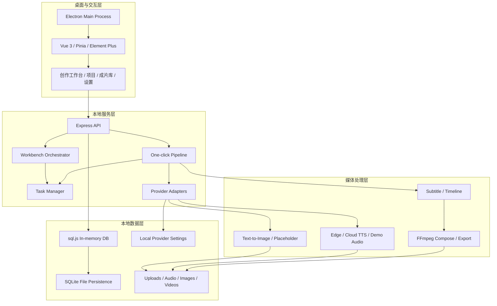
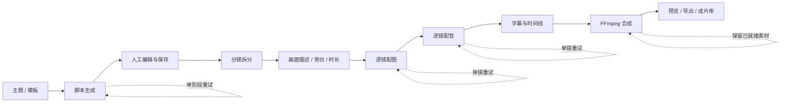
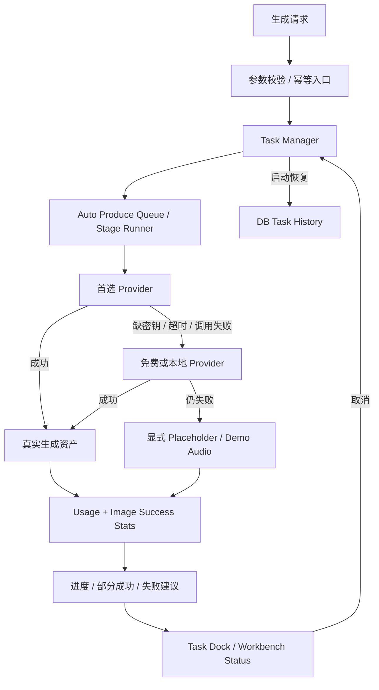
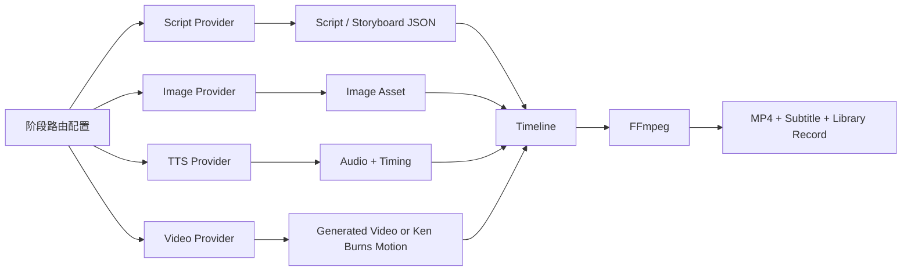
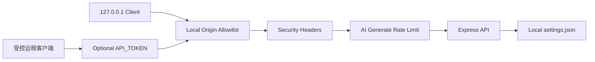

# 架构说明

## 1. 本地优先运行结构

后端不是远程 SaaS 中台，而是面向单机桌面应用的本地服务。`sql.js` 在内存中执行数据库操作，再节流写回 SQLite 文件；大型图片、音频和视频保留为文件资产，数据库只维护业务状态与路径。

## 2. 从主题到成片的流水线

把链路拆成可保存、可回退的阶段，是为了避免某一步失败后整条视频从头生成。分镜是核心中间态：画面、配音、字幕和合成都围绕稳定的 storyboard id 工作。

## 3. 任务、降级与可观测性

- 占位图不计入真实生图成功率，接口和报告会区分 `success` 与 `placeholder`。
- 批量任务允许部分成功；已完成素材保留，失败镜头可以单独重试。
- Task Manager 将历史状态写入数据库，启动时恢复记录，并限制历史与操作日志数量，避免本地数据库无限膨胀。
- `DEMO_MODE` 的目标是可复现验收，不代表外部模型真实质量。

## 4. 模型路由与媒体处理

各阶段 Provider 使用统一适配层，便于按成本、可用性和质量分别路由。FFmpeg 是最终确定性媒体处理边界，负责探测、音画拼接、字幕、转场、混音与导出。

## 5. 安全边界与取舍

当前产品没有多用户账号体系，默认只监听本地。`API_TOKEN` 适合受控桌面或远程客户端的统一保护，但不能替代公网多租户身份认证；如需公网部署，仍需要 HTTPS、网关鉴权、用户与权限模型以及集中式任务队列。
