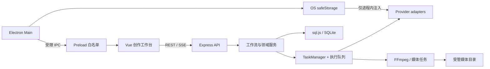
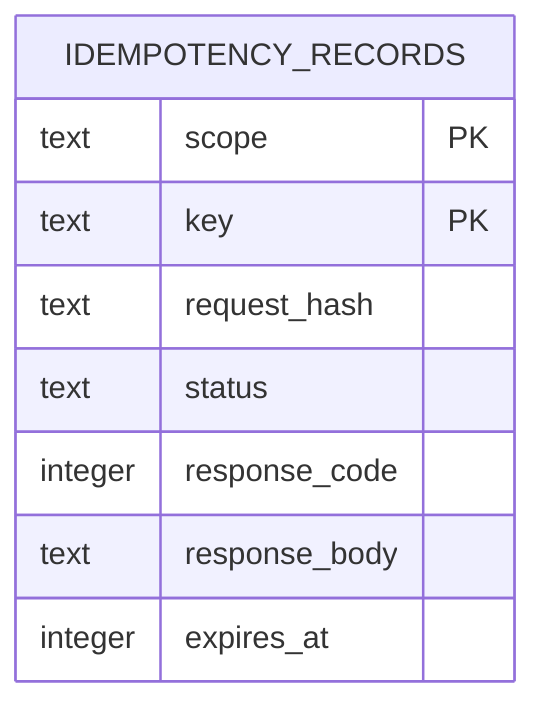
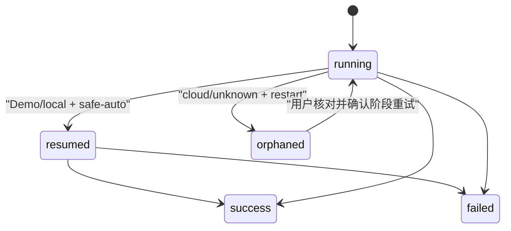

# AI 短视频平台升级审计与实施路线

> 审计与实施基线：2026-07-14；TypeScript 实施状态更新：2026-07-15
> 目标仓库分支：`codex/aigc-video-desktop-hardening`
> 本批实际使用知识库：`open-source-feature-knowledge-base@fdc96883bd762e4143a77b4270114d05ab208823`；交付前本地知识库已前进到 `59facd4a168fa23eba9391061daeb112151dbc2a`，本轮没有修改知识库。早期 TypeScript 迁移规划使用过 `15f11275d5d161d435c859079825fcdfaff49006`。

本文记录本轮升级的源码事实、差距、采用边界和持续实施状态。它不是未来能力宣传页；“已实现”必须有当前仓库代码和测试支持，“计划”不等于完成。

## 1. 升级前技术栈与运行边界

| 层 | 升级前实现 | 升级前源码入口 |
| --- | --- | --- |
| Web | Vue 3、Vite、Pinia、Element Plus、Vue Router | `client/src` |
| API | Express 4、Zod 请求校验 | `server/app.js`、`server/routes` |
| 数据 | sql.js 运行 SQLite、原子临时文件替换 | `server/db/index.js` |
| 长任务 | 持久化 TaskManager、内存执行队列、八阶段状态机 | `server/services/taskManager.js`、`autoProduceQueue.js`、`workflowStateMachine.js` |
| AI/媒体 | Provider 注册表、LLM/T2I/T2V/TTS 适配器、FFmpeg | `server/services/providers`、`pipeline.js`、`video.js` |
| Desktop | Electron main/preload、safeStorage、electron-builder | `electron/main.js`、`electron/preload.js`、`package.json` |
| 质量 | Node test、Vitest、Demo acceptance、GitHub Actions | `server/test`、`client/src/**/*.test.js`、`.github/workflows` |



升级前已经具备可工作的无 Key Demo、真实 FFmpeg 导出、阶段状态、项目/分镜/候选图片、系列与角色连续性、部分成功、任务查询、恢复点、回收站、备份恢复、Electron 安全边界和 CI。后续改造必须在这些基础上演进，不能机械重写。

### 1.1 TypeScript 转型后的当前架构

本轮采用渐进迁移，没有同时引入高风险的 ESM 切换：Vue、Express 和 Electron 源码使用 strict TypeScript；server 与 Electron 的发布产物仍为 CommonJS JavaScript。HTTP 路径、响应字段、数据库既有字段和 Electron renderer 能力保持兼容。

| 层 | 当前实现 | 源码/产物边界 |
| --- | --- | --- |
| 共享契约 | TypeScript + Zod；ESM/CJS 双产物和声明文件 | `packages/contracts/src/index.ts` → `packages/contracts/dist` |
| Web | Vue SFC `lang="ts"`、typed API/Pinia/router/composable | `client/src` → `client/dist` |
| API/领域 | strict TypeScript；外部输入 Zod 校验；数据库行显式映射 | `server/**/*.ts` → `server/dist/**/*.js` |
| 数据 | schema v9；`better-sqlite3` 发布驱动、sql.js 回退、Knex SQL 编译 | `server/db/index.ts`、`runtimeDriver.ts`、`queryBuilder.ts` |
| 实时 | Socket.IO 稳定任务事件；连接失败时有上限 polling fallback | `server/services/taskRealtime.ts`、`client/src/api/taskRealtime.ts` |
| Desktop | typed main/preload/telemetry 与 Zod IPC 参数校验 | `electron/*.ts` → `electron/dist/*.js` |
| 质量 | `tsc`、`vue-tsc`、ESLint、类型覆盖率、Node test、Vitest | 根 `package.json`、`.github/workflows` |

TypeScript 覆盖率门禁按一方运行时代码的非空行计算，忽略测试、构建脚本和编译产物。2026-07-15 最新实测为 `41367 / 41367 = 100.00%`，超过本轮不低于 95% 的目标；`client/src`、server runtime 与 Electron source 已无需要豁免的 `.js` 业务源码。仍保留的 JavaScript 仅限测试、构建/验收脚本及 TypeScript 编译产物，不作为未迁移运行时源码统计。

桌面准备链固定为 `contracts build → server compile → client build → Electron compile → Bytenode 处理已编译 server JavaScript`。发布包不以 TypeScript 源码作为运行入口。

## 2. 实测基线

所有 Provider Key 均显式清空，`DEMO_MODE=1`，没有调用真实付费模型。

| 命令 | 升级前结果 | 说明 |
| --- | --- | --- |
| `npm run quality` | 通过 | server 57 项：56 pass、1 skip；client 7 项通过；生产构建通过 |
| `npm run test:smoke`（包含于 quality） | 通过 | API smoke、重启恢复、失败后阶段重试、有效 MP4 |
| `node scripts/security-check.mjs` | 通过 | 扫描 276 个 tracked/untracked 源文件 |
| `npm run security:audit` | 通过 | root/server/client production dependency 均为 0 vulnerability |
| `npm run electron:preflight` | 通过 | ASAR、sandbox、IPC、权限、图标、桌面产物边界通过 |

已知非阻塞基线：升级前 Vite 的 Element Plus 相关 JS chunk 为 1,026,198 bytes、CSS 为 356,008 bytes。本轮组件直达入口与 shell/workbench 分包后最大 JS 约 250 KB（下降约 75.6%）、CSS 约 199 KB（下降约 44.1%），构建无循环 chunk、无超限告警，首屏不预加载 workbench chunk。

2026-07-14 最新门禁：独立 `server npm test` 为 89/89；`npm run quality` 中 server 为 88 pass + 1 个仅因该进程未设置临时 `SETTINGS_FILE` 而跳过的凭证写入测试，client 为 7 个文件 13/13，Demo 重启恢复/阶段重试/有效 MP4 与生产构建均通过；安全源码扫描覆盖 296 个 tracked/untracked 源文件，三套 production audit 均为 0 vulnerability；桌面预检编译 79 个后端模块并完成 macOS arm64 ad-hoc 临时打包。

2026-07-15 当前门禁：在显式清空 Provider Key 且 `DEMO_MODE=1` 的环境中，`npm run quality` 全部通过；contracts 6/6，server HTTP/JavaScript 84 pass + 1 个因测试进程没有隔离 `SETTINGS_FILE` 而 skip、server TypeScript 29/29，client 16 个文件 42/42，Demo 重启恢复、失败后新 attempt 单阶段重试、有效 MP4 与 client production build 均通过。独立 server 全量运行为 85/85 + TypeScript 29/29。`node scripts/security-check.mjs` 扫描 355 个 tracked/untracked 源文件，root/contracts/server/client 完整 `npm audit` 均为 0 vulnerability，FFmpeg smoke 通过。`npm run pack` 编译 89 个 server 模块，Electron 40.10.6 + better-sqlite3 arm64 预检全部通过并成功生成 macOS arm64 ad-hoc 目录包；脚本验证最终包不含 TypeScript、sourcemap、Electron 示例应用或用户数据，隔离 userData 启动并优雅退出通过，没有发布证书时公证按预期跳过。

## 3. 源码审计结论

### 3.1 产品和前端

- `Projects.vue` 可以创建普通项目和一键成片项目；一键成片返回持久化任务 id。
- `Script.vue` 支持主题润色、脚本/分镜生成、逐镜编辑、增量 reconcile、Story Bible 和角色设定。
- `Images.vue` 已支持每个分镜多个图片候选、选择、参考图、批量生成、部分失败重试和连续性质检，不应另建平行候选页。
- `Preview.vue` 负责配音、字幕、时间线、预览和真实 FFmpeg 导出。
- `TaskDock.vue` 跨页面展示任务、Provider、阶段、诊断、取消和重试。
- 页面文件仍偏大：`Preview.vue`、`Images.vue`、`Projects.vue`、`Script.vue` 混合了数据获取、编排和展示；应在行为测试保护下渐进拆分。
- 组件/源码契约测试现已覆盖 i18n、路径脱敏、typed API、候选评审、项目/分镜键盘入口和窄屏核心路径；复杂时间线拖拽与真实媒体播放器仍缺少完整组件级自动化。

### 3.2 阶段工作流

当前固定阶段为：

```text
topic → script → storyboard → image → voice → subtitle → timeline → export
```

升级前的 `workflowStateMachine.js` 为每阶段保存状态、尝试次数、进度、输出摘要、错误和时间戳，`pipeline.js` 会跳过已有脚本检查点、已选图片和已有音频；两者现已等价迁移为 `.ts`。图片/配音仍按镜头保留成功项，因此它是持续使用的恢复基础。

升级前有三项关键差距；本轮已用 StageArtifact、持久幂等和 Provider reconcile 处理主要路径，下列边界作为决策背景保留：

1. 阶段输出只是任务 `meta` 中的摘要，没有独立的 artifact revision、dependency revision 和 stale 传播；
2. 上游变更后的下游处理偏向“重置记录”，没有保留可比较的旧产物版本；
3. 云 Provider 请求的“已受理但本地未保存结果”窗口不能靠跳过已有资产证明幂等。

### 3.3 数据与迁移

- 项目、分镜、图片候选、导出、章节、系列、Story Bible、角色、角色参考图、连续性检查、任务、快照和回收站均持久化在 SQLite。
- 媒体文件与结构化元数据分离，数据库保存受管路径引用，没有把大型 base64 媒体嵌入项目 JSON。
- 写盘使用 `database.sqlite.tmp` + rename，迁移前最多保留五份数据库备份。
- 升级前 schema v3 的任务核心字段集中在 `meta/result` JSON；尚未形成可查询的 canonical GenerationTask 列。
- 旧实现遇到未来 schema 只告警后继续打开，存在旧程序改写新数据的风险。

### 3.4 资产与连续性

现有实现已经包含系列、Story Bible、角色稳定 id、角色参考图和镜头角色绑定，并用 `promptCompiler` 生成上下文 hash 和缓存键。这是 reference-first consistency 的可用基础。

升级前差距是（通用资产领域/API 已在后续 P2 落地）：

- 资产模型只覆盖角色为主，Scene、Prop、Style 没有统一 AssetUnit；
- 参考资产没有明确 Variant、Revision、selectedVariant 和归档语义；
- 镜头任务没有保存不可变的 AssetBinding/MediaReference 快照；
- 当前会为普通项目自动创建 Series，尚未完整表达“独立 Project + 可选 Series/Episode”；
- 没有 Episode > Series > Global 的显式分层解析器。

### 3.5 Provider 与模型

- Provider 注册表、凭证仓库和 T2I/T2V/TTS/LLM 适配器已存在，应抽取并补强，不另建第二套路由体系。
- `providerContract.ts` 覆盖无密钥、超时、限流、异常格式、fallback、placeholder 和 batch partial；实际 adapter 已统一到 typed Provider 契约，个别旧外围服务仍待迁移。
- 模型能力仍主要分散在静态注册表与 UI，尚无独立、可校验的 capability catalog。
- Provider-specific payload 已部分收敛到 adapter，但下载、轮询、错误解析和重试仍有重复实现。

### 3.6 安全

已确认存在的保护：

- Electron `contextIsolation=true`、`nodeIntegration=false`、renderer sandbox、默认拒绝权限；
- preload 只有语言同步和目录选择两个静态方法，main 校验 sender；
- API 默认仅绑定 `127.0.0.1`，CORS 使用本地白名单，可选 API Token；
- Provider Key 通过 Electron safeStorage 保存，前端只得到掩码；
- 图片/BGM 上传具有大小、MIME、magic bytes 和随机文件名校验；
- 错误、任务和遥测经过凭证脱敏。

升级前由源码确认的风险：

- 升级前幂等记录只存在内存 5 分钟，进程退出后丢失；
- 升级前启动恢复器会自动重跑所有已知任务类型，云任务存在重复计费窗口；
- T2I/T2V/Dreamina/Pollinations 的远程结果下载各自实现跳转，未统一限制私网、DNS 解析、跳转次数、MIME 和最大下载量；该风险已在本轮 P0 中修复，见第 7 节；
- `express.json` 当前全局上限为 50 MB，普通 JSON API 可进一步按路由收紧；
- 前端构建仍支持 `VITE_API_TOKEN`，远程部署时会把 token 放入静态产物；本地桌面不依赖它，但它不是多租户安全方案。

### 3.7 发布与许可证

- GitHub Actions 已覆盖 Linux quality/security/FFmpeg/desktop prepare，并在 macOS/Windows 做打包预检。
- release workflow 对正式签名凭据做显式检查，未配置时只能产出 internal preflight 包。
- 应用图标、主视觉和恢复概念图登记为本项目原创；Inter 字体为 SIL OFL 1.1。
- `ffmpeg-static` 的实际 LGPL/GPL 义务取决于分发构建与编解码器，商业发行前仍需单独复核并生成 SBOM/NOTICE。
- 用户上传素材、Provider 输出、模型权重和服务条款不因本仓库 MIT 许可证自动获得商业授权。

## 4. 差距矩阵

| 能力 | 当前实现 | 成熟度 | 参考知识 | 用户价值 | 风险 | 成本 | 动作 | 优先级 | 验收方法 |
| --- | --- | ---: | --- | --- | --- | --- | --- | --- | --- |
| 重启与重复计费安全 | 持久任务/幂等/attempt；reconcile 与 orphan 语义已落地 | 88% | durable task lifecycle | 极高 | 极高 | M | harden | P2 | 重启后同 key 回放；云任务不自动重提 |
| 数据版本与迁移 | schema v9、迁移备份、未来版本拒绝、双驱动奇偶测试 | 94% | local-first persistence | 极高 | 高 | S | harden | P2 | v3→v9、幂等迁移、未来版本拒绝 |
| 结构化脚本契约 | 已完成 v1 Zod 契约、Prompt/model/input hash 与脱敏诊断 | 75% | structured breakdown、phase contract | 极高 | 中 | M | harden | P1 | Provider/可编辑输入双重校验、局部更新 |
| 阶段产物 revision/stale | schema v5 已保存 revision/dependency/stale；细粒度依赖仍需扩展 | 70% | phase-contract pipeline | 高 | 中 | L | harden | P1/P2 | 上游修改只标 stale，历史不删除 |
| 端到端 Demo | 无 Key 八阶段 + 真 MP4 | 85% | durable human review loop | 极高 | 低 | S | keep/harden | P1 | smoke、重启、阶段重试、有效 MP4 |
| 候选评审 | 稳定 Candidate ID、选择保护、收藏/归档、生成来源、键盘 | 82% | multi-candidate review | 高 | 中 | M | harden | P2 | 选择不覆盖、引用中不可删、HTTP/UI 契约测试 |
| 统一资产模型 | Character 兼容层 + 通用 AssetUnit/Variant/Binding；Scene/Prop/Style 领域/API 已落地 | 78% | layered asset resolution | 高 | 中 | L | harden | P2 | revision 迁移、快照绑定、引用保护 |
| ModelCatalog | 已从现有 Registry 派生静态能力目录并接入 fail-fast | 75% | capability metadata routing | 高 | 中 | M | harden | P2 | capability fail-fast 契约测试 |
| MediaAdapter | 输出安全下载 + T2V 受管首帧 resolver 已统一 | 65% | provider-aware media resolution | 高 | 高 | M | harden | P0/P2 | SSRF、redirect、MIME、size、timeout 测试 |
| Provider 错误统一 | 契约层存在，adapter 使用不齐 | 55% | adapter routing | 高 | 中 | M | harden | P2 | 稳定 code/retryable/attempt chain |
| 页面架构与 UX | 工作台可用但页面过大 | 55% | phased director workspace | 高 | 中 | L | refactor | P2 | 组件测试 + Browser 核心路径 |
| 性能与观测 | 缓存/并发/日志/Sentry 基础 | 55% | durable loop | 中 | 中 | M | harden | P3 | bundle、轮询、缩略图、耗时基线 |
| 出口代理隔离 | 未实现 | 10% | BigBanana topology | 中 | 中 | L | inspiration-only | P3 | 本地/Provider 出口策略测试 |

优先级调整说明：`MediaAdapter` 原本可放 P2，但当前远程下载存在明确 SSRF/无界下载边界，因此安全校验部分提前到 P0；完整 capability routing 仍留在 P2。

## 5. 参考项目采用边界

### BigBanana AI Director

固定版本 `4a61f6c91964819ed2d4e46911c399811c5545d7` 不包含可见产品源码，使用非 OSI Community License。本项目只把“按能力隔离 Provider 出口代理”和“媒体访问边界”作为部署拓扑灵感，采用方式为 `inspiration-only` / clean-room reimplementation；不复制代码、README、截图或资源，也不把容器行为描述为产品源码事实。

### CineGen ShortDrama

固定版本 `e0f620bfd3c1e212b8e3ca2374577f4b0d70a053` 的四阶段工作区、结构化脚本、角色/场景参考和本地草稿体验可作为产品交互参考。其自定义许可证商业条款有歧义，且原型没有本项目所需的后端持久任务与测试，因此采用方式为 `reimplement`，不复制 Prompt、样式、代码或资源。

### LumenX

固定版本 `743683387384fb1d9fff72038933e7249d416076` 的根代码为 MIT。适合借鉴 catalog/registry/media resolver/task snapshot/candidate selection 等抽象；本项目优先适配概念到现有 Express/Vue/SQLite 架构，不复制不需要的实现。其捆绑 FFmpeg、字体、图片、图标、模型和演示素材没有被根 MIT 自动覆盖，默认不复用。

### Toonflow

固定版本 `bc61ec7a1b5df31293b286981a5f4ad4635464ee` 的可读服务端是 TypeScript + Express + Socket.IO + SQLite/Knex + Electron，但前端主要是大型编译 bundle，细粒度 UI 源码不可同等审计。根 LICENSE 在 Apache-2.0 文本后附带限制性补充协议，因此本项目只独立重新实现可视化制作、专业阶段、skill 渐进披露、计划审阅、能力目录和候选选定等思想。不复制代码、Prompt、CSS、编译 UI、品牌或资源，并明确避免默认凭据、wildcard CORS、query token、明文 secret 和 `vm2` Vendor 代码运行时。详见 [Toonflow clean-room 审计](../toonflow-clean-room-analysis.md)。

## 6. 分阶段实施路线

### P0：数据与计费安全

1. 持久化 Idempotency-Key、请求指纹和回放响应；pending 意图在 Provider 调用前同步落盘。
2. 恢复策略区分 `safe-auto` 与 `manual-reconcile`；结果不确定的云任务进入 `orphaned`，保留诊断和人工确认入口。
3. schema 迁移测试覆盖旧库、重复迁移、未来版本和原数据保留。
4. 抽取安全 RemoteMediaFetcher，覆盖 SSRF、DNS、重定向、大小、MIME、超时和原子文件写入。
5. 为任务建立清晰 attempt 血缘，重试不覆盖失败证据。

### P1：结构化阶段契约与核心闭环

1. 将脚本模型输出约束为版本化 Zod schema，保存 prompt/model/schema version 和输入 hash。
2. 抽取 StageArtifact，记录 revision、dependency revision、状态与 stale 原因。
3. 脚本局部编辑只标记受影响镜头/资产 stale；旧候选和导出保留。
4. 用 Mock/Demo Provider 验证剧本→分镜→候选→选择→任务恢复→导出的完整数据流。

### P2：资产、候选与 Provider 可替换性

1. **Character 已完成**：在现有角色体系上抽取 AssetUnit/Variant/Revision/Binding，不平行重建。
2. **工作台闭环已完成**：Character/Scene/Prop/Style/Voice/Music、Episode > Series > Global、Series→Episode fork、受管媒体 Variant、默认选择、镜头快照绑定、批量改绑、引用保护归档、键盘和窄屏路径均已落地。
3. **已完成基础闭环**：ModelCatalog 从现有 ProviderRegistry 派生静态能力，阶段路由与 LLM/T2I/T2V fail-fast；输入 MediaAdapter 已接入 T2V 首帧，输出继续统一走 RemoteMediaFetcher。对象存储 resolver 和短期签名 URL 仍待实施。
4. **已完成基础闭环**：候选有任务来源、输入快照、收藏/归档、选定保护和键盘操作；并排对比大图仍可继续优化。
5. **进行中**：在行为测试保护下持续拆分大页面与大服务。

### P3：性能、可观测性与发布体验

1. 按路由拆分 chunk、缩略图和媒体懒加载，记录 bundle 与首屏基线。
2. **实时通道已完成**：Socket.IO + 有上限 polling fallback；任务背压指标仍待增加。
3. 完善 Sentry release/source map、离线崩溃包和诊断导出。
4. 评估按 Provider 能力隔离出口代理；没有明确部署需求时不增加复杂度。

## 7. 已完成的 P0 垂直切片

### schema v4→v5 与持久化幂等



- 相同 scope/key 但请求体不同：`409`，拒绝误复用；
- 首次请求：写入 `pending` 并立即 flush，再进入 handler；
- 成功：保存状态码和响应，24 小时内跨进程回放；
- 失败响应：删除占位，允许修正后重试；
- 进程在远端结果不明时退出：保留 pending，返回可行动的“先核对”提示，不自动重放。

### 安全恢复



- Demo/local-safe 任务继续自动从检查点恢复，保持既有体验；
- 云/未知任务不再启动时静默重提，进入 `orphaned`；
- TaskDock 和历史页显示“结果待核对”、诊断建议和费用风险确认；
- `orphaned` 纳入稳定任务事件、Socket.IO/polling fallback、任务清理和终态判断。

### Attempt 血缘

- 阶段重试创建新的 task id，并保存 `retry_of` 与递增的 `attempt`；
- 原失败/partial/orphaned 任务保持终态和错误证据，不再被后续成功覆盖；
- `orphaned` 重试必须同时通过 UI 确认和服务端 `confirm_uncertain_outcome` 校验；
- 生成类 retry 入口也使用持久化 Idempotency-Key。

### 迁移保护

- v3 可直接自动升级到当前 v9，迁移前创建数据库备份；
- 重复初始化保持 v9，不重复迁移、重排 revision 或创建多余备份；
- 高于当前程序的未来 schema 直接拒绝打开，不改写原文件。

### 远程媒体边界

T2I、T2V、Dreamina 和 Pollinations 的 Provider 输出统一经过 `RemoteMediaFetcher`：

- 只接受不含 URL credentials 的 HTTP/HTTPS；
- DNS 全量解析结果中只要包含 loopback、private、link-local、CGNAT、保留地址或 metadata 地址即拒绝；
- 请求使用已验证 IP 的 pinned lookup，HTTPS 仍校验证书与原 hostname，降低 DNS rebinding 风险；
- 每次 redirect 都重新解析和校验，最多四次；
- 图片默认最大 50 MB，视频 adapter 当前最大 512 MB，并同时检查 `Content-Length` 和实际流量；
- MIME 与 magic bytes 必须匹配，流式写入唯一 `.part` 文件，`fsync` 后原子 rename；
- 失败会清理临时文件，Provider 签名 URL、query 和原始 CLI 输出不再进入前端结果或日志。

输入侧 `MediaAdapter` 已校验模型 `image_to_video` 能力，并把受管 `/uploads/` 图片按 9 MB 上限、magic bytes 和 content hash 解析为瞬时 data URL；持久化快照不含 base64、绝对路径或查询参数。对象存储上传、短期签名 URL 和更多 Provider 输入形态仍属于后续 P2。

## 8. 已完成的 P1 结构化阶段契约切片

### 结构化脚本 v1

- `scriptContract.ts` 用 Zod 约束标题、摘要、语言、风格、Story Bible、角色、章节和分镜；每镜支持对白、动作、图像/视频/负面 Prompt、角色引用和原文范围；
- Provider JSON 在解析后立即校验；用户在 Script 工作台编辑后，`reconcile` 在写库前再次校验；
- 保存 `schema_version=1.0.0`、`prompt_version`、稳定 input hash 和实际 Provider/model；用户手工 Prompt 不被模型默认值覆盖；
- 异常结构使用 `SCRIPT_OUTPUT_INVALID`，只返回字段路径和不可逆 diagnostic hash，不回显 Provider 原始响应；
- Demo/local-template 与云 Provider 使用同一契约，测试不通过特殊宽松分支。

### StageArtifact 与 stale

schema v5 新增 `stage_artifacts`。同阶段相同 input/payload/dependency 幂等复用 revision；新 revision 将旧同阶段标为 `superseded`，将下游 current 标为 `stale`。自动生产发布 script、storyboard、image、voice、subtitle、timeline、export，手工保存发布 script/storyboard。

脚本改稿不再删除变化镜头的旧图片或物理文件，也不清空 `selected_image_id`。旧候选保存 `stale=1 / SCRIPT_CONTENT_CHANGED`，镜头保存 `assets_stale=1`；画面工作台展示待复查提示，明确选择旧候选时二次确认。删除整个镜头仍属于用户显式删除操作，会按既有逻辑清理其资产。

### 本切片兼容边界

- schema v3 可直接幂等迁移到 v9；旧 Character 参考图回填 revision/selected/MediaReference 并投影为通用 AssetUnit/Variant，旧已选 Candidate 回填 selected_at；v9 additive 增加 lineage、字段 stale 与 Prompt revision，未来 schema 继续 fail safely；
- `/api/projects/:id/artifacts` 为内部兼容只读接口，默认不回传完整 payload；
- 现有项目/分镜/图片 API 保持原路径，新增字段为加法；
- `/storyboards/batch` 的显式整体替换仍保留旧语义，主工作台已使用安全的 `reconcile`；后续需为该兼容入口增加明确替换确认。

## 9. 已完成的 P2 分层资产与 Candidate 评审切片

- 没有新建平行资产系统：`character_assets` 增强为带稳定 key、revision、selected、parent、Provider/model 和 MediaReference 的 Variant；
- `storyboard_asset_bindings` 保存镜头实际使用的 Variant revision 不可变快照，角色默认版本变化不会静默污染旧镜头；
- `images` 增强为 Candidate，记录 task/Provider/model、脱敏输入快照、媒体引用、候选血缘、收藏和归档；
- Candidate 选择使用独立 API，不再把整个分镜对象回写；当前选中项和被 Variant 引用项都无法物理删除；
- 画面工作台显示作用域、revision、Provider/model/task，支持收藏、归档、恢复、Enter 选用和 `F` 收藏，窄屏保留核心路径；
- 独立视觉资产工作台支持创建 Scene/Prop/Style、从受管媒体建立 Variant、切换默认 revision、绑定指定镜头和查看影响数量；Enter/B/Delete 提供完整键盘路径；
- Character 继续使用旧数字 ID；通用资产绑定使用稳定 AssetUnit 字符串 ID。历史负数 surrogate 在 API 投影层归一化，不要求破坏性迁移；
- schema v5→v7 用真实 legacy 行验证幂等回填，URL query/fragment 不进入 MediaReference。

当前边界：Character 保持兼容 API；schema v9 的 `/api/assets` 已覆盖 Scene/Prop/Style/Voice/Music、显式 fork、批量改绑和引用影响查询。真实系列规模下的批量操作性能和复杂影响提示仍需发布前数据集验证。

## 10. 关键架构决策

1. **保持 API 兼容**：Idempotency-Key 仍为可选；旧客户端可以工作，但高成本入口的当前 Vue 客户端会发送该 header。
2. **结果不确定时 fail closed**：无法确认云任务状态时不自动重提，用户可以核对后显式继续。
3. **Demo 是安全恢复特例**：Demo 不调用付费 Provider，允许 `safe-auto`；不能把该结论外推到云模型。
4. **不建立第二套任务/资产系统**：后续 canonical fields、artifact revision 和资产 variant 都在现有表与服务上演进。
5. **许可证决定采用方式**：BigBanana/CineGen 只 clean-room 重实现思想；LumenX 仅在目标抽象合适且资源授权明确时适配。

## 11. 当前未验证与后续风险

- schema v7 已将 `provider_task_id/provider/model/attempt/parent_task_id/idempotency_key/timeout/retryable/cancel_state/input_snapshot/media_snapshot/correlation_id` 提升为任务列；adapter 支持查询时会只读 reconcile，缺 ID、不支持查询或返回未知状态时进入 `orphaned`，不会重新提交。真实付费 Provider 的线上状态组合仍未验证。
- Retry 已创建新 attempt 并保留父任务；当前对账是任务表内字段和事件，不是独立的 Provider 账单对账表。
- 结构化脚本 v1 已覆盖当前核心字段；Prompt revision、行级 diff、恢复为新 revision 和逐场景 Demo 重生成已落地。真实 Provider 局部重生成仍需各 Provider 的线上能力与费用验收。
- Provider 输出远程下载的 SSRF/redirect/size/MIME 加固已完成；T2V 本地/公开 URL 首帧已有 provider-aware resolution，对象存储与 T2I 原生参考图仍未实现。
- 通用 AssetUnit/Variant/Binding、Episode > Series > Global、Series fork、Voice/Music 工作台、批量改绑和字段级 artifact stale 已落地；真实大项目性能与跨集影响可理解性仍待验证。
- Computer Use 已用隔离 userData 真实验证最新 Electron 40 包启动、项目创建、无 Key 结构化剧本生成/分镜保存、草稿预览、macOS 系统目录选择器路径导航和“打开”确认，并收到“目录已选择并可写”结果。完整成片 MP4 导出由同次 `npm run quality` 的隔离 Demo acceptance 实际执行；不把未在该手工项目中点击的导出按钮写成 Computer Use 导出成功。
- 桌面实测产生的 MP4 为 32.03 秒、1920×1080、30 fps、H.264 High + AAC，428407 bytes；使用项目内 `ffmpeg-static` 完整解码到 null sink 成功。
- Browser Control 已用隔离数据库验证空状态、Demo 结构化脚本、两次候选生成、既有选择不被覆盖、`F` 收藏、Character Variant/镜头 Binding、服务重启后恢复、归档/恢复和 700px 窄屏入口；新增 Scene 资产→受管媒体 Variant→`B` 键绑定镜头→受引用归档 409，并在 640×720 验证布局堆叠。模型设置页另验证了静态能力标签、CogVideoX 路由切换/保存且未触发 Provider 请求；控制台均未出现 error/warn。
- 正式 macOS Developer ID、公证和 Windows 受信任签名需要发布者证书，当前只能验证配置与 unsigned/ad-hoc 预检。

## 12. 测试策略

每个垂直切片遵循：先写失败测试，再实现，再运行目标测试、server/client 全量测试、安全扫描、生产构建和相应 UI/桌面实测。

P0 新增/增强测试：

- `task-recovery.test.js`：`safe-auto` 恢复、云任务 orphaned、恢复次数上限；
- `db-migration.test.js`：v3→v9、迁移幂等、未来 schema 安全拒绝、原项目数据保留；
- `demo-acceptance.mjs`：服务重启后相同 Idempotency-Key 回放原 project/task，并继续导出有效 MP4；阶段重试创建新 attempt 且保留原失败证据；
- 既有 Demo 阶段失败测试继续验证只重试 export，不重跑 storyboard。
- `remote-media.test.js`：协议/凭证、IPv4/IPv6 私网、metadata、混合 DNS、逐跳 redirect、redirect limit、声明/实际大小、MIME/magic bytes 欺骗、失败清理和原子落盘。
- `script-contract.test.js`：契约元数据、稳定 input hash、手工 Prompt、异常结构脱敏、空分镜拒绝和 Demo 同契约；
- `stage-artifacts.test.js`：revision 幂等、同阶段 superseded、下游 stale 与历史保留；
- `smoke.test.js`：真实 HTTP 改稿保留旧候选与文件、stale UI 数据、dependency snapshot、422 失败不落库；
- `demo-acceptance.mjs`：除重启/重试/MP4 外，额外核对结构化脚本元数据和七阶段 current artifacts。

P2 新增：

- `asset-library.test.js`：Variant revision、默认选择、镜头快照、引用保护、MediaReference 边界、Candidate 稳定选择和非修复生成不覆盖既有选择；
- `db-migration.test.js`：v5 legacy Character/Candidate 幂等回填、媒体 query 剥离和未来 schema 拒绝；
- `smoke.test.js`：真实 HTTP 收藏/归档/选用、Variant 血缘、Binding 快照和 409 保护；
- `candidate-workbench.test.ts`：工作台 API 边界、归档历史、分镜卡和候选卡键盘/无障碍契约；`project-card-accessibility.test.ts` 保护明确的“打开”按钮与 Space/Enter 入口。
- `model-catalog.test.js`：稳定模型 ID、阶段/能力 fail-fast、自定义 LLM endpoint、受管输入路径、大小、magic bytes 与脱敏快照；
- `model-catalog-settings.test.js`：设置页从独立 catalog 读取并显示四阶段能力摘要。
- `runtime-utils.test.ts`：数据库时间兼容、FFmpeg/ffprobe 路径与上传文件魔数；`reliability-utils.test.ts`：导出目录、子进程诊断和阶段超时预算；`service-contracts.test.ts`：技能契约、内置凭证默认关闭及回收站动态恢复白名单。

后续测试重点是真实 Provider 零提交对账、Windows/macOS x64 远端干净 runner、两个连续正式签名版本的自动更新，以及大规模系列资产批量改绑性能。
