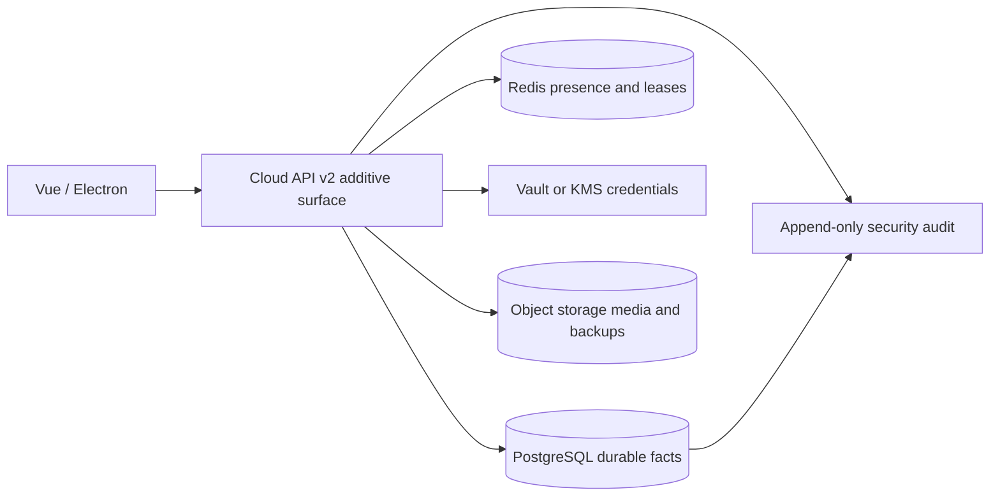

# Cloud v1 数据迁移设计

状态：Review Candidate 2。本文只定义迁移顺序和不变量，不分配实际 schema 版本号，也不包含可执行 SQL。

## 目标与不变量

- 当前本地版本继续使用 SQLite schema v12；它不是云端多租户数据库。
- 云端建议使用 PostgreSQL 保存持久事实、Redis 保存临时 Presence/Soft Lock lease、S3-compatible object storage 保存媒体与备份。
- 所有迁移采用 expand → verify → switch → later cleanup。不可逆清理不得与首次上线放在同一迁移。
- 项目事实、任务状态、Provider receipt 与安全审计不得复制为第二套状态机。
- 失败迁移必须保留 v12 数据、恢复点和媒体，不自动删除用户内容。
- 凭证不进入关系数据库、备份、项目包、日志或诊断包；数据库只保存 `credential_ref` 与不可逆指纹。

## 建议持久化拓扑

Redis 丢失后，Presence 和 Soft Lock 可以从空状态恢复；PostgreSQL 或对象存储丢失则属于数据恢复事件。Redis 中的 lease 不能成为批准、计费、任务完成或内容保存的唯一证据。

## 迁移批次

### M1 — 身份与租户

新增：

- `user_identities`：OIDC `issuer + subject` 唯一映射，不保存密码。
- `organizations`
- `memberships`：`(organization_id, user_id)` 唯一。
- `invitations`：只保存 token hash、标准化 email、角色、到期和接受状态。

验证：Owner 唯一、邀请重放失败、过期 token 不可接受、跨租户 ID 不可枚举。

回滚：删除本批新增表即可；当前项目表未变。

### M2 — 项目租户范围

1. 为云端共享的项目事实增加 nullable `organization_id`。
2. 创建不可联网的 `Local Workspace`，将桌面迁移数据映射到该范围。
3. 分批回填并校验孤儿记录、跨项目引用和复合唯一约束。
4. 云端部署在校验通过后设置 `organization_id NOT NULL`；桌面 SQLite 保持本地兼容映射。
5. 所有查询增加 `(organization_id, project_id, ...)` 复合索引。

禁止：依据请求 body 中的 organization ID 授权；服务端必须从登录身份与 membership 重新推导。

### M3 — 审阅与通知

新增：

- `review_threads`
- `review_comments`
- `review_decisions`
- `notifications`

批准必须固定 `target_revision`。目标事实 revision 变化时，原批准变为 `stale`，不能覆盖或删除历史决策。

Presence 与 Soft Lock 不进入 SQL；它们由 Redis TTL 管理：Presence 45 秒，Soft Lock 90 秒，每 30 秒续约。

### M4 — Provider 信任与成本

新增：

- `provider_connections`
- `relay_approvals`
- `model_bindings`
- `project_budgets`
- `cost_ledger_entries`

约束：

- `provider_connections` 没有 secret 列。
- `provider_receipt_ref` 在存在时唯一，防止重复计费。
- CostLedger 追加写；修正使用补偿分录，不更新历史金额。
- Provider 撤销阻断新任务；在途任务保留可诊断状态，不能伪造成功或自动重试。

### M5 — 云端媒体引用

云端媒体记录保存：`storage_key`、`sha256`、`size_bytes`、`mime_type`、`scan_status`、`created_at`。上传流程为：

1. 限额和 MIME 预检。
2. 写入隔离 staging。
3. 重新编码或拒绝不支持的动画/元数据。
4. 病毒与内容安全扫描。
5. 校验 hash 与大小。
6. 事务提交元数据并原子发布对象。

桌面本地路径继续兼容，但绝不进入云端 API 日志、事件、项目包 manifest 的公共字段或诊断包。

### M6 — 强制约束与纵深防御

- 外键、唯一约束、check constraint、复合索引。
- 可选 PostgreSQL RLS 作为纵深防御；服务层授权仍为主门禁。
- 安全审计保持 append-only，数据库阻止 UPDATE/DELETE。
- 每次 schema 迁移写入 restore point 与 migration receipt。
- 后台回填具备 checkpoint、幂等、取消和重启恢复。

## 兼容与回滚

| 场景 | 行为 |
|---|---|
| 旧本地项目 | 保持 schema v12 与 `.aigcproj` 当前行为 |
| 云端导入旧项目 | 先在隔离区验证，再分配组织范围和新 ID |
| 新 schema 被旧客户端打开 | 明确拒绝，不静默降级或删除字段 |
| 回填中断 | 从 checkpoint 继续；不得重复创建成员、台账或媒体 |
| 媒体发布失败 | 补偿删除 staging 与未引用对象；数据库不提交半成品 |
| Provider 凭证迁移失败 | 连接保持不可用，不回退到数据库明文 |

## 备份与恢复门禁

- 建议保留 7 个日备份和 4 个周备份，最终以 P8-Q06 的 RPO/RTO 结论为准。
- 数据库、对象存储 manifest 和媒体 hash 必须属于同一备份快照。
- 凭证只备份 Vault 自身的受控材料，不进入项目备份。
- 恢复前执行 schema、hash、配额、恶意路径和媒体一致性检查。
- Operator 可准备与验证恢复；Owner/Admin 批准后才允许切换。
- 恢复完成后运行权限、任务、成本、防泄漏和 Demo 导出冒烟。

## 进入可执行迁移前必须补齐

1. P8-Q01、Q02、Q03、Q06 已确认。
2. PostgreSQL 版本、对象存储、Redis 与 Vault/KMS 已选定。
3. 每批 migration 的 forward/rollback SQL 与大表耗时预算。
4. 生产规模的回填、锁表、失败注入和恢复演练。
5. 与当前 schema v12 自动迁移测试并行运行，不降低现有门禁。
