# Schema v12 数据模型

2.0 使用全新数据库，不导入旧 schema。

```mermaid
erDiagram
  SERIES ||--o{ EPISODE : orders
  EPISODE ||--|| PROJECT : produces
  SERIES ||--o{ SHARED_ASSET : scopes
  SHARED_ASSET ||--o{ SHARED_ASSET_VARIANT : versions
  SHARED_ASSET_VARIANT ||--o| SHARED_MEDIA_REFERENCE : snapshots
  SHOT ||--o{ ASSET_BINDING : pins
  SHARED_ASSET_VARIANT ||--o{ ASSET_BINDING : referenced_by
  PROJECT ||--o{ SOURCE_DOCUMENT : owns
  SOURCE_DOCUMENT ||--o{ CHAPTER : splits
  CHAPTER ||--o{ STORY_EVENT : contains
  STORY_EVENT ||--o{ STORY_EVENT_EDGE : connects
  PROJECT ||--o{ SCENE : adapts
  SCENE ||--o{ SHOT : contains
  SHOT ||--o{ SHOT_BEAT : sequences
  SHOT ||--o{ BOUNDARY_FRAME : pins
  MEDIA_REFERENCE ||--o{ BOUNDARY_FRAME : snapshots
  PROJECT ||--o{ ASSET : owns
  ASSET ||--o{ ASSET_VARIANT : versions
  SHOT ||--o{ CANDIDATE : generates
  SHOT ||--o{ CANDIDATE_BATCH : batches
  CANDIDATE_BATCH ||--o{ CANDIDATE : contains
  MEDIA_REFERENCE ||--o{ PROVIDER_MEDIA_RECEIPT : resolves
  CANDIDATE ||--o{ PROVIDER_MEDIA_RECEIPT : records
  PROJECT ||--o{ GENERATION_TASK : runs
  PROJECT ||--|| PROJECT_GENERATION_POLICY : constrains
  PROJECT ||--o| PROVIDER_ROUTE_POLICY : routes
  PROVIDER_CONNECTION ||--o{ PROVIDER_ROUTE_POLICY : selected_by
  PROJECT ||--o{ PROVIDER_COST_LEDGER_ENTRY : accounts
  PROVIDER_CONNECTION ||--o{ PROVIDER_COST_LEDGER_ENTRY : reports
  PROJECT ||--o{ SECURITY_AUDIT_EVENT : audits
  PROJECT ||--o{ PROMPT_RUN : compiles
  PROJECT ||--o{ PROMPT_REVISION : overrides
  PROMPT_REVISION ||--o{ GOLDEN_EVALUATION : gates
  PROJECT ||--o{ SKILL_PACKAGE_VERSION : forks
  SKILL_PACKAGE_VERSION ||--o{ GOLDEN_EVALUATION : gates
  PROMPT_RUN ||--o{ GENERATION_TASK : binds
  GENERATION_TASK ||--o{ TASK_ATTEMPT : attempts
  TASK_ATTEMPT ||--o| PROVIDER_RECEIPT : accepts
  CANDIDATE ||--o{ REVIEW_DECISION : reviews
  PROJECT ||--o{ ARTIFACT_VERSION : versions
  ARTIFACT_HEAD ||--|| ARTIFACT_VERSION : points_to
  PROMPT_RUN ||--o{ ARTIFACT_VERSION : produces
  ARTIFACT_VERSION ||--o{ ARTIFACT_VERSION : depends_on
  PROJECT ||--o{ EXECUTION_PLAN : plans
  EXECUTION_PLAN ||--o{ AGENT_APPROVAL : gates
  EXECUTION_PLAN ||--|| AGENT_RUN_CHECKPOINT : snapshots
  AGENT_RUN_CHECKPOINT ||--o{ MEMORY_RECORD : cites
  PROJECT ||--o{ MEDIA_REFERENCE : stores
  PROJECT ||--o{ MEMORY_RECORD : indexes
  SERIES ||--o{ MEMORY_RECORD : scopes
  MEMORY_RECORD ||--o{ MEMORY_CHUNK : splits
```

所有 ID 为稳定 UUID。结构化对象以 Zod 契约验证后写入实体表；项目维护 `graphRevision` 进行乐观并发控制。布局单独保存在 `graph_layouts`，删除布局不会删除领域对象。

`ShotBeat` 是 Shot 内的有序结构值：ordinal 与 start 必须连续，单拍不少于 100 ms，所有 Beat 时长之和必须精确等于 Shot 总时长。`BoundaryFrame` 是嵌入 Shot 的稳定引用快照，固定内部 media ID、SHA-256、来源 Shot/Candidate/BoundaryFrame、来源 revision 和 provenance；首帧与尾帧角色各最多一个。它们随 `.aigcproj` 一并 remap，不依赖临时 URL。

数据库启用 WAL 与 foreign keys。v1→v2 增加 PromptRun、Attempt、Receipt、ArtifactVersion 与 ReviewDecision；v2→v3 增加 Series、Episode、共享资产、精确 AssetBinding、反向引用与 reconcile 审批；v3→v4 增加不可变 PromptRevision、ArtifactHead、SkillPackageVersion 和 GoldenEvaluation；v4→v5 增加 CandidateBatch 与 ProviderMediaReceipt；v5→v6 增加可重建的 MemoryRecord 与 MemoryChunk；v6→v8 的旧可执行插件表只作为历史迁移兼容保留；v8→v9 增加不可覆盖的 `AgentRunCheckpoint`；v9→v10 增加项目级 `ProjectGenerationPolicy`；v10→v11 增加 append-only `SecurityAuditEvent`；v11→v12 增加 `ProviderConnection`、`ProviderRoutePolicy` 与不可变 `ProviderCostLedgerEntry`。每版迁移前创建可恢复的 SQLite restore point，版本只在完整事务成功后生效；重复执行结果不变，未来版本会在创建产品表前安全拒绝。

新安装使用 `director.sqlite`。如果同一 2.0 数据目录中已存在早期文件名 `director-v1.sqlite`，Server 会原位逐版迁移到 v12，不会通过更名静默丢失项目。每个旧 Project 会获得一个 standalone Episode；项目内容和导出语义不变。

`ProjectGenerationPolicy` 是独立实体而不是 UI 偏好。它使用 project ID 作为稳定主键，保存 revision、最大并发任务数、单批候选上限、单次导出最长时长、Provider 模式和每日预算。默认是 `billingMode=demo-only`、`paidProviders=blocked` 与 `dailyPaidBudgetMicros=0`；切换 `user-funded` 必须携带 `ENABLE_USER_FUNDED_PROVIDERS`、expected revision 和明确预算。Server 使用 CAS 更新；任务创建、失败重试、候选批次和导出都会在持久化意图前重新计算 `TaskAdmission`。降低策略不会取消已运行任务，只影响之后的新任务。

`ProviderConnection` 是安装级本机配置，只保存协议、HTTPS origin、能力、受限 manifest、`credentialRef`、测试结果和 revision。秘密值只在系统凭证库或 Docker Secret。`ProviderRoutePolicy` 按项目与模态固定主连接、降级链、模型、超时和最大尝试数；只允许引用 ready 且能力匹配的连接。`ProviderCostLedgerEntry` 只追加 task/attempt/connection/model、金额、币种、来源和 `billed`，不保存 Provider payload 或付款信息。

`SecurityAuditEvent` 是项目级不可变安全证据。一次高风险动作共享同一个 operation ID，先追加 `started`，再追加 `succeeded` 或带稳定错误码的 `rejected`；数据库 trigger 拒绝 UPDATE 和 DELETE，因此进程崩溃也会留下 started-only 线索。记录只包含固定动作、目标类型、目标 ID 的 SHA-256、correlation ID 和时间，不存请求 body、正文、Prompt、凭据、Provider payload、媒体 locator 或路径。它不进入项目包，避免把本机安全日志当成可移植创作内容。

共享资产按 Episode local → Series → Global 解析，并用 `logicalId` 而非显示名称覆盖。fork 会复制 Variant 与受管媒体为 Episode 本地 revision；promote 创建共享副本，不删除本地源。`AssetBinding` 固定实际 asset/variant/revision/scope，源 revision 改变只产生 drift 与字段级 stale，不覆盖历史 Candidate。删除前会重建反向引用，检查 Shot、Task、Candidate 与 BoundaryFrame。

`PromptRun` 固定 Prompt/Skill/Workflow/Provider Profile/Model capability 的精确版本、内容 hash、变量 hash、compiled hash、中文审阅文本和实际模型输入。`GenerationTask` 只引用固定 `promptRunId`；同一逻辑 attempt 保存独立 `TaskAttempt`，Provider 接收成功后立即保存脱敏 receipt。主任务和 attempt 都能表达 `outcome_unknown`；未知结果不能直接 retry。显式 retry 创建带 `parentTaskId` 的新任务与递增 attempt，并由独立 idempotency key 防止重复点击。

`ArtifactVersion` 是阶段产物的不可变证据：保存 workflow/stage、scope、revision、parent、PromptRun、content hash 及所有上游 Artifact hash。结构化 Demo 依赖链从 CreativeBrief 延伸到 FramePlans，每个镜头的 ImagePromptRun 继续依赖 FramePlans，CandidateSet、ImageReviewDecision 和 ApprovedCandidate 再按实际选择连接。新 revision 不删除旧产物。

`CreativeBrief` 作为 project-scope `ArtifactVersion` 保存。读取时只投影完整通过 Zod 且已批准的版本；格式错误的历史 Artifact 会隔离为 `invalidArtifactIds`，不会与 UI fallback 混成一份伪造事实。人工修改使用 `expectedRevision`。本地确定性候选以 `CreativeBriefCandidate` draft Artifact 追加，固定 batch、反馈 hash、锁定字段和变更字段；只有人工精确确认批准后才创建新的 `CreativeBrief` revision，拒绝只改变候选审阅状态。上游字段变更在 Scene/Shot 的 `staleFields` 中记录 `brief.<field>` 及受影响阶段，不删除历史 Candidate。

Studio Inspector 使用 scope + artifact type 读取版本历史与字段 diff；rollback 路径必须与目标 scope 一致，并使用 expected head revision 执行 CAS。用户二次确认后以旧内容创建新 revision，不更改旧 ArtifactVersion。

`CandidateBatch` 固定目标 Shot、模型、数量、并发上限、参数快照、来源、父批次、完成/失败计数和幂等键。Candidate 使用稳定 `batchId` 关联批次；label、tags、favorite 与 Shot 的 `selectedCandidateId` 分开保存，因此收藏、比较和最终批准不会互相覆盖。`ProviderMediaReceipt` 只保存输入角色、顺序、源 hash、传输类型和 locator 的脱敏 hash，不保存 signed URL、Authorization、API Key 或本机绝对路径。

批次失败重试要求精确确认和独立 idempotency key，只克隆源批次中明确失败、超时或取消且可验证为 `demo-local` image 的任务。重试批次通过 `parentBatchId` 追溯源批次，每个新任务通过 `parentTaskId` 和递增 attempt 追溯失败项；重复请求返回同一个重试批次，不覆盖原 Candidate 或原失败证据。

`EpisodeContinuitySummary` 是 episode-scope 的不可变 Artifact，固定 Source ID/revision/content hash、事件 revision hash、锁定事实、摘要与下一集 hook。本集 `nextHookArtifactId` 和下一集 `previousSummaryArtifactId` 只保存稳定 Artifact ID。读取时会将固定快照与当前 Source/Event revision 比较；上游变化返回 `source_changed` 或 `event_revision_changed`，旧 Artifact 继续保留且不会被下一集静默当成最新事实。

视频 Candidate 的真实尾帧由 `boundary_extract` GenerationTask 生成。FFprobe 先验证输入，FFmpeg 在受控目录提取最后一个可解码帧，校验 PNG magic、尺寸和 SHA-256 后原子发布；只有文件发布与数据库事务都成功才替换 Shot 的 end BoundaryFrame。失败任务保留诊断 hash，原尾帧保持不变。

`MemoryRecord` 是 canonical data 的可重建索引，而不是新的事实源。它固定 Episode/Series/Global scope、来源类型、来源 key/revision、内容 hash、stale/disabled 与敏感标记；`MemoryChunk` 只保存有界文本和关键词。来源新 revision 会使旧记忆 stale，不会删除审计历史。检索会过滤 stale、disabled 和敏感内容，并返回 scope/revision/命中关键词的采用原因。删除记忆只删除索引记录，原 Event、Artifact、Asset 或 Candidate 保留。

`AgentRunCheckpoint` 在计划签发前固定 graph revision、已批准 Artifact hash 和本次召回的 memory ID/scope/source key/source revision/content hash/采用原因。checkpoint 不复制 MemoryRecord 的 title、summary 或 content，且同一 run/plan 不能覆盖；即使派生记忆之后被禁用或删除，当时的决策来源 hash 仍可审计。

`PromptRevision` 分开 original、中文审阅稿和英文执行稿，并保存变量 Schema、输出 Schema、模型策略、反馈和内容 hash。交互式润色以当前 revision 为父版本追加 draft，并在结果中记录确定性 Demo 模式、方向、请求 hash 与最近已发布的 last-known-good；幂等重放复用同一 revision，失败不移动已发布兜底。`SkillPackageVersion` 保存受限 manifest、Markdown 和安全资源清单。两者发布都要求至少一个通过的 `GoldenEvaluation`；restore/rollback 只追加新版本。`ArtifactHead` 用 expected revision 的 CAS 指向当前 ArtifactVersion，不修改或删除历史产物。

`ScopedPromptBinding` 是局部生产任务的不可变输入证据，固定 Prompt revision/content hash、Event/Scene/Shot 的稳定 ID 与 revision，以及创建任务时的 graph revision。Scene 重生成先产生 draft `SceneScriptRevision` 与结构化 `SceneRevisionPatch`；patch 可同时包含 Scene `title/synopsis` 和所属 Shot 的 `title/description/dialogue/visualPrompt/videoPrompt/negativePrompt/durationMs/beats`，每个 Shot patch 都固定自身 base revision。只有经人工确认、通过 project/scene/shot revision CAS 并重新通过完整 `ShotSchema` 后才在单个事务内写入；任一冲突或 duration/Beat 不一致会整批回滚。stale 由实际字段依赖计算，对白不会污染图像，视觉字段不会无故污染配音。Event 重生成仍只追加作用域 Artifact；Shot 重生成只增加 Candidate，并把实际 Prompt revision ID 写入 Candidate。任务、Artifact、媒体、Candidate 和人工选择历史保持不变。

Voice/Music 新写入使用独立 metadata 契约，包含语言/用途/语速/情绪或 BPM/循环点、来源和权利状态。Voice revision 只污染 voice/subtitle/timeline/export，Music 只污染 timeline/export；视觉资产才会污染 image/video。

任务输入快照可在本地数据库保存恢复所需路径，但公开 API 与 Socket 会替换敏感目录。二进制媒体存放在受控媒体目录，数据库只保存 `MediaReference`。

导出任务的 `ExportTaskInput` 冻结全部 Shot revision、顺序、时长及每个已选 Candidate/Media SHA-256，并用 `assemblyHash` 参与幂等键。创建任务前先生成 10 分钟有效的 `ExportPreflight`：目标目录只存在于服务端私有记录，approval token 只保存 hash，公开预检只展示脱敏装配摘要与 Demo 零成本。确认时重新计算 assembly；发生漂移即拒绝，已消费确认的幂等重放只返回原任务。FFmpeg 实际消费该快照的图片或视频，不再生成与候选无关的纯色占位成片。成功 MP4 保留在用户选择目录，同时以 UUID 文件名和真实字节 hash 原子归档到项目媒体目录；数据库事务失败时会清理未发布归档。

`ProjectDiagnosticBundle` 是按需生成的只读投影，不进入数据库，也不是新的事实源。它只包含 schema/runtime 门禁、实体计数、任务状态、哈希化 Task/Provider 引用和固定代码的引用完整性问题。项目名、Source/Prompt 正文、Task 输入/结果、Provider payload、媒体 locator、凭据、signed URL 和本机路径全部排除；`bundleHash` 可用于核对交付给支持人员的文件未被意外改写。

`ProjectRecoveryReport` 也是按需投影，但只供已认证的本地 Studio 使用。它返回实际 Shot/Candidate/Task ID 和严格枚举的 `open_shot / open_candidate / clear_boundary / reconcile / retry / inspect` 动作，让恢复 UI 能定位对象而不复制业务数据。报告不持久化；修复仍通过既有 GraphCommand、任务 reconcile/retry 与 revision/idempotency 门禁完成。

`.aigcproj` v2 是 schema v12 的便携项目投影，不是第二个事实源；v1 永久可导入。生成策略、安全审计、Provider 连接/路由/成本、凭据、历史插件表、记忆索引和 AgentRunCheckpoint 不进入项目包；导入项目使用目标运行时的默认零付费策略。Project 包把实际使用的共享 revision 和媒体固定为本地副本。Series 包携带有序 Episodes、Series 资产、共享媒体与项目媒体；被引用的 Global 资产导入时转为 Series pinned 副本。所有实体、绑定、媒体与 Artifact 依赖生成新 ID，非终态任务转为 `orphaned`，失败会补偿删除数据库与已发布媒体。可重建记忆索引不入包，导入后可从 canonical source 重建。

TXT/Markdown 的 `source-imports` 隔离目录同样不是领域事实源：其中只保存短时有效、0600 权限的纯文本和预览元数据。确认前数据库没有 Source/Chapter/Event；确认时使用内容 hash 与数据库 idempotency record 事务创建 canonical entities。成功后原始隔离正文被删除，只保留短期 consumed 元数据用于安全重放响应。
