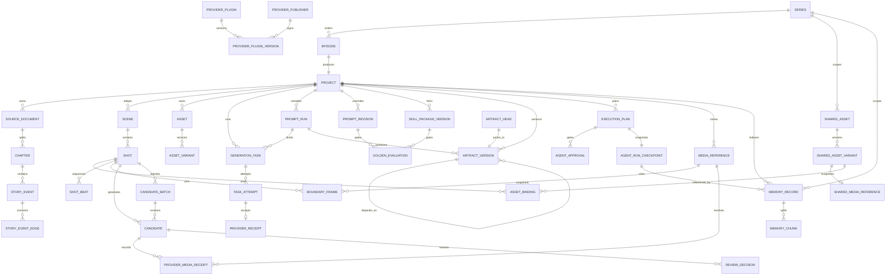

# Schema v9 数据模型

2.0 使用全新数据库，不导入旧 schema。

所有 ID 为稳定 UUID。结构化对象以 Zod 契约验证后写入实体表；项目维护 `graphRevision` 进行乐观并发控制。布局单独保存在 `graph_layouts`，删除布局不会删除领域对象。

`ShotBeat` 是 Shot 内的有序结构值：ordinal 与 start 必须连续，单拍不少于 100 ms，所有 Beat 时长之和必须精确等于 Shot 总时长。`BoundaryFrame` 是嵌入 Shot 的稳定引用快照，固定内部 media ID、SHA-256、来源 Shot/Candidate/BoundaryFrame、来源 revision 和 provenance；首帧与尾帧角色各最多一个。它们随 `.aigcproj` 一并 remap，不依赖临时 URL。

数据库启用 WAL 与 foreign keys。v1→v2 增加 PromptRun、Attempt、Receipt、ArtifactVersion 与 ReviewDecision；v2→v3 增加 Series、Episode、共享资产、精确 AssetBinding、反向引用与 reconcile 审批；v3→v4 增加不可变 PromptRevision、ArtifactHead、SkillPackageVersion 和 GoldenEvaluation；v4→v5 增加 CandidateBatch 与 ProviderMediaReceipt；v5→v6 增加可重建的 MemoryRecord 与 MemoryChunk；v6→v7 增加受信签名 Provider 插件状态；v7→v8 增加可撤销发布者信任；v8→v9 增加不可覆盖的 `AgentRunCheckpoint`。每版迁移前创建可恢复的 SQLite restore point，版本只在完整事务成功后生效；重复执行结果不变，未来版本会在创建产品表前安全拒绝。

新安装使用 `director.sqlite`。如果同一 2.0 数据目录中已存在早期文件名 `director-v1.sqlite`，Server 会原位逐版迁移到 v9，不会通过更名静默丢失项目。每个旧 Project 会获得一个 standalone Episode；项目内容和导出语义不变。

共享资产按 Episode local → Series → Global 解析，并用 `logicalId` 而非显示名称覆盖。fork 会复制 Variant 与受管媒体为 Episode 本地 revision；promote 创建共享副本，不删除本地源。`AssetBinding` 固定实际 asset/variant/revision/scope，源 revision 改变只产生 drift 与字段级 stale，不覆盖历史 Candidate。删除前会重建反向引用，检查 Shot、Task、Candidate 与 BoundaryFrame。

`PromptRun` 固定 Prompt/Skill/Workflow/Provider Profile/Model capability 的精确版本、内容 hash、变量 hash、compiled hash、中文审阅文本和实际模型输入。`GenerationTask` 只引用固定 `promptRunId`；同一逻辑 attempt 保存独立 `TaskAttempt`，Provider 接收成功后立即保存脱敏 receipt。

`ArtifactVersion` 是阶段产物的不可变证据：保存 workflow/stage、scope、revision、parent、PromptRun、content hash 及所有上游 Artifact hash。结构化 Demo 依赖链从 CreativeBrief 延伸到 FramePlans，每个镜头的 ImagePromptRun 继续依赖 FramePlans，CandidateSet、ImageReviewDecision 和 ApprovedCandidate 再按实际选择连接。新 revision 不删除旧产物。

Studio Inspector 使用 scope + artifact type 读取版本历史与字段 diff；rollback 路径必须与目标 scope 一致，并使用 expected head revision 执行 CAS。用户二次确认后以旧内容创建新 revision，不更改旧 ArtifactVersion。

`CandidateBatch` 固定目标 Shot、模型、数量、并发上限、参数快照、来源、父批次、完成/失败计数和幂等键。Candidate 使用稳定 `batchId` 关联批次；label、tags、favorite 与 Shot 的 `selectedCandidateId` 分开保存，因此收藏、比较和最终批准不会互相覆盖。`ProviderMediaReceipt` 只保存输入角色、顺序、源 hash、传输类型和 locator 的脱敏 hash，不保存 signed URL、Authorization、API Key 或本机绝对路径。

视频 Candidate 的真实尾帧由 `boundary_extract` GenerationTask 生成。FFprobe 先验证输入，FFmpeg 在受控目录提取最后一个可解码帧，校验 PNG magic、尺寸和 SHA-256 后原子发布；只有文件发布与数据库事务都成功才替换 Shot 的 end BoundaryFrame。失败任务保留诊断 hash，原尾帧保持不变。

`MemoryRecord` 是 canonical data 的可重建索引，而不是新的事实源。它固定 Episode/Series/Global scope、来源类型、来源 key/revision、内容 hash、stale/disabled 与敏感标记；`MemoryChunk` 只保存有界文本和关键词。来源新 revision 会使旧记忆 stale，不会删除审计历史。检索会过滤 stale、disabled 和敏感内容，并返回 scope/revision/命中关键词的采用原因。删除记忆只删除索引记录，原 Event、Artifact、Asset 或 Candidate 保留。

`AgentRunCheckpoint` 在计划签发前固定 graph revision、已批准 Artifact hash 和本次召回的 memory ID/scope/source key/source revision/content hash/采用原因。checkpoint 不复制 MemoryRecord 的 title、summary 或 content，且同一 run/plan 不能覆盖；即使派生记忆之后被禁用或删除，当时的决策来源 hash 仍可审计。

`PromptRevision` 分开 original、中文审阅稿和英文执行稿，并保存变量 Schema、输出 Schema、模型策略、反馈和内容 hash。`SkillPackageVersion` 保存受限 manifest、Markdown 和安全资源清单。两者发布都要求至少一个通过的 `GoldenEvaluation`；restore/rollback 只追加新版本。`ArtifactHead` 用 expected revision 的 CAS 指向当前 ArtifactVersion，不修改或删除历史产物。

`ScopedPromptBinding` 是局部生产任务的不可变输入证据，固定 Prompt revision/content hash、Event/Scene/Shot 的稳定 ID 与 revision，以及创建任务时的 graph revision。Event/Scene 重生成只产生作用域 `ArtifactVersion`；Shot 重生成只增加 Candidate，并把实际 Prompt revision ID 写入 Candidate。任务、Artifact、媒体与 Candidate 的引用在一个数据库事务中发布，其他场景和既有选中结果保持不变。

任务输入快照可在本地数据库保存恢复所需路径，但公开 API 与 Socket 会替换敏感目录。二进制媒体存放在受控媒体目录，数据库只保存 `MediaReference`。

`.aigcproj` v2 是 schema v9 的便携项目投影，不是第二个事实源；v1 永久可导入。Provider 插件、发布者信任、运行时、记忆索引和 AgentRunCheckpoint 不进入项目包。Project 包把实际使用的共享 revision 和媒体固定为本地副本。Series 包携带有序 Episodes、Series 资产、共享媒体与项目媒体；被引用的 Global 资产导入时转为 Series pinned 副本。所有实体、绑定、媒体与 Artifact 依赖生成新 ID，非终态任务转为 `orphaned`，失败会补偿删除数据库与已发布媒体。可重建记忆索引不入包，导入后可从 canonical source 重建。

TXT/Markdown 的 `source-imports` 隔离目录同样不是领域事实源：其中只保存短时有效、0600 权限的纯文本和预览元数据。确认前数据库没有 Source/Chapter/Event；确认时使用内容 hash 与数据库 idempotency record 事务创建 canonical entities。成功后原始隔离正文被删除，只保留短期 consumed 元数据用于安全重放响应。
