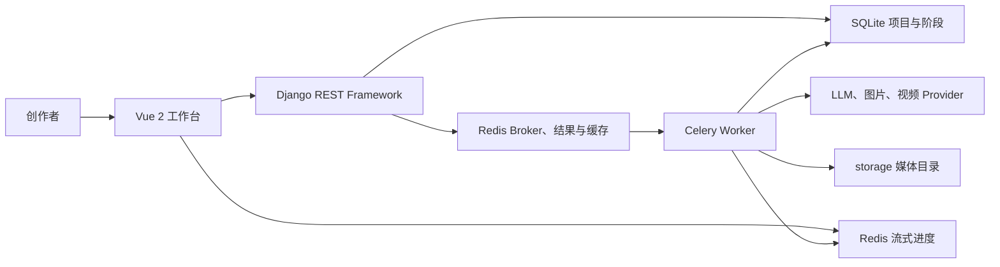
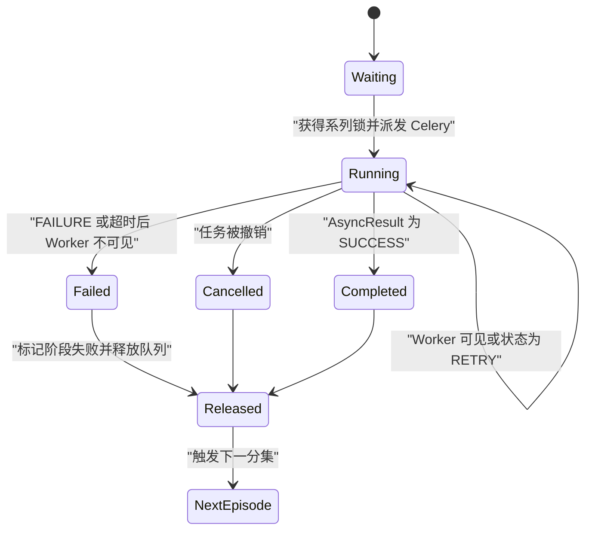
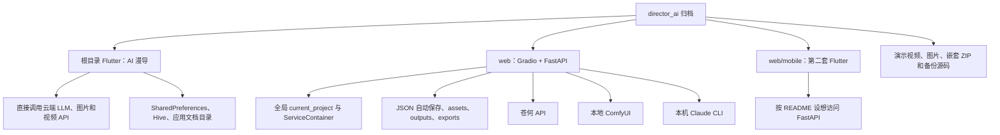
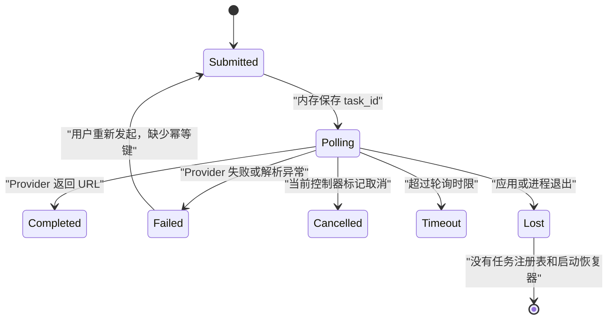
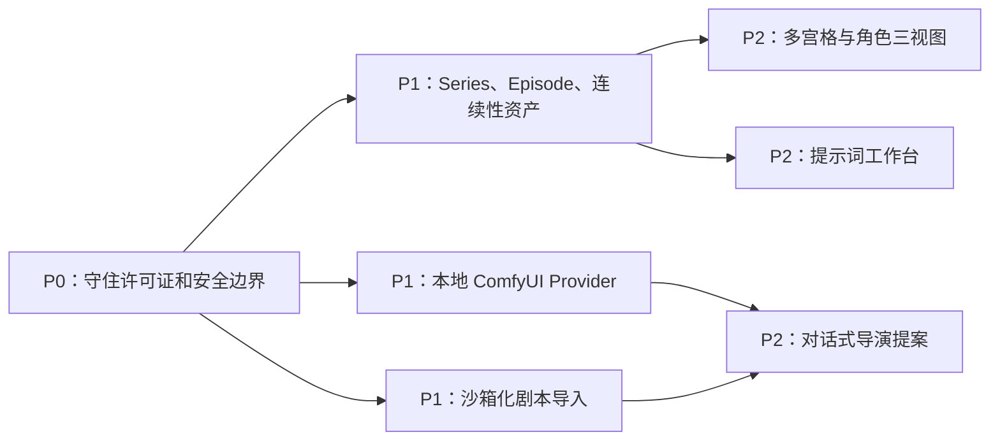

# 两个 AIGC 开源项目深度解析与迁移评估

> 审计对象：`ai_story-main.zip`、`director_ai-master.zip` 
> 对照项目：AIGC 视频工作台 `1.0.3` 
> 快照日期：2026-07-14 
> 结论性质：工程与产品风险评估，不构成法律意见

## 如何阅读这份报告

本文回答三个问题：两个项目实际上能否运行、哪些设计值得吸收、哪些代码或模式不应进入当前桌面产品。证据使用以下标记：

- **源码确认**：可以直接由 ZIP 内代码、配置或清单复核；
- **实测确认**：在临时目录、空 Key、本地服务环境中复现；
- **合理推断**：由实现方式推导出的运行后果，尚未覆盖所有平台；
- **待确认**：缺少上游身份、许可证正文、签名环境或真实 Provider 所需信息。

所有安装和运行都在临时目录中完成。没有向两个项目写入真实 API Key，没有调用图像、视频、语音或 LLM 付费接口，也没有把第三方源码、生成资产或测试数据库复制进本仓库。

## 执行结论

### 一句话判断

| 项目 | 判断 | 建议 |
| --- | --- | --- |
| `ai_story` | 领域模型和多分集队列有参考价值，但当前归档后端无法通过 Django 启动检查，恢复与重试能力也弱于 README 描述 | 只研究设计，在当前 TypeScript/SQLite 状态机上重新实现；未取得商业授权前不复制代码 |
| `director_ai` | 更接近多个原型的集合：Flutter、Gradio/FastAPI 和另一套 Flutter Mobile 共存，核心分镜 CRUD 实测失败，安全边界不适合发布 | 仅吸收产品交互灵感；不并入代码、不继承 Provider 和配置实现 |
| 当前 AIGC 视频工作台 | 已具备两个项目都缺少的桌面安全边界、无 Key Demo、阶段恢复、Provider 契约和发布配置 | 保持现有架构，只补齐系列创作、资产一致性和本地 ComfyUI 等能力 |

### 最终决策

1. **不以任一项目作为新基座。** `ai_story` 的栈、许可证和运行缺陷会扩大迁移成本；`director_ai` 缺少统一的持久化与发布架构。
2. **不复制第三方源码和素材。** `ai_story` 声明非商业、相同方式共享许可；`director_ai` 的 ZIP 没有可核验的许可证正文。
3. **优先重新实现四类能力：** 系列/分集、资产绑定与角色连续性、本地 ComfyUI Provider、安全的剧本导入。
4. **保留当前任务系统。** 两个项目都没有比当前 `taskManager + workflowStateMachine + taskRecovery` 更完整的桌面崩溃恢复语义。

## 统一评分

评分衡量“作为可交付桌面创作产品基座的工程就绪度”，不是功能数量、社区热度或创意质量。

| 维度 | 权重 | `ai_story` | `director_ai` | 当前平台 |
| --- | ---: | ---: | ---: | ---: |
| 产品流程覆盖 | 15 | 11 | 10 | 13 |
| 架构与数据模型 | 15 | 9 | 4 | 13 |
| 可靠性与恢复 | 20 | 8 | 2 | 18 |
| 安全与隐私 | 20 | 4 | 1 | 17 |
| 测试与 CI | 15 | 4 | 1 | 13 |
| 打包与运维 | 10 | 5 | 2 | 8 |
| 许可证与来源 | 5 | 1 | 0 | 5 |
| **总分** | **100** | **42** | **20** | **87** |

关键扣分依据：

- `ai_story` 后端启动、迁移、测试和 Celery Worker 都被缺失的 `apps.mcp.urls` 阻断；阶段重试接口只改状态，没有启动任务；异常任务被标记失败而不是自动续跑。
- `director_ai` 没有可执行的 Python 测试，FastAPI 分镜创建返回 500，Gradio 在按声明范围安装的最新依赖上启动失败；项目状态主要是进程内全局变量。
- 当前平台的分数仍不是 100：正式签名、公证、真实 Provider 端到端和更多 UI 自动化仍需要发布环境验证。

## 归档与代码规模

### 完整性与来源

| 项目 | SHA-256 | 文件数 | 来源状态 |
| --- | --- | ---: | --- |
| `ai_story-main.zip` | `051d5d45dbe98c97713aa84b807be4555e871050b14c6ea925b63b007b0c57ab` | 310 | 可对应到 [xhongc/ai_story](https://github.com/xhongc/ai_story)，归档与当前上游都保留了缺失 MCP URL 模块的引用 |
| `director_ai-master.zip` | `4bd8de4ae5b14322d99378646a94850d6de8422f308fcee2d8d567825f5e5183` | 219 | 通过多组唯一标识仍未找到可核验的公开上游，来源与提交版本待确认 |

`director_ai` 使用标准 `unzip` 解包时出现损坏编码文件名；改用 `bsdtar` 后才能完整展开。这不是磁盘空间问题，而是归档文件名的跨平台可移植性缺陷。

### 代码规模与热点

| 项目 | 主要代码量 | 最大热点 | 仓库卫生 |
| --- | --- | --- | --- |
| `ai_story` | Python 28,415 行；Vue 34,134 行；JavaScript 5,817 行 | `ProjectCanvas.vue` 3,394 行；`projects/views.py` 2,212 行；`projects/tasks.py` 1,360 行 | 根目录含多张大图；有锁文件；无独立许可证文件 |
| `director_ai` | Python 38,365 行；Dart 22,363 行 | `web/app.py` 12,690 行；备份副本 10,386 行；`api_service.dart` 2,238 行 | 含 64 MB 演示 MP4、BMP、GIF、`.DS_Store`、嵌套 ZIP、备份源码和重复 Mobile 工程 |

`director_ai` 的 Python 统计包含仓库内直接保留的旧版备份文件，因此不能把总行数理解为有效独立功能量。

## 产品能力对比

| 能力 | `ai_story` | `director_ai` | 当前平台 |
| --- | --- | --- | --- |
| 主题到脚本 | LLM 重写阶段、模板集 | Flutter Agent、Gradio 一句话生成 | 八阶段状态机、Demo/Provider 路由 |
| 分镜 | 数据库模型、画布节点、运镜阶段 | Web/Flutter 两套分镜对象和提示词 | 分镜编辑器、增量改稿与资产健康检查 |
| 图片/视频 | 多 Provider、文生图、图生视频、多宫格、编辑 | 直连云 API 或 ComfyUI，Flutter 轮询 | Provider 契约、占位素材、部分成功与失败项重试 |
| 音频/字幕/时间线 | 不是主工作流的一等阶段 | 主要聚焦分镜和画面，生产时间线不完整 | 配音、字幕、时间线、FFmpeg 导出均为固定阶段 |
| 多集创作 | `Series`、分集序号、串行队列 | 无可靠的多集持久化 | 尚缺少完整 Series/Episode 领域层 |
| 资产连续性 | 项目资产绑定、角色/场景上下文 | 角色参考图、三视图、素材包 | 具备文件管理和引用健康检查，角色连续性仍可加强 |
| 失败恢复 | 阶段记录和缺失图片/视频补跑 | 内存进度、超时和当前调用取消 | 阶段检查点、部分成功、取消、重启扫描与恢复上限 |
| 无 Key Demo | 有 Mock API 代码，但当前后端无法启动 | Mock 为编译期常量且默认关闭 | 全流程无 Key Demo，实测重试、重启恢复和导出 |
| 桌面发布 | Docker Web，不是桌面产品 | Flutter 主要面向 Android；Web 另行启动 | Electron、safeStorage、打包预检、签名/公证配置 |

## `ai_story` 深度解析

### 运行拓扑

这套结构比普通脚本原型更接近服务端产品：项目、阶段、模型配置和队列都进入数据库，长任务交给 Celery，前端通过流式消息获取进度。问题是实现中存在多套并行编排：

- `core/pipeline/orchestrator.py` 实现责任链和进程内重试；
- `ProjectWorkflowService` 管理数据库阶段状态；
- `run_full_pipeline_task` 又直接遍历阶段，并同步调用各 Celery Task 对象；
- ViewSet 中另有暂停、恢复、回滚和一个未完成的重试入口。

状态转换规则分散后，README 中的“任意阶段重试”和“错误恢复”无法由单一状态机保证。

### 数据模型中值得借鉴的部分

**源码确认：**

- `Series` 与 `Project` 表达作品和分集，系列内通过 `episode_number` 保持顺序；
- `ProjectStage` 保存阶段输入、输出、错误、重试次数与时间戳；
- `ProjectModelConfig` 允许按能力关联多个 Provider，并配置负载均衡策略；
- `EpisodeTaskQueue` 使用数据库行锁保证同一系列串行执行；
- `ProjectAssetBinding` 将角色、场景和其他可复用资产绑定到具体项目；
- 图片和视频阶段会查询已完成的分镜资产，只处理缺失项，具备资产级幂等雏形。

这些概念适合映射到当前平台，但不应原样复制 Django 模型。当前 schema 可以新增 Series/Episode 和 AssetBinding 层，同时继续让现有任务、快照、回收站和资产健康检查作为唯一事实来源。

### 实际任务恢复语义

这里的“recovery”主要是**修复队列占用**，不是恢复工作：

- `_repair_stale_running_task` 只在再次调度系列任务时被调用，不是独立启动恢复器；
- 运行任务超过两分钟且 Worker/结果后端不可见时，会把队列和处理中阶段标记为失败；
- 系统随后释放系列队列，但不会从最后检查点自动重建 Celery 任务；
- 完整流程再次启动时会跳过 `completed` 阶段，并补跑缺失图片，能减少重复成本，但需要用户或其他请求重新触发；
- 仅图片完整性有额外核对，其他阶段可能出现“阶段 completed、资产实际缺失”的不一致。

因此它具备“失败后从已完成阶段继续”的基础，却不满足“服务重启后自动续跑”。当前平台的恢复 Runner、恢复次数上限和 `interrupted` 诊断状态更完整。

### 重试、取消与部分成功

| 行为 | 源码结论 | 风险 |
| --- | --- | --- |
| 阶段重试 API | `retry_stage` 增加计数并把状态改成 `processing`，实际 Celery 调用仍是 TODO | 前端看到“开始重试”，后台没有任务 |
| 自动重试 | 阶段 Task 使用 Celery `self.retry`，完整 Pipeline 又同步调用这些 Task | 嵌套执行上下文复杂，阶段和主任务重试边界不清晰 |
| 暂停 | 从 Redis Cache 读取任务 ID，调用 `revoke(terminate=True)` | Cache 重启或任务未登记时无法可靠撤销；强制终止可能落在非原子文件写入中间 |
| 队列取消 | 数据库队列项改为 `cancelled` 并调度下一项 | `cancel_running_queue_task` 自身不撤销 Celery；依赖调用者先执行另一套撤销逻辑 |
| 部分成功 | 图片/视频结果按分镜保存，并能找出缺失项 | `ProjectStage` 终态仍主要是 completed/failed，没有明确的 partial 协议和失败项契约 |
| 回滚 | 清空目标及后续阶段的 JSON 状态 | 不负责删除、快照或解绑下游媒体，可能留下孤儿资产 |

### 安全审查

**P0 问题：**

1. `ModelProvider.api_key` 与 `VendorConnectionConfig.api_key` 是普通 `CharField`；没有系统安全存储或应用层加密。
2. `ModelProviderDetailSerializer` 声称隐藏密钥，但 `to_representation` 原样返回数据，详情响应包含完整 `api_key`。
3. `ModelUsageLog` 保存完整 `request_data` 和 `response_data`，序列化器也直接返回，可能长期保留提示词、响应和媒体 URL。
4. production 配置允许所有 Host 和所有 CORS Origin，并保留开发用默认 `SECRET_KEY` 回退值。
5. 2026-07-14 的 `pip-audit` 在锁定环境中报告 17 个包共 93 条已知漏洞记录；关键旧依赖包括 Django 3.2.15 和 PyJWT 1.7.1。

**P1 问题：**

- JWT Access/Refresh Token 存入 `localStorage`，XSS 可读取；
- SSE 把 Access Token 放入查询参数，容易进入代理、浏览器历史或访问日志；
- Provider URL 只检查 `http://`/`https://`，没有阻止回环、内网或云元数据地址，存在 SSRF 面；
- 部署默认 SQLite，同时允许 Celery 并发写入，繁忙项目可能遇到锁竞争；
- Redis 没有数据卷，Broker/结果和缓存状态随容器重建丢失；
- Docker Compose 没有健康检查，`depends_on` 不能证明 Redis 或 Django 已就绪。

### 实测结果

| 检查 | 结果 |
| --- | --- |
| `uv sync --frozen` | 通过，Python 3.11 环境安装 76 个包 |
| Django `check --deploy` | 失败：`ModuleNotFoundError: apps.mcp.urls` |
| Django migration | 同一 URL 检查失败，未执行迁移 |
| Django tests | 测试数据库创建后在系统检查阶段失败，业务测试未运行 |
| Celery Worker | 启动时执行 Django 检查，因相同缺失模块退出 |
| Redis 7 | 本地容器可正常启动；无法绕过应用启动缺陷 |
| Vue `npm ci` | 通过 |
| Vue lint | 通过但有 77 条 warning |
| Vue production build | 通过但有 4 类构建/体积 warning，入口约 828 KiB |
| Docker Compose config | 通过 |
| Docker images | 前端镜像构建通过；后端/Celery 基础层因 Debian 镜像下载超时而未完成，属于本次网络环境阻塞，未据此判定源码失败 |
| `npm audit` | 38 项：4 low、18 moderate、15 high、1 critical |

这说明前端“能构建”和 Compose 配置可解析不能替代后端启动及业务测试门禁。后端镜像还依赖 Bullseye 软件源的在线可用性，本次 `cpp-10` 下载超时后整层失败，没有重试或镜像源兜底。现有 GitHub Actions 只在 `release` 分支构建/推送镜像，没有执行 Django 测试、前端 lint、安全审计或容器健康检查。

## `director_ai` 深度解析

### 这不是一个统一应用

根 Flutter 与 `web/mobile` 的包名、依赖和页面结构不同，不是同一代码库的简单平台目录。Web 端又同时保留 12,690 行的 `app.py`、1,478 行的 services、FastAPI 和 10,386 行旧版备份。它更像多次原型迭代的合并快照。

### 状态和任务模型

Web 端的核心状态是模块级 `current_project` 或 `ServiceContainer.project.current_project`：

- 服务进程内只有一个当前项目，没有用户、租户、版本号或并发控制；
- Gradio 与 FastAPI 各自有全局状态路径，不能证明两者始终共享同一个对象；
- 自动保存覆盖固定 `_autosave.json`，不是事务、快照或事件日志；
- 云端生成任务由同步调用或内存轮询维护，没有持久化 Task 表；
- Flutter 的视频轮询支持超时和本地取消回调，但取消不会持久化，也不会在进程重启后恢复；
- 视频合并只调用 Android MethodChannel，iOS、macOS、Windows 没有等价实现，FFmpeg Flutter 依赖还因兼容问题被注释。

这不满足当前平台的阶段保存、部分成功、幂等、恢复上限和失败诊断要求。

### 实测发现的核心功能错误

在空 Key、`IMAGE_BACKEND=comfyui`、不连接 ComfyUI 的 TestClient 中：

- `/health`、创建项目、添加角色、添加场景、列出分镜和导出 JSON 返回成功；
- 创建分镜返回 HTTP 500；
- 异常为 `TemplateDefinition` 没有 `default_weights` 属性，发生在 `ShotService.add_shot`；
- 因此 README 所描述的项目到分镜核心路径无法完整通过。

Gradio 的 `requirements.txt` 使用宽泛版本范围。按 2026-07-14 实际解析得到 Gradio 6.20.0 后：

- UI 能构建到本地服务启动阶段；
- 随后在主题字体比较处触发 `AttributeError: 'str' object has no attribute 'name'` 并退出；
- 这证明没有版本锁的 README 安装流程不可复现。

### 安全审查与动态证明

**P0 问题：**

1. FastAPI 没有认证或授权依赖，默认监听 `0.0.0.0`，CORS 默认 `*`，所有项目、导入、生成和导出接口均可被同网段访问。
2. `/api/import/analyze` 接受客户端提供的服务器本地 `filepath`。实测传入临时 `.txt` 文件时，响应成功返回其中的标记内容，确认任意本地文件读取面。
3. 项目名称直接拼接导出文件名，没有规范化或目录约束。实测项目名含 `../` 时，导出返回 200，解析后的文件位于 `exports` 目录之外。
4. Web 把 API Key 明文写入 `projects/_user_config.json`；Flutter 把四类 Key 明文写入 SharedPreferences。
5. Flutter Dio `LogInterceptor` 开启请求 Header、请求 Body 和响应 Body，Authorization 与创作内容可能进入控制台；`AppLogger` 又会把完整请求/响应写入应用文档目录。
6. Windows 上调用 Claude CLI 使用 `shell=True` 拼接用户提示词，只转义双引号，没有安全处理命令元字符，构成命令注入面。
7. ZIP 内没有 LICENSE 文件，无法依据 `web/README.md` 的 MIT 链接获得可执行的授权文本。

**P1 问题：**

- 上传先把整个文件读入内存再检查大小，只校验扩展名，不校验 MIME、文件签名或压缩炸弹；
- Android Manifest 允许明文网络流量，并请求旧式读写外部存储权限；
- `ApiConfigService` 记录 Key 前八位，短于八位的输入还会触发 substring 越界；
- 下载方法接受任意 URL 和可选文件名，缺少协议、目标网段和最终路径约束；
- 生成提示词、媒体 URL、Provider 原始响应和堆栈被大量写入日志；
- 导出 ZIP 信任项目中保存的本地素材路径，缺少统一资产根目录和授权检查；
- Gradio `allowed_paths` 暴露项目、资产和输出目录，没有多用户隔离。

### 实测结果

| 检查 | 结果 |
| --- | --- |
| ZIP 解包 | 标准 `unzip` 因损坏编码文件名失败；`bsdtar` 成功 |
| Python compileall | 通过 |
| Python pytest | exit 5：没有发现测试；根 `test_api.py` 为空文件 |
| FastAPI 网络启动 | 通过，绑定本地地址后 `/health` 返回 200 |
| 本地 CRUD | 项目、角色、场景和导出通过；新增分镜返回 500 |
| Gradio 启动 | 失败：未锁定依赖解析到 Gradio 6.20.0 后发生主题类型异常 |
| 路径安全 | 动态确认本地文件读取和导出目录逃逸 |
| `pip-audit` | 当前宽泛依赖解析环境发现 PyPDF2 3.0.1 的 1 条漏洞；结果不代表可重复锁定版本 |
| Flutter SDK/doctor | 临时 Flutter 3.44.6、Dart 3.12.2 安装成功；Android SDK 缺失，Xcode 安装不完整且没有 CocoaPods，移动端构建受阻 |
| Flutter root | `pub get` 通过但更新 5 个锁定依赖；`flutter analyze` 失败并报告 335 项，包含嵌套工程测试的 2 个编译错误；根目录没有 `test/`，`flutter test` 失败 |
| Flutter nested mobile | `pub get` 通过但更新 114 个锁定依赖并产生 `file_picker` 桌面插件警告；`analyze` 报 3 项，模板测试引用不存在的 `package:mobile/main.dart` 和 `MyApp`；`test` 编译失败 |
| CI | 未发现 GitHub Actions、CircleCI 或其他流水线 |

### 维护性判断

`web/app.py` 同时承担配置、持久化、LLM、图片、视频、导入导出、分析、HTML/CSS/JS 和 Gradio 事件绑定。全局变量数量和跨模块兼容层使单元测试难以隔离。根 Flutter 也把 2,238 行 Provider 实现集中在一个 `api_service.dart` 中，并在 UI/Controller 中维护任务状态。

如果直接合并到当前平台，会同时引入 Python Web 运行时、Dart/Android 工具链、重复 Provider 客户端和第二套数据模型，收益远低于重新实现少数产品能力。

## 与当前平台的架构差距

当前平台已经具备：

- 固定八阶段协议：主题、脚本、分镜、图片、配音、字幕、时间线、导出；
- SQLite 工作流记录、任务尝试链、阶段检查点和启动恢复 Runner；
- `partial`、失败项重试、取消标记、恢复次数上限和诊断错误码；
- Demo Provider、占位素材、Provider 契约测试与零成本验收；
- Electron `contextIsolation`、受限 preload、CSP、外链和 IPC 参数校验；
- Electron safeStorage 与普通设置分离，前端只获取凭证配置状态；
- 文件签名、路径约束、回收站、备份恢复和资产健康检查；
- FFmpeg 冒烟、Electron 打包预检、GitHub Actions 和发布文档。

两个项目真正补充的是创作上层能力，而不是底层可靠性：

1. `ai_story` 的 Series/Episode 串行创作；
2. 项目级资产绑定和角色/场景连续性上下文；
3. 多宫格、角色三视图和提示词调试工作台；
4. 本地 ComfyUI 和更多可发现 Provider；
5. `director_ai` 的对话式导演 Agent、剧本文档导入和移动端遥控思路。

## 迁移决策矩阵

“直接吸收”仅表示吸收通用概念、字段词汇或验收场景，不表示复制受限制源码。

| 能力 | 来源 | 决策 | 优先级 | 工作量 | 依赖 | 验收方式 |
| --- | --- | --- | --- | --- | --- | --- |
| Series/Episode 与分集顺序 | `ai_story` | 重新实现 | P1 | L | schema migration、状态机、列表 UI | 同系列并发请求只运行一集；重启后继续；单集失败不破坏其他集 |
| 系列级角色/场景 Bible | 两者 | 重新实现 | P1 | L | AssetBinding、快照、分镜编译器 | 多集复用资产；修改后只使受影响镜头待同步 |
| 缺失资产补跑 | `ai_story` | 直接吸收概念 | P0 | S | 现有资产健康检查 | 图片、音频、字幕、视频都只补缺失/失败项，成功项哈希不变 |
| Provider 多候选与策略 | `ai_story` | 重新实现 | P1 | M | 现有 Provider Registry、成本记录 | 超时/限流后按明确策略降级，并记录每次尝试 |
| 本地 ComfyUI Provider | 两者 | 重新实现 | P1 | M | Provider 契约、SSRF 防护、工作流映射 | 无 Key、本机白名单地址、超时/取消/异常格式契约测试 |
| 多宫格和角色三视图 | 两者 | 重新实现 | P2 | M | 图片 Provider、资产绑定 | 每个切片有来源、选择状态和幂等键；可局部重试 |
| 提示词调试工作台 | `ai_story` | 重新实现 | P2 | M | PromptCompiler、Provider Attempt | 展示编译前后提示词、变量来源、成本估算且自动脱敏 |
| 安全剧本导入 | `director_ai` | 重新实现 | P1 | M | Electron 文件选择、解析沙箱 | 只读取用户选择文件；签名/大小/页数限制；禁止任意服务器路径 |
| 对话式导演 Agent | 两者 | 重新设计 | P2 | L | 白名单命令、确认、操作日志、撤销 | Agent 只能生成结构化提案；写入前预览；破坏操作二次确认 |
| 移动端遥控 | `director_ai` | 暂缓 | P2 | L | 本地认证、设备配对、TLS、同步协议 | 先完成威胁模型和桌面局域网 API，不直连 Provider |
| Django/Celery 主工作流 | `ai_story` | 明确避免 | — | — | — | 继续使用现有桌面任务系统 |
| 全局 `current_project` | `director_ai` | 明确避免 | — | — | — | 所有状态必须进入项目/任务/资产记录 |
| 明文 Key/SharedPreferences/JSON | 两者 | 明确避免 | — | — | — | 继续使用系统安全存储 |
| 移动端直连付费 Provider | `director_ai` | 明确避免 | — | — | — | 凭证不进入普通客户端配置和日志 |
| `shell=True` 调用 AI CLI | `director_ai` | 明确避免 | — | — | — | 只允许参数数组、固定可执行文件和超时/输出限制 |

## 风险清单

### `ai_story`

| ID | 等级 | 风险 | 证据与影响 |
| --- | --- | --- | --- |
| A-01 | P0 | 后端不可启动 | URLConf 引用只有 `.gitkeep` 的 `apps.mcp.urls`；check、migration、test、Celery 全部失败 |
| A-02 | P0 | Provider Key 明文且详情泄露 | 数据库普通字段；Serializer 原样输出 `api_key` |
| A-03 | P0 | 阶段重试是假启动 | API 改状态和计数，Celery 调用仍是 TODO |
| A-04 | P0 | 重启只释放队列、不自动续跑 | stale 任务转 failed；没有启动扫描并重新入队 |
| A-05 | P0 | 生产安全默认值不安全 | `ALLOWED_HOSTS=*`、全 CORS、默认 Secret 回退 |
| A-06 | P0 | 大量已知依赖漏洞 | pip 93 条记录；npm 38 项，含 critical |
| A-07 | P0 | 商业复用受限 | README 声明 CC BY-NC-SA 4.0，ZIP 无许可证正文 |
| A-08 | P1 | Token 暴露面 | JWT 在 localStorage；SSE 使用查询参数 Token |
| A-09 | P1 | 状态与资产不一致 | 回滚清 JSON 不清媒体；完整性补偿主要覆盖图片 |
| A-10 | P1 | CI 不能证明可发布 | 只构建镜像，不运行测试、安全检查或健康检查 |

### `director_ai`

| ID | 等级 | 风险 | 证据与影响 |
| --- | --- | --- | --- |
| D-01 | P0 | 任意本地文件读取 | 无认证的 import analyze 接收本地 filepath，动态验证成功 |
| D-02 | P0 | 导出目录逃逸 | 项目名未经清理进入路径，动态验证 `../` 可离开 exports |
| D-03 | P0 | 核心分镜创建崩溃 | FastAPI 返回 500，缺失 `default_weights` |
| D-04 | P0 | Key 与内容进入明文存储/日志 | JSON、SharedPreferences、Dio Header 日志和 Raw Logger |
| D-05 | P0 | Windows 命令注入面 | 用户提示词拼入 `shell=True` 命令字符串 |
| D-06 | P0 | 无认证且宽松跨域 | 默认绑定所有网卡、CORS `*`、项目是全局单例 |
| D-07 | P0 | 没有业务测试和 CI | pytest 无测试；Flutter 只有模板测试；无流水线 |
| D-08 | P0 | 许可证不可核验 | README 链接不存在的 LICENSE，无法确认公开上游 |
| D-09 | P1 | 进程退出即丢任务 | 没有持久化任务、检查点、恢复扫描或幂等键 |
| D-10 | P1 | 发布和仓库不可维护 | 三套应用、超大单文件、备份源码、大媒体、损坏文件名、Android-only 合并 |

## 许可证与素材边界

### `ai_story`

README 声明 [CC BY-NC-SA 4.0](https://creativecommons.org/licenses/by-nc-sa/4.0/)：非商业使用、署名、改编后以相同条件共享。ZIP 和 GitHub 元数据都没有独立许可证文件。

对当前 MIT 且计划发布的桌面产品，默认处理规则是：

- 不复制源码、提示词正文、图片、Logo 或演示资产；
- 可以独立实现通用思想，例如 Series/Episode、资产绑定和队列串行；
- 若希望直接使用任何实现，先取得作者明确的商业授权，并确认衍生作品许可范围；
- 保留独立设计记录，证明实现来自当前产品需求和公开概念，而不是逐行翻译。

### `director_ai`

`web/README.md` 写有 “MIT License” 链接，但归档中没有目标 LICENSE；根 README 还是通用 React/Vite 模板，与 Flutter 项目不符。公开搜索无法确认唯一上游仓库。

在作者身份、仓库地址、提交哈希和许可证正文全部确认前，应按“未授予复制和分发许可”处理。归档中的演示视频、二维码 BMP、GIF、Stitch ZIP、截图和字体也不能转入当前仓库。

## 实测总表

| 对象 | 安装/构建 | 测试/启动 | 安全审计 | 结论 |
| --- | --- | --- | --- | --- |
| 当前平台 | production build 通过 | Server 57 项中 56 pass、1 skip；Client 7/7；Demo 重启恢复与单阶段重试通过 | root/server/client production `npm audit` 均为 0 | 可作为迁移承载基座 |
| `ai_story` | `uv sync`、Vue build、Compose config 和前端镜像通过；后端镜像被 Debian 下载超时阻断 | Django、migration、tests、Celery 被缺失 URL 模块阻断 | pip 93 条；npm 38 项 | 不能按 README 直接部署 |
| `director_ai` Web | Python 编译通过；依赖无锁 | FastAPI 可启动但分镜 500；Gradio 依赖漂移后启动失败；pytest 无测试 | 本地文件读取、路径逃逸动态复现；pip 1 条 | 原型可浏览，不具备服务发布安全性 |
| `director_ai` Flutter | 两套 `pub get` 通过但都改写锁定依赖 | root analyze 335 项且无测试；nested analyze/test 因错误模板失败；Android/Xcode 工具链不完整 | 静态确认明文 Key、完整 Header/Body 日志和 cleartext | 不应作为桌面或移动发布基座 |

依赖漏洞数量是 2026-07-14 的数据库快照，可能随审计源更新。`director_ai` Web 没有锁文件，pip 结果只代表当天解析出来的环境；`ai_story` 的结果来自 `uv.lock`，可重复性更高。

## 推荐实施路线

### P0：先形成复用门禁

- 在贡献指南中继续要求外部代码必须带来源、提交哈希和兼容许可证；
- 新增文件导入或 Provider URL 前，先复用当前路径、SSRF、签名和日志脱敏测试；
- 把“项目名不能影响实际文件路径”和“API 不接受服务器任意路径”加入安全回归；
- 任何新 Provider 必须先通过无 Key、超时、限流、异常格式、降级和部分失败契约测试。

### P1：补齐上层领域能力

1. 在 schema v4 设计 Series/Episode，不改变现有八阶段名称；
2. 给角色、场景、道具和风格建立可版本化 AssetBinding；
3. 在现有 TaskManager 上实现系列内串行、系列间受控并发；
4. 以本地白名单和工作流模板注册 ComfyUI，而不是接受任意服务地址；
5. 剧本导入只接收 Electron 文件选择结果和上传句柄，不接收服务器路径字符串。

### P2：增强创作体验

- 多宫格和三视图成为图片阶段的子任务，仍使用同一任务、成本和重试协议；
- 提示词工作台展示变量来源、编译结果和脱敏 Provider 尝试，不显示 Key；
- Agent 只产出白名单结构化提案，用户确认后再调用现有 API；
- 移动端只在桌面局域网配对、认证和同步协议成熟后评估。

## 结语

`ai_story` 最有价值的是系列/分集、项目资产绑定和多 Provider 编排的领域词汇；`director_ai` 最有价值的是导演式对话、多参考图、三视图和文档导入的产品想象。两者最薄弱的部分恰好是当前桌面产品已经投入建设的能力：安全凭证、确定状态机、崩溃恢复、文件边界、契约测试和可发布配置。

正确路线不是合并两个仓库，而是在当前平台中独立重建少数高价值能力，并让它们服从已有的八阶段协议、任务恢复、Provider 契约和桌面安全模型。
