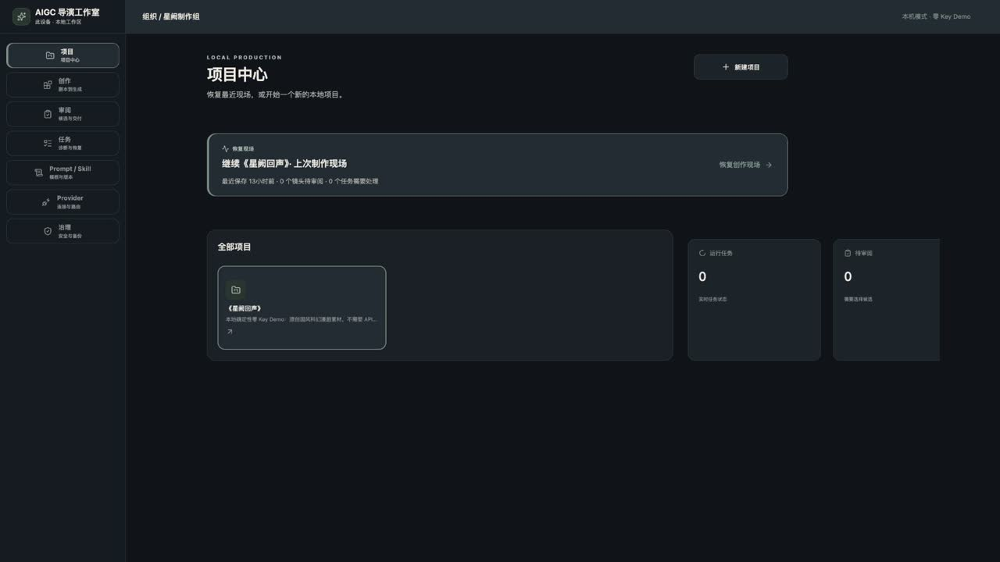
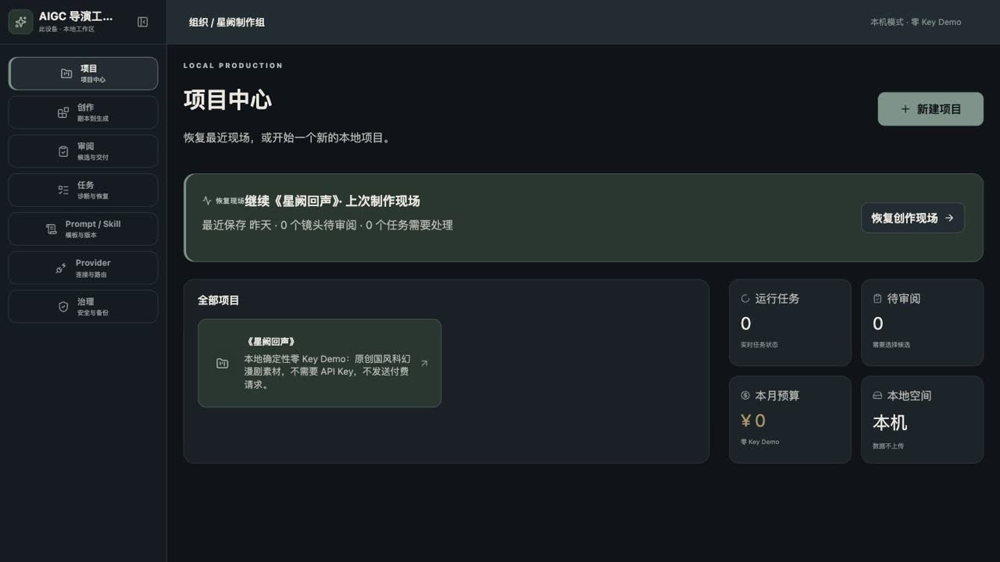

# Product Design 实机审查与截图证据

日期：2026-07-23
范围：Vue `/studio/:projectId?`、本机 Web 服务、Electron 开发模式
安全边界：`DEMO_MODE=1`、`PROVIDER_NETWORK_DISABLED=1`、Provider Key 全空、付费请求 0

## 结论

本轮关闭了三个会直接影响评审和研发的问题：项目中心存在两套 CSS 导致指标卡水平溢出；窄屏品牌区被高优先级选择器重新显示，形成类似“两层导航”；Electron 启动 Smoke 依赖首个 `h1` 文案，项目中心标题会误报渲染失败。

整改后，桌面端只有一层可收起主侧栏，窄屏只有一层底部导航；项目中心的项目列表、恢复入口与指标区在三类视口下无横向溢出。

## 修改与验收

| 项目 | 修改 | 实测结果 |
| --- | --- | --- |
| 桌面主导航 | 新增收起/展开按钮、图标模式 ARIA 名称和 48px 点击区 | 240px 展开，72px 收起；两种状态 `scrollWidth === innerWidth` |
| 项目中心 | 删除重复旧样式，项目与指标改为有界自适应网格 | 1440 下项目区与 2×2 指标并排；1180 自动收敛；无水平滚动 |
| 窄屏 | 强制隐藏品牌栏，项目标题和主操作改为单列 | 767×900 下底部导航 64px，新建按钮宽度等于内容宽度，无溢出 |
| Electron Smoke | 使用 `data-desktop-smoke-ready="aigc-director-studio"` 稳定标记 | 不再依赖页面第一个 `h1`，新增独立回归测试 |
| Electron 视觉 | 使用系统临时隔离 userData 启动 | 候选审阅工作区可见，`demo-local`、`¥0`、`billed=false` 可识别 |

Browser 页面 console 为 0 error。测试中看到的 Statsig 超时来自 Codex 内置浏览器外壳，不是产品页面请求。

## 实机截图

### 项目中心整改前后

展开对比证据

### 1440px 项目中心

### 72px 收起侧栏

### ≤768px 底部单层导航

### Electron 候选审阅

## 截图溯源与隐私

| 文件 | 来源 | 采集方式 | 隐私/授权状态 |
| --- | --- | --- | --- |
| `v2-studio.jpg` | 本项目 Vue UI | Browser，零 Key Demo | 原创产品 UI；无凭据、路径或用户素材 |
| `v2-studio-sidebar-collapsed.jpg` | 本项目 Vue UI | Browser，1440px 收起状态 | 原创产品 UI；无凭据、路径或用户素材 |
| `v2-studio-compact.jpg` | 本项目 Vue UI | Browser，767×900 | 原创产品 UI；无凭据、路径或用户素材 |
| `v2-electron.jpg` | 本项目 Electron UI | Computer Use，系统临时隔离 userData | 原创产品 UI；无凭据、用户路径或私人媒体 |

`docs/evidence/product-design-2026-07-23/` 保留与上表同次采集的整改前、整改后、收起侧栏、窄屏和 Electron 审查证据；文件不含真实凭据、用户路径、上传素材或私人项目。

所有 JPEG 的扩展名与 MIME 一致；主图为 1280×720，单图小于 500 KB。

## 仍需外部条件

- Figma MCP 当前无法读取 `Cloud Production Prototype v2` 的精确节点与 Variables，因此不将本轮结果标记为“像素级一比一通过”。
- 正式 Provider live verification、代码签名、Apple 公证、Windows 干净机和自动更新仍是外部发布门禁。
- 产品、设计、前端、后端、测试和安全六角色的人工评审签字尚未完成。
