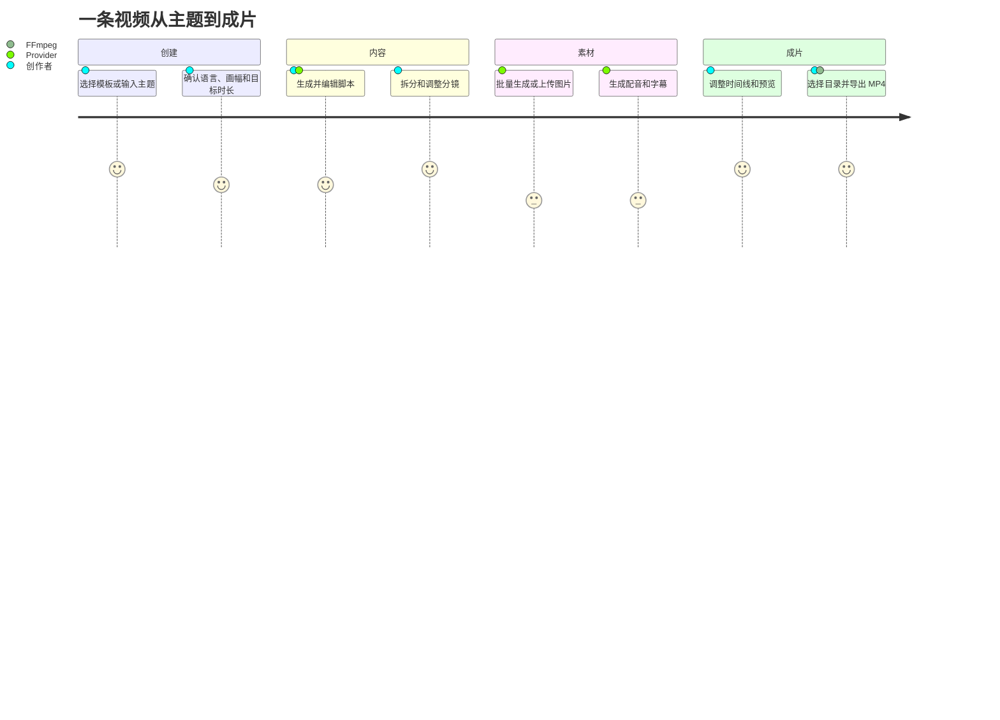
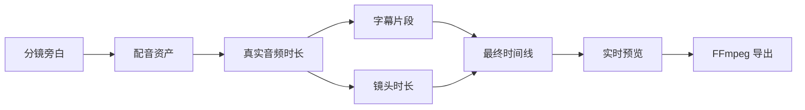

# 产品导览

这份文档从创作者视角说明 AIGC 视频工作台如何组织信息、任务和失败修复。它不是页面字段清单，而是一条从选题到成片的实际路径。

## 工作台首页

首页回答四个问题：

1. 现在有多少项目和成片；
2. 哪个项目最值得继续；
3. 是否有失败或缺失资产需要修复；
4. 不想从空白开始时可以选择什么模板。

顶部摘要只展示项目、成片、待修复和素材数量。继续创作区优先显示最近项目及资产健康；模板区提供知识科普、商业转化、故事表达、文旅本地、效率教程和品牌表达等结构；待修复区集中展示失败任务与资产问题。

## 典型创作路径

## 页面与职责

| 页面 | 主要任务 | 关键状态 | 失败修复入口 |
| --- | --- | --- | --- |
| 创作工作台 | 查看全局进度并继续项目 | 项目/成片/待修复摘要 | 待修复卡片 |
| 项目管理 | 搜索、筛选、继续、删除项目 | 项目阶段与资产健康 | 项目卡片继续按钮 |
| 脚本与分镜 | 编辑文本、镜头、旁白和时长 | 保存中、已保存、内容变更 | 重新生成变化镜头 |
| 图片 | 查看候选图、选择主图、上传 | 成功、占位、失败、缺失 | 只重试失败图片 |
| 配音 | 音色、情感、试听、批量生成 | Provider、音频时长、失败项 | 单镜重试或降级 |
| 预览与时间线 | 字幕、音轨、运镜、画幅、播放 | 时间线健康、导出是否过期 | 定位缺失资产 |
| 成片库 | 查看、播放、定位已导出文件 | 文件是否存在、大小、时间 | 回到项目重新导出 |
| 历史记录 | 查看任务尝试链和错误 | Provider、阶段、请求 ID | 重试对应阶段 |
| 文件管理 | 浏览图片、音频、字幕和视频 | 引用状态、文件类型 | 归一化命名或移入回收站 |
| 设置 | Provider、存储、备份、监控 | 凭证是否配置、目录可写 | 测试连接与恢复备份 |

## 脚本与分镜工作区

脚本页把长文本编辑和结构化分镜放在同一创作上下文中：

- 脚本修改不会自动删除已有素材；
- 分镜保存以稳定 storyboard id 为主键；
- 只清理内容发生变化的镜头资产；
- 每镜头单独保存画面描述、旁白、时长和素材引用；
- 批量保存后再进入图片阶段，避免半保存状态。

当脚本修改导致时间线过期时，预览页会提示重新生成相关阶段，而不是继续导出旧内容。

## 图片与素材选择

图片阶段区分四种视觉状态：

- 真实 Provider 生成；
- Demo 本地占位；
- 用户上传；
- 生成失败或文件丢失。

候选图与选中图分离。删除文件时会同步检查引用，默认进入回收站；恢复后重新绑定原分镜，减少误操作带来的不可逆损失。

## 配音、字幕和时间线

配音不是导出按钮里的隐式步骤。用户可以先选择音色、情绪和 Provider，再逐镜生成。音频时长会影响字幕和镜头长度，因此时间线阶段会重新计算：

## 桌面体验

Electron 增加了浏览器模式没有的系统能力：

- 原生目录选择器；
- 应用数据目录和系统凭证库；
- 后端子进程启动、健康探测与优雅退出；
- crash dump、本地日志和自动更新；
- macOS/Windows 安装包与代码签名。

原生能力通过极小 preload 白名单提供，Vue 页面无法直接访问 Node.js 或任意文件系统路径。

## Provider 与模型路由

设置页把“阶段路由”和“平台凭证”分开：创作者可以为脚本、图片、视频和配音选择不同 Provider；凭证卡片只显示配置状态，不回传完整密钥。未配置的云端 Provider 不会阻止 Demo/local 路径继续工作。

## 长任务与弱网反馈

后台任务浮层持续展示：任务类型、阶段、进度、Provider、消息和终态。离开当前页面不会丢失任务。弱网或 Provider 抖动时，界面会区分：

- 正在重试；
- 已降级；
- 部分成功；
- 需要用户修复；
- 已取消；
- 服务重启后正在恢复。

取消操作在安全边界生效。例如媒体文件正在写入时，不强制截断进程，而是在当前可取消点停止并保留已完成资产。

## 键盘与误操作保护

- 项目卡片和主要动作可通过 Tab 聚焦；
- Enter/Space 可以触发主要卡片动作；
- 删除、覆盖导出和清空操作要求确认；
- 长任务按钮进入忙碌态，避免重复提交；
- 导出目录和用户路径在公开截图中自动脱敏；
- 空列表不仅显示“暂无数据”，还提供下一步入口。

## 建议演示顺序

完整现场讲解可直接使用 [Demo 演示脚本](demo-script.md)。如果只有两分钟，推荐展示：工作台首页 → 一个已保存分镜 → 后台任务状态 → 预览时间线 → 成功导出 → 设置页安全存储说明。
