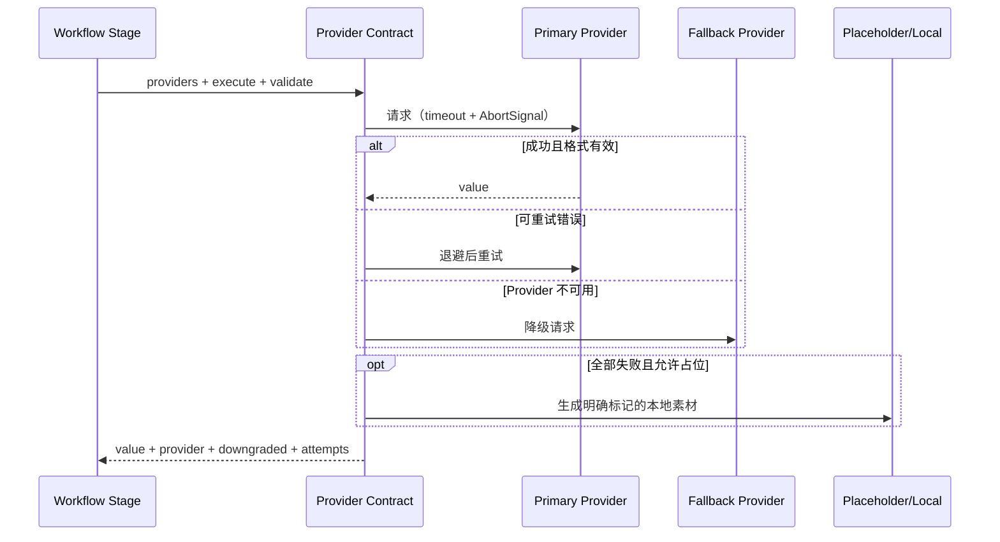
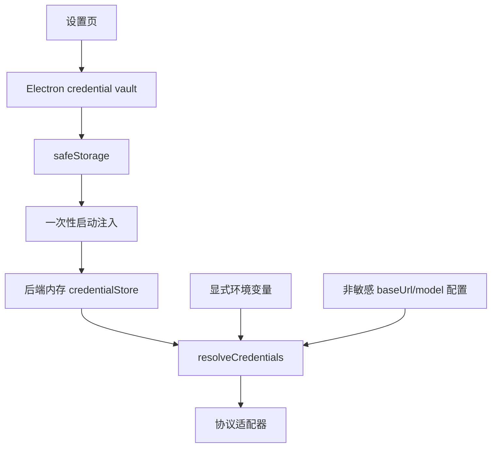
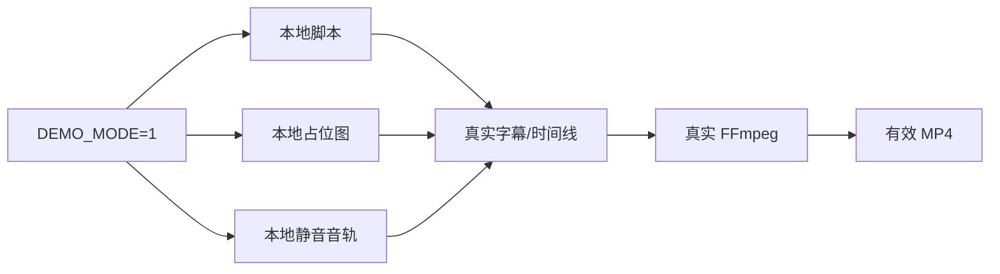

# Provider 与 Demo 指南

Provider 层的目标不是隐藏所有厂商差异，而是把业务最关心的行为统一：凭证检查、超时、限流、重试、降级、格式校验、占位兜底和尝试记录。

## 能力分类

| kind | 作用 | 示例协议 |
| --- | --- | --- |
| `llm` | 主题扩写、脚本与分镜结构 | OpenAI-compatible chat |
| `t2i` | 文生图 | Zhipu Image、OpenAI Image、DashScope Image |
| `t2v` | 文生视频 | Zhipu Video、Kling async |
| `tts` | 旁白配音 | Edge、本地、OpenAI TTS、Volcano TTS |

Provider 注册表位于 `server/services/providers/index.js`。注册项描述能力和协议，不应包含任何真实 Key。

## 调用链



## 统一错误

| code | 典型来源 | 是否可重试 |
| --- | --- | --- |
| `MISSING_CREDENTIALS` | 未配置 Key/双密钥 | 否 |
| `TIMEOUT` | AbortError、请求超时 | 是 |
| `RATE_LIMITED` | HTTP 429、rate limit | 是 |
| `INVALID_RESPONSE` | JSON/字段格式错误 | 否 |
| `UPSTREAM_UNAVAILABLE` | HTTP 5xx | 是 |
| `AUTH_FAILED` | HTTP 401/403 | 否 |
| `PROVIDER_FAILED` | 其他已知失败 | 否 |
| `ALL_PROVIDERS_FAILED` | 所有候选均失败 | 否 |

对前端返回 `safeMessage`，原始响应不得包含 Key、Authorization、完整请求体或 Provider 的敏感调试信息。

## 尝试记录

每次调用保留安全的尝试链：

```json
[
  {
    "provider": "primary",
    "attempt": 1,
    "ok": false,
    "code": "RATE_LIMITED",
    "status": 429,
    "retryable": true
  },
  {
    "provider": "fallback",
    "attempt": 1,
    "ok": true
  }
]
```

它用于任务诊断、Provider 标签和失败修复，不应记录提示词全文或凭证。

## 凭证来源



桌面版优先使用系统安全存储。纯 server 开发模式可以从显式环境变量读取凭证，但不得把真实值提交到 `.env`、测试夹具或文档。

## Demo Mode

Demo Mode 是产品能力，不是测试 mock 的别名。它需要满足：

- 无 Key 可以创建项目、脚本和分镜；
- 图片输出为本地生成且带 Demo/placeholder 标记；
- 配音不访问云端；
- 字幕、时间线和 FFmpeg 仍走真实代码；
- UI 显示 Provider 为 Demo/local，成本为 0；
- 测试环境主动清空常见 Key；
- Dreamina 等外部 CLI 探测在 Demo 下不会启动。



## 批任务与部分成功

`executeBatch` 对每个输入独立捕获错误。三张图片成功、一张失败时，整体状态是 `partial`，不是 `failed`。业务层应把失败项与 storyboard id 关联，允许精确重试。

## 新增 Provider

推荐顺序：

1. 在注册表添加 provider 定义；
2. 选择已有协议或新增窄适配器；
3. 定义凭证字段和 `credentialFrom`；
4. 给输出写明确 `validate`；
5. 确保超时支持 AbortSignal；
6. 通过契约层返回统一 attempts；
7. 在 UI 标明能力、是否本地、是否可能计费；
8. 补齐测试；
9. 更新本文档和设置页说明。

最低测试矩阵：

- [ ] 无密钥时不发网络请求；
- [ ] 超时可诊断且按策略重试；
- [ ] 429 可重试；
- [ ] 401/403 不盲目重试；
- [ ] 5xx 可降级；
- [ ] 异常 JSON 被拒绝；
- [ ] 全部失败时行为明确；
- [ ] 批量调用产生正确 `partial`；
- [ ] 错误和日志不泄露凭证。

## 成本与授权提醒

本项目不会替 Provider 承诺价格或版权。启用真实模型前，用户需要自行确认当前模型与账号的计费规则、生成内容的商业使用条款、输入素材是否有上传授权、音色是否涉及声音权利，以及输出是否需要水印或人工审核。
