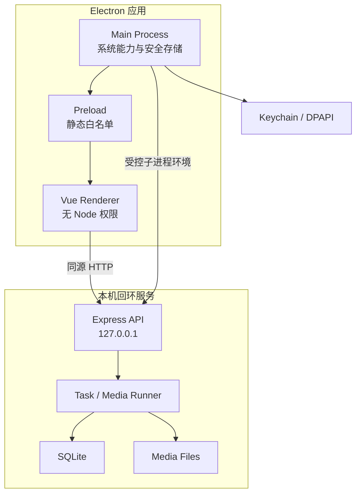
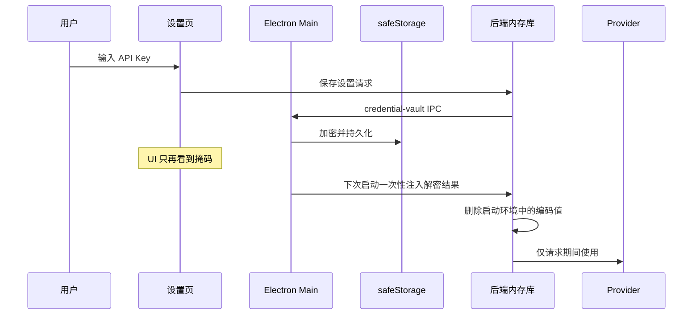
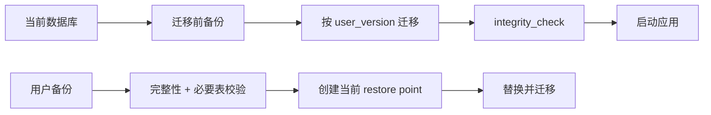

# 安全与数据边界

这份文档描述桌面单用户模型下的安全假设、凭证流、Electron 边界、数据位置、备份和日志处理。漏洞报告流程见根目录 `SECURITY.md`。

## 威胁模型

重点防护：

- API Key 被长期明文保存；
- renderer 被 XSS 后直接读取 Node 或文件系统；
- 任意 IPC 参数导致目录遍历或文件覆盖；
- 上传扩展名伪装；
- 日志、错误响应、Sentry 或截图泄露凭证和用户路径；
- 服务暴露到局域网；
- 安装包混入开发数据库、上传文件或日志；
- 迁移/恢复破坏数据库且无法回退。

当前不承诺抵御已经取得用户操作系统账户、调试权限或进程内存读取能力的本地攻击者。代码混淆和 ASAR 也不等同于加密或 DRM。

## 进程边界

## Electron 安全配置

| 配置 | 值/策略 | 目的 |
| --- | --- | --- |
| `contextIsolation` | `true` | 隔离页面与 preload 上下文 |
| `nodeIntegration` | `false` | 页面不能直接 require Node 模块 |
| `sandbox` | `true` | 限制 renderer 权限 |
| `webSecurity` | `true` | 保留浏览器同源策略 |
| 权限请求 | 默认拒绝 | 防止页面索取摄像头等能力 |
| 外部链接 | 只交给系统浏览器打开 HTTPS | 避免在高权限窗口加载未知页面 |
| preload | 两个静态接口 | 缩小 IPC 攻击面 |

当前 preload 暴露：

- `setLocale(locale)`：只接受 `zh` 或 `en`；
- `selectExportDirectory()`：打开原生目录选择器，返回经过校验的路径。

新增 IPC 时必须同时完成来源校验、参数 schema、返回值最小化、错误脱敏和安全测试。

## 凭证生命周期

不应出现凭证的地方：

- `settings.json`；
- SQLite 项目备份；
- 配置导出；
- API 返回；
- 任务错误和 attempts；
- HTTP 日志和 Sentry 事件；
- README、截图、测试 fixture；
- 安装包与源码控制。

旧版设置中的明文凭证会在首次启动时提取到 vault，并从普通配置删除。

## HTTP 与上传边界

后端默认绑定 `127.0.0.1`。主要控制：

- 精确 CORS origin；
- CSP 和常见安全响应头；
- 删除 `X-Powered-By`；
- JSON/表单请求体限制；
- 生成接口限流；
- 请求 ID 用于关联诊断；
- 可选 `API_TOKEN`；
- 上传扩展名、MIME 和魔数联合校验；
- 文件名与目标目录规范化。

不要把桌面后端直接反向代理到公网。需要远程访问时，应重新设计鉴权、租户隔离、CSRF、配额、审计和密钥管理。

## 数据分类

| 数据 | 示例 | 默认位置 | 是否进入备份 |
| --- | --- | --- | --- |
| 项目结构 | 主题、脚本、分镜、任务检查点 | SQLite | 是 |
| 媒体资产 | 图片、音频、字幕、MP4 | 用户数据媒体目录 | 需单独复制 |
| 非敏感设置 | 语言、模型名、baseUrl、目录 | settings.json | 是 |
| Provider 凭证 | API Key、Access/Secret | 系统安全存储 | 否 |
| 后端日志 | 请求 ID、已脱敏错误 | logs | 否 |
| crash dump | Electron/Chromium 崩溃信息 | 系统 crash 目录 | 否 |

## 数据库迁移、备份和恢复

数据库与媒体目录应来自同一时间点。只恢复数据库会保留结构，但可能出现缺图/缺音频；资产健康检查会列出缺失文件。

## 日志与遥测

后端日志用于本地诊断，包含时间、请求 ID、路由和安全错误，不应包含 Authorization、Key、完整 Provider 响应或用户内容全文。

Sentry 默认关闭。只有显式配置 DSN 才初始化，并在 `beforeSend` 中执行凭证和路径清理。启用前应在隐私说明中明确收集范围、保留时间、处理方和关闭方式。

## 安装包门禁

`electron:preflight` 会检查 ASAR 与 FFmpeg 解包配置、Electron 安全选项、preload 白名单、客户端和后端构建产物、运行时依赖、entitlement、图标，以及包内容不含数据库、设置、上传和日志。

`scripts/security-check.mjs` 扫描 Git tracked/untracked 源码；没有 `.git` 的源码包会回退到受限文件系统遍历。

## 发布前安全检查

- [ ] 三套 `npm audit` 为 0 或已记录例外；
- [ ] 源码敏感文件扫描通过；
- [ ] Demo 测试环境没有真实 Key；
- [ ] 包内不含数据库、上传、日志和凭证；
- [ ] 外部链接和 IPC 无新增宽泛能力；
- [ ] macOS/Windows 完成受信任签名；
- [ ] Sentry 与更新服务使用生产配置且不泄密；
- [ ] 在全新系统账户中安装、生成、导出和卸载；
- [ ] 日志提交指引提醒用户先脱敏。
