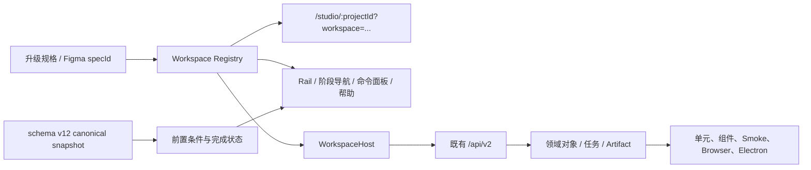

# Studio Workspace 交付矩阵

状态：`Review Candidate 2 / 开发预览`
范围：Vue `/studio/:projectId?`、schema v12、`/api/v2`、零 Key Demo、本机/Docker Provider 连接
不在范围：安装包、正式签名/公证、线上更新、真实 Provider 线上验收、正式多用户 RBAC

## 导航与事实源

工作台保持单一路由，通过 `workspace` 查询参数表示用户当前工作位置。`view=story|production|delivery` 继续兼容旧链接；合法 `workspace` 优先，未知值回退到 canonical snapshot 推导的首个未完成阶段。

`selected entity` 不进入公开 URL。进入任务中心时只在内存保存来源 Workspace 和滚动位置；项目清单、锁定、过期、部分成功、未知结果与失败状态均从服务器事实推导，不保存第二套阶段完成状态。

## 16 个 Workspace

| specId / Workspace | 入口与职责 | 主操作 / 前后阶段 | 领域对象与既有能力 | 保存点、校验与恢复 | 状态 |
| --- | --- | --- | --- | --- | --- |
| `T/01-ProjectCenter` `project_center` | 初始回退、项目切换器；打开项目、备份或恢复现场 | 创建或打开项目；→ 新建向导 | Project、Series、Snapshot；项目列表、项目包导入/导出 | 只有成功载入 snapshot 才算完成；包先校验 manifest、路径、schema 与媒体 hash | Partial |
| `T/02-ProjectSetup` `project_setup` | 项目中心、命令面板；空项目、零 Key Demo、安全导入 | 打开项目创建与导入；← 项目 / → 简报 | Project、SourceImportPreview；本地 Demo Provider | 创建失败不得残留项目；导入确认前不写入 | Partial |
| `T/03-CreativeBrief` `brief` | 新项目完成后、阶段导航；结构化创作意图与候选审批 | 编辑并批准创作简报；← 新建 / → 剧本 | CreativeBriefState、ArtifactVersion、ReviewDecision | 字段必填、长度与枚举校验；revision/CAS；候选不经批准不替换事实源 | Partial |
| `T/04-ScriptEditor` `script` | 简报、导入原著；组织 Source/Chapter/Event/Scene | 导入原著并生成故事结构；← 简报 / → 资产 | Source、Chapter、StoryEvent、Scene、SourceImportPreview | UTF-8、大小、MIME、hash 复检；隔离预览可取消；确认后事务提交 | Partial |
| `T/05-Assets` `assets` | Source 已存在；检查本地/Series/Global 资产与绑定 | 检查资产与镜头绑定；← 剧本 / → 分镜 | ResolvedAsset、AssetBinding、Variant | 作用域、revision drift 和影响范围；预览后事务改绑；旧候选保留 | Partial |
| `T/06-Shots` `shots` | Source 已存在；审批计划、组织 Shot/Beat | 生成或检查制作计划；← 资产 / → 连续性 | ExecutionPlan、AgentCheckpoint、Scene、Shot、ShotBeat | 计划审批令牌；Beat 覆盖时长；写入幂等；崩溃后从 checkpoint 恢复 | Partial |
| `T/07-Continuity` `continuity` | Shot 已存在；检查首尾帧和跨集事实 | 检查镜头连续性；← 分镜 / → 生成 | BoundaryFrame、EpisodeContinuity、AssetBinding | 引用 hash/revision；缺失或漂移显示修复入口；清除引用需显式操作 | Partial |
| `T/08-Generation` `generation` | Shot 已存在；提交 Demo 候选批次 | 生成零 Key Demo 候选；← 连续性 / → 审阅 | CandidateBatch、GenerationTask、PromptRun、ProviderReceipt | idempotency key、项目并发/批量上限；`provider=demo-local`、`billed=false` | Partial |
| `T/09-Review` `review` | Candidate 已存在；比较证据并采用 active take | 审阅并采用镜头候选；← 生成 / → 时间线 | Candidate、Review、ArtifactVersion、Shot.selectedCandidateId | 采用使用 graph revision/CAS；部分失败只重试失败项；旧批次追加保留 | Partial |
| `T/10-Timeline` `timeline` | 所有 Shot 已采用候选；检查规范化装配 | 检查装配与导出预检；← 审阅 / → 画布 | Candidate、Media、Track、ExportPreflight | 缺轨、缺媒体、字幕与编码问题阻断预检；自由剪辑为 Planned | Partial |
| `T/11-Canvas` `canvas` | 任意已打开项目；跨三张领域图查看关系 | 查看领域图与检查器；← 时间线 / → Prompt | GraphProjection、GraphNode/Edge、selected entity | 图布局命令携带 revision/idempotency；列表为拖拽的键盘替代 | Implemented |
| `T/12-PromptSkill` `prompt_skill` | 已打开项目；版本、diff、评测、发布与回滚 | 打开 Prompt 与 Skill 管理；← 画布 / → 任务 | PromptRevision、SkillVersion、GoldenEvaluation、LKG | 不可变 revision；仅已发布版本进入生产；回滚追加新 revision | Partial |
| `T/13-Tasks` `tasks` | 任意项目或恢复中断；Attempt、诊断、对账 | 打开任务诊断与恢复；← Prompt / → 导出 | GenerationTask、Attempt、ProviderReceipt、TaskDiagnostic | unknown 只能对账；partial 只重试失败项；retry 创建新 attempt；保存内存 returnTo | Partial |
| `T/14-ProviderConnections` `provider_connections` | 任意本机环境；管理 Demo、OpenAI-compatible 与声明式 HTTPS 连接 | 管理本机 Provider 连接 | ProviderConnection、ProviderRoutePolicy、CredentialRef | 系统 Keychain/Docker Secret；脱敏连通性测试；任意可执行适配器禁用 | Partial |
| `T/15-LocalGovernance` `local_governance` | 任意环境；本地安全、恢复、备份和审计 | 检查本地安全与备份 | RecoveryReport、SecurityAuditEvent、GenerationPolicy | 只显示受限证据；恢复动作仍走 revision、确认与幂等门禁 | Partial |
| `T/16-ExportSettings` `export_settings` | 项目与 Delivery 图；导出、策略、凭证、备份、安全 | 打开导出预检与设置；← 时间线 | ExportPreflight、GenerationPolicy、Credential Vault、SecurityAudit | 预检不启动 FFmpeg；显式 `START_LOCAL_EXPORT`；assembly hash 与幂等确认 | Partial |

## 全局状态契约

每个 Workspace 使用统一的 Empty、Loading、Success、Failure、Read-only、No Permission 和 Weak Network 语义。当前开发预览是本地单用户产品，Read-only/No Permission 仅作为目标规格和兼容视觉；正式 RBAC 属于 External Gate，不存在伪造的权限 API。

| 状态 | 用户文案原则 | 可用动作 | 稳定技术值 |
| --- | --- | --- | --- |
| locked | 说明缺少什么以及先去哪里 | 前往真实前置 Workspace、帮助 | 前端从 snapshot 推导 |
| stale | “上游版本已变化，请检查受影响内容” | 查看影响、局部修复、保留旧版本 | API/审计仍使用 `stale` |
| partial | “部分完成，成功项已保留” | 查看失败项、仅重试失败项 | 任务/CandidateBatch 原值不变 |
| unknown | “结果暂时无法确认，禁止重复提交” | 打开任务中心并对账 | `outcome_unknown` |
| failed | 显示可理解原因与稳定错误码 | 诊断、符合条件时创建新 attempt | `failed`/`timed_out` |

## 查询参数兼容

| 输入 | 结果 |
| --- | --- |
| `?workspace=review&view=story` | 合法 Workspace 优先；同步为 `view=production` |
| `?view=story` | 映射到 `workspace=canvas` |
| `?view=production` | 映射到 `workspace=shots` |
| `?view=delivery` | 映射到 `workspace=timeline` |
| 未知 `workspace` 且无合法 `view` | 根据 snapshot 回退到首个未完成 Workspace |

## 验收用例索引

- `WS-REG-001`：Registry 恰好 16 个唯一 ID，映射三张领域图。
- `WS-URL-001`：旧 `view` 链接保持兼容；浏览器前进/后退恢复 Workspace。
- `WS-GATE-001`：锁定阶段显示原因和替代路径，不渲染无响应主按钮。
- `WS-TASK-001`：进入任务中心保存内存 returnTo；返回时恢复来源 Workspace。
- `WS-STATE-001`：阶段完成只从 canonical snapshot 推导。
- `WS-A11Y-001`：可见操作目标不小于 44×44；焦点可见；状态同时使用图标、文字和颜色。
- `WS-DEMO-001`：零 Key Demo 创建、导入、计划、审批、候选、审阅、导出与重启恢复。

API 的请求、错误、认证、revision、幂等和审计细节以 [API v2](api-v2.md) 为准；数据关系以 [schema v12 数据模型](data-model-v2.md) 为准。本矩阵是前端交付规格，不承诺新的公共服务端接口。
