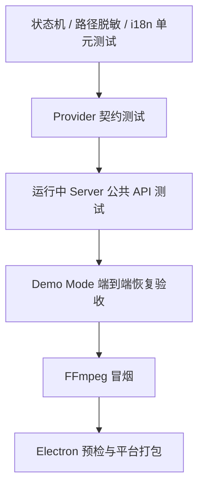
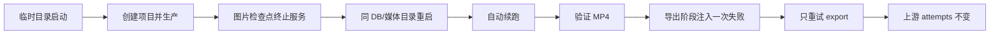
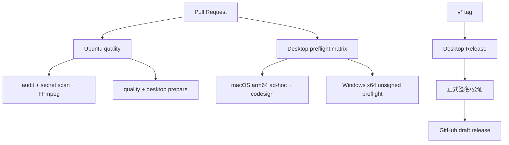

# 测试与 CI 指南

测试目标不是追求单一覆盖率数字，而是保护最昂贵、最容易中断的边界：Provider、检查点、媒体文件、重启恢复、桌面安全和发布包内容。

## 测试分层



## 常用命令

| 命令 | 覆盖内容 | 是否需要 Key |
| --- | --- | --- |
| `npm run quality` | server 预检、测试、Demo、client 测试和构建 | 否 |
| `npm run test:smoke` | 公共 API、MP4、阶段重试、重启恢复 | 否 |
| `npm --prefix client test` | i18n、路径脱敏等客户端单元测试 | 否 |
| `npm run security:audit:all` | 三套依赖树完整审计 | 否 |
| `node scripts/security-check.mjs` | 禁止文件和疑似密钥扫描 | 否 |
| `node scripts/ffmpeg-smoke.mjs` | 最小 MP4 合成 | 否 |
| `npm run electron:preflight` | Electron 配置与包内容 | 否 |
| `npm run pack` | 当前平台 unpacked 预检包 | 否 |

## 无付费请求保证

CI 与验收脚本显式设置 Demo 和本地静音模式，并清空 OpenAI、DeepSeek、DashScope、Gemini、Runway、Kling、Ark、Volcano 等常见 Key 环境变量。

此外，Demo 代码在进入网络适配器前短路。无密钥契约测试还会断言 execute 没有被调用。

## 服务端测试

服务端测试分两类：

1. 纯函数/服务测试：状态机、Provider 契约、恢复扫描；
2. 对运行中服务的公共 API 测试：项目、分镜、素材、回收站、Provider 列表、安全头等。

`server/scripts/run-tests.mjs` 负责在隔离环境准备数据库和端口，并避免测试写入用户数据目录。

关键断言包括：

- 项目更新保持 PATCH 语义；
- 分镜 reconcile 只清理变化镜头；
- 上传伪装文件被拒绝；
- 删除与恢复保持引用一致；
- CORS 非白名单来源返回 403；
- 未知对象返回 404 而不是 500；
- Provider health 不返回凭证；
- 任务重启后仍可查询；
- 达到恢复上限时进入诊断失败。

## Demo 验收



有效 MP4 不只检查文件存在，还通过媒体结构确认输出可识别。

## 客户端测试与构建

客户端测试保护两个桌面特有风险：

- CSP 下 i18n 不依赖运行时 `eval`；
- UI 展示路径时隐藏 `/Users/<name>`、`/home/<name>` 和 `C:\\Users\\<name>`。

生产构建是质量门禁的一部分。大 chunk 警告不会使构建失败，但应持续关注 Element Plus 的体积并在后续做更细粒度拆分。

## GitHub Actions



Ubuntu job 执行三套 `npm ci`、完整审计、源码扫描、FFmpeg、quality、桌面准备和 Electron 预检。

桌面矩阵在 macOS 生成 arm64 ad-hoc 包并严格验签，在 Windows 生成 x64 unsigned 预检目录。手动 Release 默认只做预检；tag 或关闭预检开关时要求正式签名与公证 Secrets。

## 本地复现 CI

```bash
npm ci
npm --prefix server ci
npm --prefix client ci
npm run security:audit:all
node scripts/security-check.mjs
node scripts/ffmpeg-smoke.mjs
npm run quality
npm run prepare:desktop
npm run electron:preflight
```

如需模拟完全无 Git 的源码包，`security-check.mjs` 会回退到文件系统扫描，并跳过 `.git`、`node_modules`、构建产物和 coverage。

## 新功能最低验收

| 变更类型 | 最低测试 |
| --- | --- |
| 新工作流阶段行为 | 状态转换 + 非法越级 + 重试下游重置 |
| 新 Provider | 完整 Provider 契约矩阵 |
| 新媒体处理 | FFmpeg 冒烟 + 临时文件清理 |
| 新数据库迁移 | 旧 schema 升级 + 备份 + integrity check |
| 新 IPC | 参数、来源、拒绝路径和 preload 白名单 |
| 新页面状态 | 空、加载、失败、部分成功、长任务 |
| 发布配置 | Electron preflight + 对应平台包预检 |

## CI 失败排查顺序

1. 先看失败属于依赖、测试、媒体还是平台打包；
2. 使用工作流中的同一 Node 版本；
3. 清空 Provider Key 并确认 Demo Mode；
4. 复现单个命令，不先使用 `audit fix --force`；
5. 检查临时目录、端口和 FFmpeg 可执行权限；
6. 平台签名失败时区分“包内容不合法”和“缺少受信任身份”。
