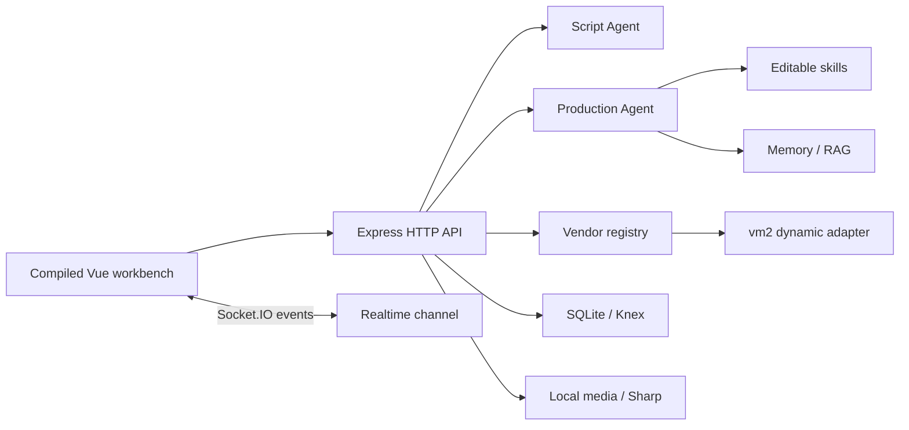
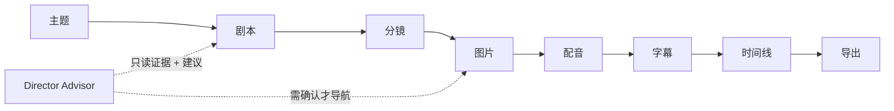
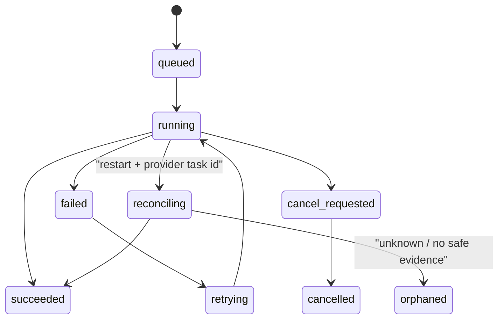

# Toonflow 深度审计与 clean-room 转型记录

> 审计日期：2026-07-15
> 上游固定版本：`HBAI-Ltd/Toonflow-app@bc61ec7a1b5df31293b286981a5f4ad4635464ee`
> 知识库实际使用版本：`open-source-feature-knowledge-base@fdc96883bd762e4143a77b4270114d05ab208823`
> 知识库在本文交付前已前进到 `59facd4a168fa23eba9391061daeb112151dbc2a`；本轮没有修改知识库，也没有把新增的排名/CI 改动误当作本次产品设计证据。

本文只记录可由固定源码、本项目代码和实测结果支持的结论。Toonflow 的代码、Prompt、编译 Web bundle、样式、品牌和素材均未复制到本仓库。

## 1. 证据等级与结论

| 结论 | 证据等级 | 说明 |
| --- | --- | --- |
| 上游服务端以 TypeScript 为主 | 源码确认 | 可读 `src` 为 TypeScript，共享 schema 使用 Zod |
| 运行边界是 Express + Socket.IO + SQLite/Knex + Electron | 源码确认 | 固定 commit 的 manifest 和入口可追踪 |
| 存在 Script Agent / Production Agent / skill / Vendor 适配层 | 源码确认 | 可追踪分派、skill 激活、Vendor schema 和 VM 运行链 |
| 前端交互细节可全面复刻 | 未验证 | 仓库主要交付约 26 MiB 编译 bundle，没有等价可审计 UI 源码 |
| 截图中“顶层框架”文案就是真实服务入口 | 不采信 | 屏幕文案与固定源码冲突时，以源码和 lockfile 为准 |
| 可以直接按 Apache-2.0 复制 | 否 | 根 LICENSE 还附带限制性 Supplementary Agreement |

固定证据入口：[Express/CORS/body/auth](https://github.com/HBAI-Ltd/Toonflow-app/blob/bc61ec7a1b5df31293b286981a5f4ad4635464ee/src/app.ts#L50-L168)、[Script Agent](https://github.com/HBAI-Ltd/Toonflow-app/blob/bc61ec7a1b5df31293b286981a5f4ad4635464ee/src/agents/scriptAgent/index.ts#L25-L232)、[Production Agent](https://github.com/HBAI-Ltd/Toonflow-app/blob/bc61ec7a1b5df31293b286981a5f4ad4635464ee/src/agents/productionAgent/index.ts#L43-L485)、[skill 渐进加载](https://github.com/HBAI-Ltd/Toonflow-app/blob/bc61ec7a1b5df31293b286981a5f4ad4635464ee/src/utils/agent/skillsTools.ts#L44-L275)、[Vendor 能力 schema](https://github.com/HBAI-Ltd/Toonflow-app/blob/bc61ec7a1b5df31293b286981a5f4ad4635464ee/src/routes/setting/vendorConfig/addVendor.ts#L9-L110)、[VM 动态代码](https://github.com/HBAI-Ltd/Toonflow-app/blob/bc61ec7a1b5df31293b286981a5f4ad4635464ee/src/utils/vm.ts#L17-L55)、[候选视频选定](https://github.com/HBAI-Ltd/Toonflow-app/blob/bc61ec7a1b5df31293b286981a5f4ad4635464ee/src/routes/production/workbench/selectVideo.ts#L1-L21)。

## 2. 上游架构解析

### 2.1 值得独立重新实现的思想

- “先规划、后审阅、再执行”：Agent 不应跳过人审直接发起高成本任务。
- 专业阶段分工：剧本、资产、导演、分镜、画面是领域阶段，不是一个巨型 Prompt。
- skill 渐进披露：先显示名称/摘要，选中后再加载详细资源，避免无界上下文。
- 能力导向的模型目录：UI 选择统一能力，Provider-specific payload 只存在 adapter 边界。
- 候选与选定分离：新结果不静默覆盖已选结果。
- 图形化制作：用节点和边表达可恢复阶段，快速模式仍保留线性入口。

### 2.2 明确避免的实现

| 上游做法 | 本项目动作 | 原因 |
| --- | --- | --- |
| 默认管理员凭据 | avoid | 发布到局域网后会形成低成本未授权入口 |
| wildcard CORS | avoid | 本项目继续使用精确本地 origin 白名单 |
| query-string JWT | avoid | URL 可进入历史、代理和日志；Socket 使用 handshake auth |
| Vendor secret 明文 SQLite | avoid | 凭据由 Electron `safeStorage` 持有，renderer 只看授权状态 |
| `vm2` 执行用户 Vendor 代码 | avoid | 动态代码 + 网络 helper 不是可接受的单机秘密边界 |
| 100 MiB 全局 body | avoid | 上传和 JSON 按路由/媒体类型限制，大媒体不嵌入项目 JSON |
| 不明云任务自动重提 | avoid | 结果未知时进入 `orphaned/reconciling`，不产生重复计费 |
| 复制编译 UI/Prompt/skill 素材 | avoid | 源代码不可同等审计，且附加许可和资源授权不明 |

## 3. 本项目的转型结果

### 3.1 实际技术栈

| 层 | 当前落地 | 与参考栈的关系 |
| --- | --- | --- |
| Runtime | Node.js 22 | 保留已验证 LTS/CI 基线，不为对齐截图数字无条件升级 Node 23 |
| Language | TypeScript 5.9 strict | 一方运行时源码覆盖率 100% |
| Web | Vue 3.5 + Pinia + Vue Router + Vite | 保留成熟客户端，不因上游前端源码不可见而机械重写 |
| API | Express 5.2.1 + Zod | 升级为强类型路由与稳定错误契约 |
| Realtime | Socket.IO 4.8.3 | 精确 origin + handshake token；失败时有上限的 HTTP polling 回退 |
| Database | better-sqlite3 12.9 + Knex 3.2 | 发布包使用同步本地 SQLite；Knex 仅编译 SQL，不建第二连接 |
| Compatibility | sql.js 1.14 | 作为显式回退和驱动语义对照，不是发布默认 |
| Desktop | Electron 40.10.6 | 与 `better-sqlite3` 当前 ABI 验证组合一致；43 在实测编译中不兼容 |
| Image | Sharp 0.34.5 | 上传图片 metadata/pixel limit/MIME/magic bytes 安全校验 |
| Media | FFmpeg + RemoteMediaFetcher | 真实 MP4 导出，外部媒体防 SSRF/私网/重定向/超限 |
| Contracts | `packages/contracts` + Zod | API、任务、资产、媒体、模型、Advisor 和 IPC 的共享契约 |

### 3.2 可视化 AI 导演工作室

- `/studio` 是新的默认入口，`/dashboard` 和“一键成片”作为快速模式保留。
- Vue Flow + Dagre 构建九节点原创画布，布局按 project/user/view 保存到 schema v8。

> 后续收尾升级已把主数据库推进到 schema v9；本节保留当时 Toonflow clean-room 垂直切片的 v8 历史事实，v9 的资产 lineage、字段级 stale 与 Prompt revision 见[数据模型](data-model.md)。
- 布局保存有 `revision` 乐观锁，多窗口冲突返回 409，不静默覆盖。
- Director Advisor 只基于项目、分镜、资产、任务和导出的当前证据产生白名单动作。
- Advisor 不执行 Provider、不运行代码、不打开外部 URL；高成本动作需二次确认，确认后也只导航到已有工作页。
- 原创暗色信息层级、节点、图标和窄屏覆盖层由本项目独立实现，没有根据上游 bundle 还原 CSS。

### 3.3 可恢复任务和实时状态

- 任务意图、idempotency key、Provider task ID、attempt 血缘、输入/媒体快照和 correlation ID 在可能计费前持久化。
- 已有 Provider task ID 时重启后只做 reconcile；远端状态不明时进入 `orphaned`，绝不自动 submit。
- Demo/local 确定性任务可从检查点安全续跑。
- Socket.IO 发送稳定 TaskEvent；连接不可用时前端回退到有上限轮询。

## 4. 数据与桌面发布决策

### 4.1 schema v8

v8 只增加 Studio 布局表，保留 v3–v7 数据和 API 兼容性。启动时在迁移前备份；未来 schema 直接拒绝打开。`better-sqlite3` 和 `sql.js` 驱动对照测试共同验证：

- 基本读写；
- foreign key cascade；
- 原始备份；
- 运行中恢复；
- v3→v8 幂等迁移；
- 未来版本 fail safely。

### 4.2 Electron 发布边界

- `contextIsolation=true`、`nodeIntegration=false`、`sandbox=true`；
- preload 只暴露静态 IPC 白名单，main 使用 Zod/路径检查；
- Provider 凭据进入 OS `safeStorage`，旧明文设置一次性迁移后删除秘密字段；
- 后端落盘日志会脱敏凭据、Bearer token 和用户主目录路径；
- 发布包只含编译 JavaScript/运行时，不含 TypeScript、sourcemap、数据库、日志、上传或用户文件；
- macOS arm64 ad-hoc 目录包已实际构建和启动；正式 Developer ID/公证及 Windows 受信任签名仍需发布者凭据。

## 5. 为什么没有一次性安装全部参考依赖

`Vercel AI SDK` 和 `@huggingface/transformers` 不是 UI 标签，而是应当由实际垂直切片驱动的运行时依赖。本轮没有在没有可验收的本地模型、资源授权、包体积预算和 Provider 契约的情况下空装依赖。

| 能力 | 决策 | 启动条件 |
| --- | --- | --- |
| Vercel AI SDK 统一 text/structured output | defer / P3 | 用当前 adapter 契约先做官方 API 验证和 recorded fixture，证明可减少重复代码 |
| Transformers.js / ONNX 本地 embedding | defer / P3 | 明确检索场景、模型许可、首包与峰值内存预算，支持延迟下载 |
| 用户可编程 Vendor runtime | avoid | 除非改为独立低权限进程/容器，带出口白名单和签名扩展包 |
| Docker | optional | 只用于服务端复现/媒体 worker，不取代桌面 local-first 主路径 |

## 6. 验收证据

| 范围 | 本轮实测 |
| --- | --- |
| Server | 85 个 HTTP/JavaScript 测试 + 30 个 TypeScript 领域/任务测试通过 |
| Contracts | 7 项共享契约通过，包括资产旧数字 ID 兼容、Advisor 白名单与外部 URL/任意代码拒绝 |
| Client | 17 个测试文件、45 项测试通过；AssetWorkbench 生产 chunk 为 15.70 kB（gzip 5.21 kB） |
| Browser | 创建项目、Studio/Advisor，以及 Scene 资产→受管媒体 Variant→键盘绑定→引用保护 409；640px 堆叠布局与页面 console 0 error/warn |
| Realtime | Socket.IO 任务更新、失败/重试与 polling fallback 通过测试 |
| Database | `better-sqlite3` 与 `sql.js` 读写/外键/备份/恢复奇偶对照通过 |
| Packaging | Electron 40.10.6 + better-sqlite3 arm64 rebuild、preflight、ad-hoc macOS 目录包构建和隔离 userData 启动通过；最终包无 `.ts`/sourcemap/default app |

最终的 `quality`、Demo 重启/失败重试/导出、security scan、audit 和发布包检查以当次交付报告为准，不用本文的过程数字代替实际命令结果。

## 7. 许可证与资源风险

- 上游根 LICENSE 为 Apache-2.0 文本加限制性补充协议；向两个及以上独立第三方提供产品等场景有额外限制。
- 本项目的采用类型是 `reimplement` / `inspiration-only`，不形成 Toonflow 源码衍生版本的工程承诺。
- 上游 ONNX 模型、图片、视频、品牌、skill 资源和编译 bundle 都没有加入本仓库。
- 本项目 MIT 不自动授予模型权重、Provider API、用户上传、字体、音乐、肖像或生成内容的商业权利。

详细许可结论是工程风险提示，不替代法律意见。
