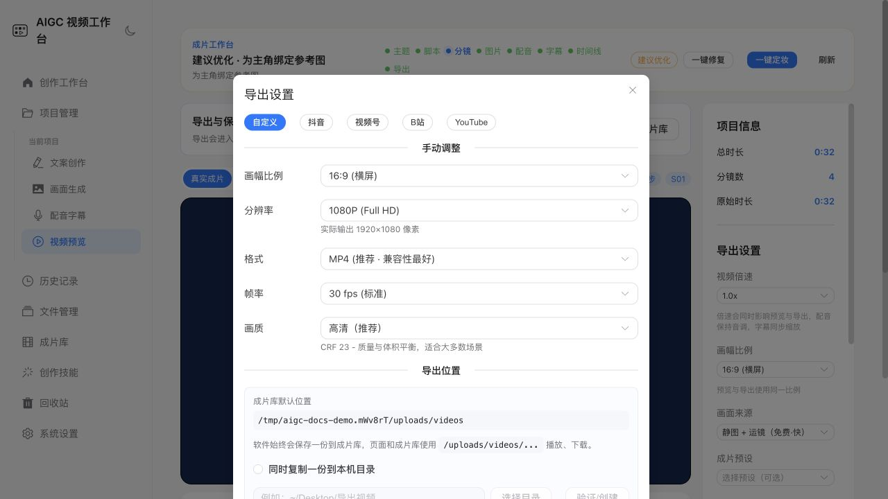

# 创作者使用手册

本手册面向第一次使用 AIGC 视频工作台的创作者。它按真实工作顺序解释每个阶段的输入、保存点、失败处理和下一步，不要求理解后端或 Provider 实现。

## 开始前

本地体验推荐先使用 Demo Mode：

~~~bash
npm run demo
~~~

Demo Mode 不需要 Key，不会调用付费模型，但会真实创建项目、分镜、字幕、时间线和可播放 MP4。云端 Provider 仅在用户主动配置并选择后使用。

## 一分钟认识工作台

左侧是全局入口和当前项目步骤；中间是当前工作区；右下角任务浮层负责跨页面显示长任务。项目卡片上的状态用于回答三个问题：

1. 已经完成了什么；
2. 现在阻塞在哪里；
3. 下一步应该继续、修复还是导出。

## 八阶段创作路径

~~~mermaid
flowchart LR
  T["主题"] --> S["脚本"]
  S --> B["分镜"]
  B --> I["图片"]
  I --> A["配音"]
  A --> C["字幕"]
  C --> L["时间线"]
  L --> E["导出"]
~~~

### 1. 主题

创建项目时填写名称、主题、风格、画幅和目标时长。名称用于管理，主题决定内容方向。建议主题同时包含：

- 内容对象；
- 目标观众；
- 希望传达的结论；
- 时间或节奏约束。

示例：“用 30 秒向第一次接触 AI 的大学生解释为什么长任务需要检查点。”

保存后系统创建项目记录。即使后续生成失败，主题和项目设置也不会丢失。

### 2. 脚本

脚本阶段可以使用本地模板或已配置的 LLM Provider。生成后先检查标题、开头钩子、事实和结尾行动，再保存。修改脚本不会自动删除全部已有素材；系统会比较分镜变化，只让受影响的镜头进入待同步状态。

遇到无 Key、超时或异常格式时：

- 查看 Provider 标签和诊断；
- 选择本地 Demo 或其他 Provider；
- 保留已有内容后重试当前阶段；
- 不要重复点击创建多个相同任务。

### 3. 分镜

每条分镜都有稳定 id、顺序、画面描述、旁白、时长、提示词和可选角色约束。逐镜修改时优先保存小范围变更。

如果只改了一个镜头：

- 未变化镜头的图片和音频继续保留；
- 变化镜头进入待同步；
- 时间线和导出结果会提示需要更新；
- 可以先完成其他镜头，再集中修复。

### 4. 图片

图片阶段支持批量生成、上传、候选图选择和失败项重试。批任务出现部分失败时，成功项不会回滚。

推荐顺序：

1. 检查统一画风和角色锚点；
2. 批量生成；
3. 对失败镜头使用“只重试失败项”；
4. 为每个镜头选择最终图片；
5. 检查缺图和悬空引用。

明确标记为 placeholder 的画面用于保障 Demo 和恢复链路，不应被宣传为真实云端模型输出。

### 5. 配音

选择音色、情感和语速后可以逐镜生成或批量生成。Edge 或 Demo 本地能力适合离线演示；云端音色可能产生费用。

修改旁白后需要重新生成对应音频。没有旁白的镜头可以标记为无配音，避免工作台持续提示缺失。

### 6. 字幕

字幕文本默认来自旁白，可以逐镜修改。生成前确认：

- 文本没有超长单句；
- 字号和位置适合画幅；
- 音频时长已经稳定；
- 中英文和标点符合发布平台要求。

字幕可烧录进视频，也可以生成外挂 SRT/VTT。成片库会显示当前字幕状态。

### 7. 时间线

时间线把图片或镜头视频、音频、字幕、转场和时长组合成最终结构。拖动或调整前先查看是否有音频锁定；音频锁定的镜头应优先通过旁白或语速调整时长。

草稿预览用于快速检查节奏，真实导出以 FFmpeg 合成结果为准。

### 8. 导出

导出前运行资产健康检查，确认没有缺图、缺音频、过期时间线或不可写目录。导出设置包括：

- 画幅；
- 分辨率；
- 格式；
- 帧率；
- 质量；
- 是否复制到自定义目录；
- 字幕方式。

导出成功后记录会进入成片库。不要手工移动应用数据目录中的源文件；需要交付时使用下载或自定义导出目录。

## 失败、重试和恢复

~~~mermaid
stateDiagram-v2
  [*] --> ready
  ready --> running
  running --> succeeded
  running --> partial
  running --> failed
  running --> canceled
  partial --> ready: 只重试失败项
  failed --> ready: 重试当前阶段
  canceled --> ready: 用户重新开始
~~~

失败卡片会显示失败阶段、Provider、错误分类、是否可重试和建议动作。优先选择阶段级修复，避免重跑已成功内容。

关闭应用时，已完成的阶段输出和当前检查点保存在 SQLite。重新打开后，支持恢复的任务会自动重新排队；连续恢复超过上限后会进入诊断终态，等待人工修复。

## 文件、成片和回收站

| 文件管理 | 成片库 | 回收站 |
| --- | --- | --- |
|  |  |  |

- 文件管理按图片、音频、视频、字幕和脚本查看占用；
- 成片库保存导出记录和字幕状态；
- 普通删除先进入回收站；
- 回收站支持整组或选中内容恢复；
- 彻底删除不可撤销，操作前必须确认。

## 凭证与 Provider

Web 开发模式只适合本地受控环境。桌面版使用系统安全存储持久化密钥，设置接口只回显掩码。配置导出、数据库备份和截图都不应包含密钥。

每次启用云端 Provider 前确认：

- 服务条款和区域可用性；
- 当前模型名称；
- 计费方式和额度；
- 输入内容是否允许传给该服务；
- 失败后的降级行为。

## 键盘和误操作保护

- 使用 Tab 和方向键浏览可聚焦的项目卡与按钮；
- Enter 或 Space 只在焦点明确时触发操作；
- 文本编辑区不会拦截常规输入快捷键；
- 删除、恢复备份和彻底清空需要确认；
- 长任务可离开页面查看其他内容，进度保留在任务浮层。

## 常见处理顺序

当页面显示异常时：

1. 刷新当前项目状态；
2. 查看任务浮层和失败诊断；
3. 运行资产健康检查；
4. 只重试失败阶段；
5. 检查 Provider 和本地目录；
6. 仍无法解决时按[故障排查](troubleshooting.md)收集脱敏信息。

开发者需要了解状态机和 API 时，继续阅读[工作流与崩溃恢复](workflow-recovery.md)、[内部 API 参考](api-reference.md)和[数据模型](data-model.md)。
