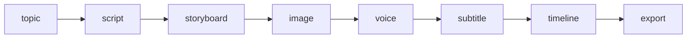
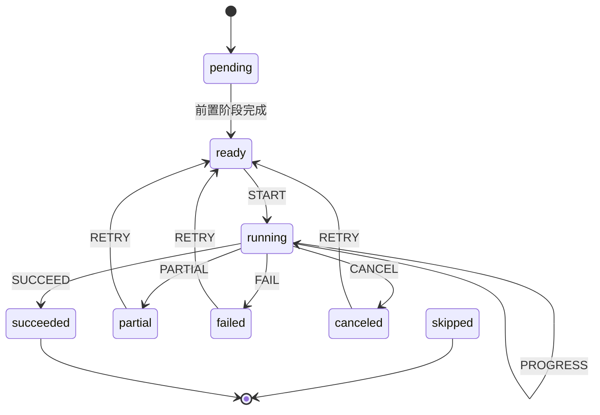
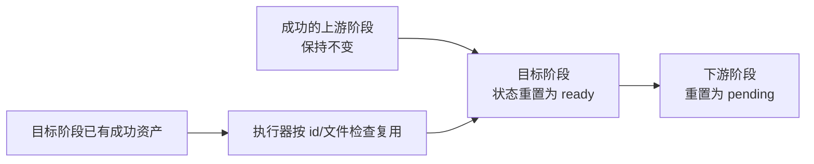
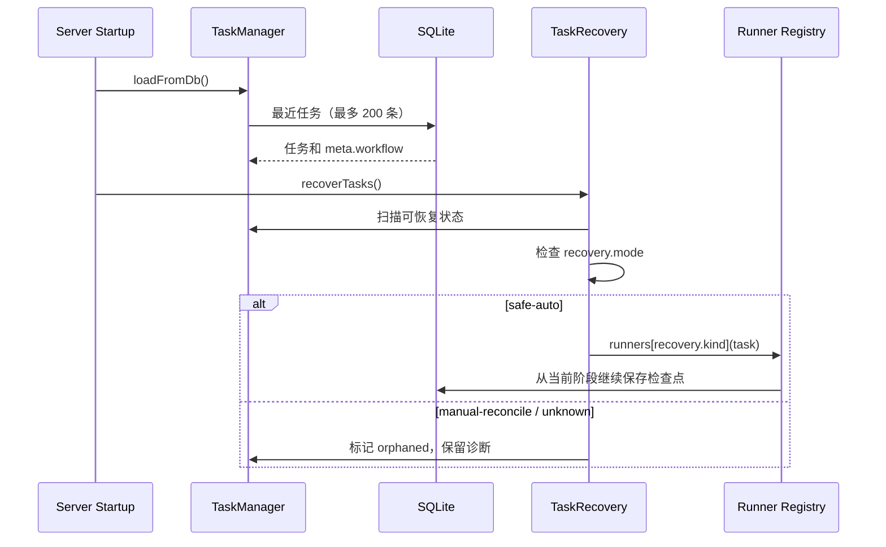

# 工作流与崩溃恢复

这份文档说明八阶段状态机如何保存进度、处理部分成功、避免重复成本，并在进程重启后恢复任务。对应实现主要位于：


> 这是内置 ImageGen 为本文生成的原创概念视觉，不是产品界面截图。八个模块表示工作流阶段，中心时间线/存储表示持久化检查点，回环表示失败或进程退出后从最近阶段继续。

- `server/services/workflowStateMachine.ts`
- `server/services/taskManager.ts`
- `server/services/taskRecovery.ts`
- `server/services/pipeline.ts`
- `server/routes/tasks.ts`

## 设计目标

工作流需要同时满足五个约束：

1. 每个阶段都能独立保存和诊断；
2. 失败后不删除已经成功的上游资产；
3. 重试只重跑必要阶段；
4. 服务退出后任务仍可查询；只有明确安全的 Demo/local 任务自动恢复，云任务进入人工核对；
5. 重复请求不能产生不受控的重复素材或导出记录。

## 八个固定阶段



阶段顺序是稳定协议。前端、任务记录、恢复器和测试都使用同一组名称。新增内部子步骤时，应放在阶段执行器内部，不应随意修改对外阶段名。

## 工作流记录

每个任务的 `meta.workflow` 保存完整工作流：

```json
{
  "version": 1,
  "project_id": 42,
  "current_stage": "image",
  "stages": {
    "image": {
      "status": "partial",
      "attempts": 2,
      "progress": 100,
      "output": { "succeeded": 3, "failed": 1 },
      "error": "第 4 个镜头生成失败",
      "started_at": 1710000000000,
      "completed_at": 1710000020000,
      "updated_at": 1710000020000
    }
  }
}
```

| 字段 | 作用 |
| --- | --- |
| `status` | 阶段当前状态 |
| `attempts` | 当前阶段已尝试次数 |
| `progress` | 0–100 的可展示进度 |
| `output` | 可序列化的阶段摘要，不替代正式资产表 |
| `error` | 已脱敏的诊断信息 |
| `started_at` | 最近一次执行开始时间 |
| `completed_at` | 最近一次到达终态时间 |
| `updated_at` | 最近检查点时间 |

## 状态与事件

可用状态包括 `pending`、`ready`、`running`、`succeeded`、`partial`、`failed`、`canceled` 和 `skipped`。



状态机拒绝非法越级。例如 `storyboard` 尚未完成时启动 `image` 会直接抛出前置条件错误，避免数据库出现“没有分镜却有图片任务”的矛盾状态。

## 任务检查点与阶段产物的区别

`tasks.meta.workflow` 回答“这次 attempt 执行到了哪里”；schema v5 的 `stage_artifacts` 回答“项目当前使用哪个内容 revision”。每个 artifact 保存上游 dependency snapshot。上游内容变化时，下游 artifact 进入 `stale`，旧 payload 和候选文件继续保留；用户可以局部重生成或明确保留旧版本。任务重试不能覆盖 artifact 历史，artifact 新发布也不能伪造任务已经执行成功。

## 阶段保存点

阶段保存分为三层：

1. **任务检查点**：状态、进度、尝试次数和诊断同步进入 `tasks` 表；
2. **领域数据**：项目、脚本、分镜和资产引用进入各自表；
3. **媒体文件**：图片、音频、字幕、视频保存在用户数据目录。

只有三层同时健康，项目才算可恢复。数据库备份如果不包含对应媒体目录，资产健康检查会报告文件缺失，而不会假装项目完整。

## 局部重试



状态机负责重置目标与下游状态；具体执行器负责资产级幂等。例如图片阶段会检查每个 storyboard 的已选图片，批任务只处理缺失项。

阶段重试会创建一个新任务 attempt，并记录 `retry_of` 与递增的 `attempt`。原失败任务及错误诊断保持不变；新任务复制上游 workflow 检查点，只把目标阶段和下游转回待执行。

## 部分成功

图片和配音是典型批任务。系统采用类似 `Promise.allSettled` 的聚合方式：

```json
{
  "status": "partial",
  "successes": [
    { "storyboard_id": 101, "asset_id": 501 },
    { "storyboard_id": 102, "asset_id": 502 }
  ],
  "failures": [
    { "storyboard_id": 103, "code": "RATE_LIMITED" }
  ]
}
```

`partial` 是可恢复终态，不等于“全部失败”。UI 应同时展示成功数量、失败数量和只重试失败项入口。

## 取消语义

取消请求写入任务 `meta.cancel_requested`。执行器在 Provider 请求之间、每个分镜生成前后、FFmpeg 启动前和临时文件安全落盘后检查该标记。

系统不会在任意字节写入中间强杀任务，避免得到看似存在但不可解析的媒体文件。已经成功的资产继续保留。

## 重启恢复流程



扫描状态包括 `pending`、`waiting`、`running`、`composing` 和 `interrupted`。每个任务通过 `meta.recovery.kind` 选择 runner，并记录 `mode`、`attempts`、`max_attempts` 和 `resumed_at`。

只有 `mode=safe-auto`（或兼容旧版的明确 Demo 标记）会自动运行。云端或未知任务使用 `manual-reconcile`：程序可能在 Provider 已受理、但本地尚未保存 provider task id 时退出，因此系统将其标为 `orphaned`，要求用户先核对任务历史和已有资产，再确认是否重试。

如果找不到对应 runner，任务保持 `interrupted` 并记录 `RECOVERY_RUNNER_MISSING`；如果达到恢复上限，任务进入 `failed` 并给出次数诊断。

## 请求幂等边界

高成本入口把 `scope + Idempotency-Key + request_hash` 持久化在 SQLite。首次请求在进入 handler 前同步保存 `pending`；成功后保存状态码与响应并保留 24 小时。相同 key 和输入在服务重启后回放原响应，同 key 不同输入返回 409。

如果进程在结果未确认时退出，pending 记录会保留，系统不会自动重放。这与任务 `orphaned` 使用相同原则：结果不确定时宁可要求人工核对，也不制造可能计费的第二次提交。

## 各阶段幂等策略

| 阶段 | 幂等键或检查 | 重复执行结果 |
| --- | --- | --- |
| 主题 | 项目 id | 读取现有主题 |
| 脚本 | 项目脚本字段/阶段输出 | 已成功时复用，显式重试才覆盖 |
| 分镜 | `project_id + storyboard id` | 按变化集合 reconcile，不全量删除 |
| 图片 | storyboard id + 选中资产 + 文件存在 | 跳过已有健康图片 |
| 配音 | storyboard id + 旁白/音色摘要 | 跳过匹配音频，变化后重建 |
| 字幕 | 项目 + 时间线版本 | 输出到唯一或原子替换文件 |
| 时间线 | 资产版本与配置摘要 | 重新计算纯结构数据 |
| 导出 | 新 export 记录 + 唯一文件名 | 不覆盖未知用户文件，失败清理临时文件 |

## 数据库写盘与迁移

sql.js 在内存中运行，持久化时先写临时文件再原子 rename。schema 通过 `PRAGMA user_version` 管理。迁移开始前自动复制原数据库，并轮换保留最近五份迁移备份。

恢复用户备份时先创建 restore point，再执行完整性检查和必要表校验，替换后运行迁移并重新检查资产引用。

## 自动化验收

`scripts/demo-acceptance.mjs` 覆盖两条关键路径：

### 重启恢复

1. 在临时目录启动 Demo 服务；
2. 创建项目并运行自动生产；
3. 到达图片检查点时终止服务；
4. 使用同一数据库和素材目录重启；
5. 用同一 Idempotency-Key 验证回放的是原 project/task；
6. 验证 Demo 安全任务自动续跑并导出有效 MP4。

### 单阶段重试

1. 用 `DEMO_FAIL_STAGE_ONCE=export` 注入一次导出失败；
2. 记录上游阶段 attempts；
3. 调用阶段重试；
4. 验证返回新的 task id，原失败任务证据仍存在；
5. 验证新 attempt 导出成功；
6. 验证脚本、分镜、图片等上游 attempts 未增加。

## 修改恢复逻辑时的检查清单

- [ ] 新任务类型是否写入 `meta.recovery.kind`；
- [ ] 是否注册对应恢复 runner；
- [ ] 是否在每个可重复边界检查已有资产；
- [ ] 错误是否经过凭证脱敏；
- [ ] 部分成功是否保留成功项；
- [ ] 取消是否在安全边界生效；
- [ ] 是否补充重启与阶段重试测试；
- [ ] 是否验证缺文件、坏数据库和恢复上限场景。
